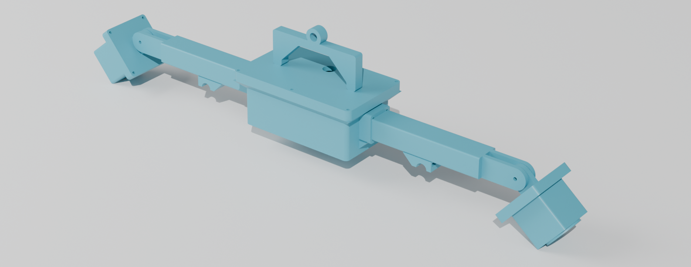
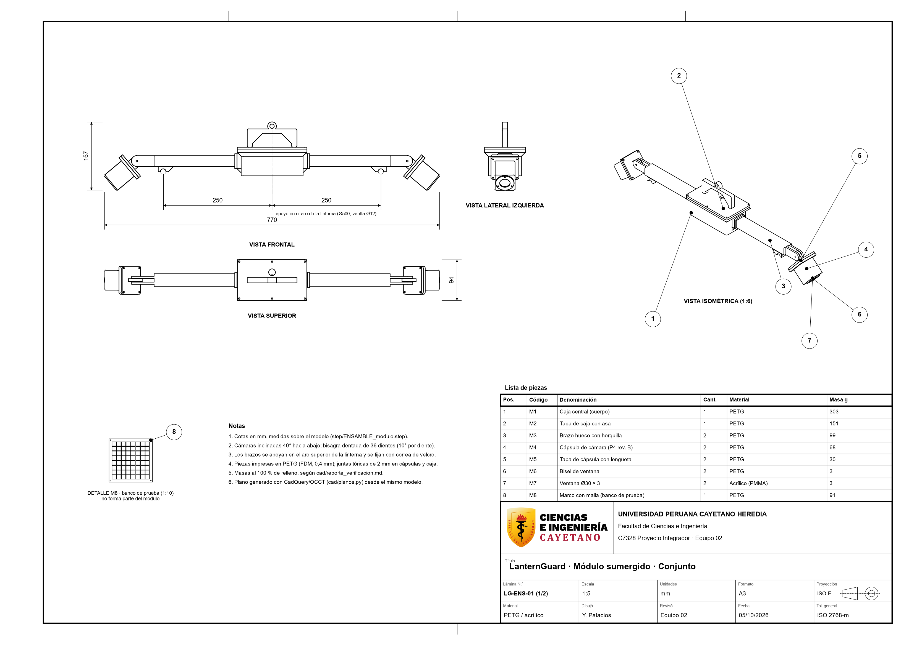
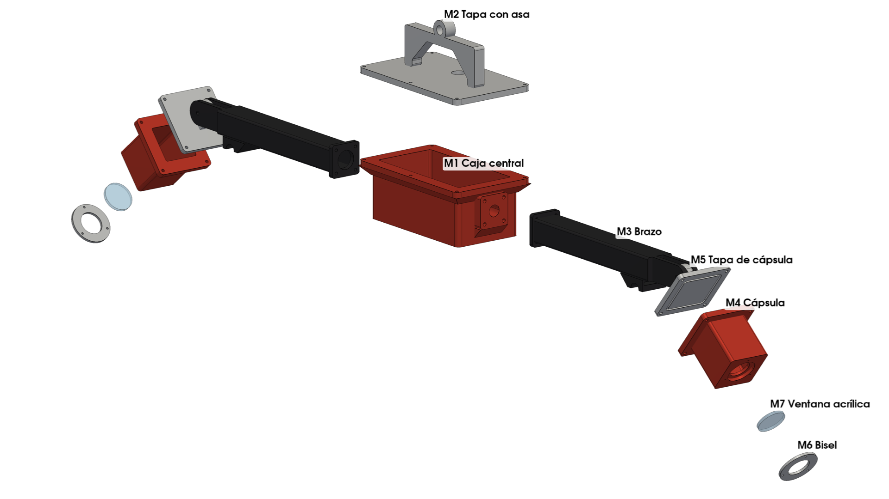

# Módulo mecánico: LanternGuard (prototipo a escala de laboratorio)

Carcasa estanca y soporte para las dos cámaras y la electrónica sumergida del concepto elegido (**Solución 1**): una barra prismática que se apoya sobre el aro superior de la linterna, con una caja central y una cápsula de cámara en cada extremo. La bisagra dentada fija el ángulo de cada cápsula.

El diseño es **CAD paramétrico en código** (CadQuery, Python). Todas las medidas están en un solo archivo, [`cad/params.py`](cad/params.py), en mm. Cada pieza se exporta a **STEP** (para Onshape) y **STL** (para imprimir).



## Piezas

| Pieza | Archivo (`step/`, `stl/`) | Cant. | Material | Qué hace |
|---|---|---|---|---|
| M1 | `M1_caja_central_cuerpo` | 1 | PETG | Caja estanca: ESP32-WROOM-32U, microSD, MAX485, placa del JSN-SR04T. Sensor ultrasónico pasante por el fondo. Almohadillas en los extremos para atornillar los brazos |
| M2 | `M2_caja_central_tapa` | 1 | PETG | Tapa con ranura de junta tórica, prensaestopas PG9 del umbilical, **asa para guantes y ojo de anclaje** |
| M3 | `M3_brazo` | 2 | PETG | Brazo hueco 30 × 25 de 190 mm (conducto inundado del cable), horquilla dentada al final, apoyo con ranura sobre el aro de una linterna de Ø500 y ranura para correa |
| M4 | `M4_capsula_cuerpo_P4revB` | 2 | PETG | Cápsula de cámara con asiento exterior para la ventana y prensaestopas PG7 en la pared inferior |
| M5 | `M5_capsula_tapa` | 2 | PETG | Tapa trasera con ranura de junta y **lengüeta dentada de la bisagra (fuera del sello)** |
| M6 | `M6_bisel_ventana` | 2 | PETG | Aro que retiene la ventana (3 tornillos M2 autorroscantes) |
| M7 | `M7_ventana` | 2 | Acrílico 3 mm | Disco Ø30 (comprado y cortado, no impreso) |
| M8 | `M8_marco_malla_prueba` | 1 | PETG | Marco 200 × 200 con malla de referencia de 20 mm para el banco de prueba |
| - | `ENSAMBLE_modulo` | - | - | Conjunto montado, cámaras a 40° |
| - | `ENSAMBLE_banco_prueba` | - | - | Conjunto + marco de malla a 150 mm frente a la cámara derecha |

### Correspondencia con las piezas del Taller 01

Las piezas del CAD se numeran **M1 a M8** para no confundirlas con las del T01 (P1 a P6, una por integrante). Así se relacionan; conviene usar esta tabla en la columna "Dónde está en el 3D" de la diapo de trazabilidad:

| Pieza del T01 (autor) | Qué era | Pieza del CAD |
|---|---|---|
| P1 (Bustos) y P2 (Lombardi; en algunos archivos figura como P6) | Caja central, mitades A y B, unidas a presión | M1: una sola caja con tapa M2 sellada por junta (la unión sin junta no cumplía la fila Fabricación) |
| P5 (Antezana) | Tapa con manija | M2: tapa con asa para guantes y ojo de anclaje |
| P3 (Santamaría) y P4 (Palacios) | Cápsulas de cámara | M4 (P4 rev. B) + M5 (tapa con la lengüeta de la bisagra) + M6 y M7 (bisel y ventana) |
| Falta en el T01 | Barra principal y bisagra dentada | M3: brazo con horquilla dentada y apoyo sobre el aro |
| Nuevo | Banco de prueba | M8: marco con malla de 20 mm |

Compras (no se modelan): cordón de junta tórica Ø2 mm (Buna-N o EPDM), 3 prensaestopas (2 PG7 y 1 PG9) con contratuerca, tornillería M3 × 12 con tuerca, 8 insertos térmicos M3, 2 pernos M4 × 20 con tuerca mariposa (bisagra, se ajusta con guantes) y una correa de velcro o abrazadera.

## Medidas principales

| Conjunto | Medida |
|---|---|
| Conjunto montado, cámaras a 40° (largo × ancho × alto) | 770 × 94 × 157 mm; apoyos a ±250 mm del centro (aro de Ø500) |
| Caja central (exterior, sin brazos ni pestaña) | 142 × 76 × 60 mm + tapa de 6 y asa de 42 mm (pestaña 160 × 94) |
| Cavidad de la caja | 132 × 66 × 54 mm |
| Cápsula (exterior / cavidad) | 46 × 46 × 56 mm con pestaña de 64 × 64 / 38 × 38 × 50 mm |
| Bisagra | Disco Ø24, 36 dientes (paso 10°), horquilla 5 + 8.4 + 5, perno M4. Rango 0 a 90° |
| Masa estimada en aire | ≈ 1.02 kg (exigencia ≤ 3 kg) |

Los números verificados están en [`cad/reporte_verificacion.md`](cad/reporte_verificacion.md). El script los regenera cada vez.

## Decisiones de diseño (opción elegida y alternativa)

Cada alternativa se puede activar desde `params.py` o es un cambio pequeño en `parts.py`.

1. **Dónde va la bisagra.**
   - **Elegida: lengüeta en la tapa trasera, a la altura del eje óptico.** Con el eje sobre el techo de la cápsula, al inclinarla 90° el cuerpo gira hacia atrás y choca con el brazo (comprobado en el CAD). Con el eje detrás, la cápsula baja sin tocar nada en todo el rango de 0 a 90°: la holgura mínima medida es 8.5 mm. El eje queda **fuera del sello**, como pedía la documentación.
   - Alternativa: orejas sobre la cápsula (como la P4 original). Exige horquillas de unos 90 mm, demasiado largas y flexibles. Se descartó.
2. **Ventana.**
   - **Elegida: disco plano de acrílico de 3 mm en un asiento exterior.** La presión del agua la empuja contra el hombro, que tiene 2.8 mm. Va sellada con silicona neutra o RTV marino y retenida por el bisel M6. Es barata, fácil de cortar y de reemplazar.
   - Alternativa: domo (la lista de exigencias rev. 3 pide "ventana hemisférica truncada, R 25 a 150 mm" para corregir la refracción). Cuesta más (domo comprado o termoformado) y complica el sello. **Contradicción a resolver con el grupo.**
3. **Cierre de las tapas.**
   - **Elegida: sello de cara con cordón tórico de Ø2 mm.** La ranura de 2.6 × 1.5 mm da 25 % de compresión. El cierre es con tornillos M3 pasantes y tuerca: 4 en la cápsula y 6 en la caja.
   - Alternativa: insertos térmicos en la pestaña. Se ve más limpio, pero un inserto mal puesto agrieta la pestaña justo donde está el sello.
4. **Cómo se fija a la linterna.**
   - **Elegida: dos apoyos con ranura semicircular sobre el aro (Ø12, supuesto) y una correa de velcro o abrazadera.** No necesita herramientas y se pone con guantes en menos de 5 min (exigencia de Montaje).
   - Alternativa: abrazadera impresa con perilla. Es más rígida, pero agrega piezas y tiempo.
5. **Brazos.**
   - **Elegida: conductos inundados.** El cable pasa por dentro del brazo (como pide la rev. 3), pero el sello está en los prensaestopas de la caja y de la cápsula, no en el brazo.
   - Alternativa: brazo sellado. Duplica las superficies que hay que sellar.
6. **Escala.**
   - **Elegida: brazos de 190 mm, impresos de pie (242 mm de alto, cama de 250).** Así los apoyos caen sobre el aro de una linterna real de Ø500 mm [1] y las cámaras quedan fuera de la proyección de la malla, como pide la rev. 3. La posición del apoyo se calcula desde `LANTERN_RING_D`; si cambia la linterna, el script avisa cuando el apoyo cae fuera del brazo.
   - Alternativa: tubo comercial (aluminio o PVC) en lugar del brazo impreso. Permite cualquier largo, pero agrega una unión más.

## Supuestos (confirmar con el grupo)

- **Componentes:** el repo no tiene nuestro esquema electrónico. El PDF de `MóduloElectrónico/` es una plantilla de otro proyecto. Las medidas de los componentes son de datasheet y están marcadas en `params.py` con su grado de confianza. **Hay que medir las placas reales**, sobre todo la Arducam Mega con su lente y el ESP32 DevKit (los clones varían ±3 mm).
- **Electrónica de la caja:** se sigue el boceto de la Solución 1 (ESP32-WROOM-32U, JSN-SR04T, microSD y MAX485 en la caja; baterías en la boya). La rev. 3 pone las baterías en el módulo y dice "sin sensores".
- **Ventana:** se usa Ø30 en vez de Ø25.4 para dar margen al campo de visión del lente gran angular.
- **Bisagra:** ángulo de trabajo de 40° (debe ser múltiplo de 10°, el paso del dentado).
- **Varios:** varilla del aro de Ø12 mm, cama de impresión 220 × 220 × 250 y distancia de prueba de 150 mm.
- **P4 rev. B:** la cavidad de la P4 original (46 × 34 × 22) no aloja la placa de 33 × 33 con su lente. Se agrandó a 38 × 38 × 50: la cámara más una zona para la contratuerca del prensaestopas detrás de la placa. **La simulación SimScale del Taller 01 ya no corresponde a esta geometría.**

## Verificación hecha (resumen de `cad/reporte_verificacion.md`)

- **Sólidos e impresión:** las 8 piezas son sólidos válidos y su STL es cerrado, de un solo cuerpo. Todas caben en la cama en la orientación de impresión indicada.
  - Lo que queda como voladizo son puentes cortos: el techo de la cavidad de la cápsula (38 mm), los agujeros de los prensaestopas, el aro del ojo del asa y los flancos de los dientes.
  - Las pestañas y las almohadillas tienen chaflanes a 45° para imprimir sin soporte.
- **Espesores:** todos los que quedan bajo un corte (asiento de ventana, ranuras de junta, insertos, pilotos) miden ≥ 1.2 mm. El más justo está entre la ranura y el tornillo de la cápsula: 1.25 mm.
- **Encaje:** las placas no tocan las paredes (holgura ≥ 1.59 mm). Ninguna de las cuatro contratuercas (2 PG7 en la caja, PG9 de la tapa, PG7 de cada cápsula) toca placas, paredes ni la cámara; la mínima es de 2.5 mm. La cámara cabe con 1 mm frente a la ventana.
- **Bisagra:** sin choque de 0 a 90° y los dientes engranan sin solaparse a 40°.
- **Geometría para Onshape:** antes de exportar, cada pieza pasa por `clean()`, `ShapeFix` y `UnifySameDomain`, y luego por `BRepCheck`, `BOPAlgo_ArgumentAnalyzer` y un barrido de aristas y caras diminutas. Si algo falla, el build se detiene, y el STEP escrito se vuelve a leer para comprobarlo. La importación en Onshape **no se probó desde aquí**: su núcleo (Parasolid) puede ser más estricto que OCCT.
- **Presión a 15 m (0.15 MPa):** la tabla de Roark (placa plana) da un factor de seguridad de 3.9 a 18 y una flecha máxima de 0.86 mm. Pero Roark no considera el agujero del sensor en el centro del fondo (Kt ≈ 2) ni que en las paredes la flexión cruza las capas impresas. **El factor de seguridad efectivo del fondo y de las paredes es ≈ 2.** Es una estimación, no un ensayo.
- **Flotabilidad:** con 615 cm³ de aire sellado, el conjunto **flota** (≈ −0.31 kgf de peso aparente). Para cumplir 0.2 a 0.5 kgf hace falta un **lastre de unos 0.6 a 0.9 kg** de acero inoxidable, por ejemplo una placa bajo la caja. Hay que medirlo en un balde.

## Qué falta validar (no está probado)

- **Paso libre para el cabo de suspensión (rev. 3, fila Geometría): NO CUMPLE TODAVÍA.** La caja central queda justo sobre el centro de la linterna, por donde baja el cabo. Opciones:
  - desplazar la caja hacia un lado con un brazo más largo;
  - una ranura en U a través de la caja (complica el sello);
  - un tubo vertical sellado que atraviese la caja.
  Decidir con el grupo.
- **Estanqueidad real.** El PETG impreso por FDM es poroso entre capas. Recomendado:
  - 100 % de relleno o al menos 5 perímetros en las paredes del sello;
  - capa de sellado (resina epoxi o barniz) por dentro;
  - prueba en balde 30 min con papel indicador dentro, y luego a la profundidad del tanque.
- **Resistencia a 0.15 MPa:** con anisotropía entre capas. Falta un ensayo (cámara de presión o inmersión progresiva). Las simulaciones del equipo usaron 50 kPa (≈ 5 m).
- **Tolerancias de impresión:** ajuste de la ventana en su asiento, prensaestopas en agujeros impresos (quizá roscar o usar contratuerca) y engrane de los dientes impresos.
- **Compresión de la junta:** está calculada (25 %), no medida. La planitud de la tapa impresa puede dejar fugas.
- **Lastre y equilibrio:** el centro de masa respecto al centro de empuje, para que la barra no gire.
- **Sensor ultrasónico:** el sellado del JSN-SR04T en el fondo de la caja (supuesto: junta con silicona o tuerca propia del sensor).
- **Planos:** los dos planos con cajetín UPCH (sección [Planos](#planos)) se generan desde este mismo modelo con CadQuery/OCCT, no se dibujaron a mano ni en Onshape. Falta la revisión del equipo.

## Cómo regenerar

```bash
pip install cadquery trimesh
cd Proyecto/MóduloMecánico/cad
python build.py        # ~17 min (medido): STEP, STL y reporte_verificacion.md
```

Para cambiar una medida, edita `cad/params.py` y vuelve a correr `build.py`. El reporte dice si algo dejó de caber o de cumplir.

Vistas y planos (leen los STEP que deja `build.py`, ~30 s cada uno):

```bash
pip install pyvista matplotlib
python vistas.py       # Recursos/Imágenes/LG_mec_vista_*.png y LG_mec_explosionada.png
python planos.py       # planos/LG-ENS-01 y LG-M4-01 (PDF + PNG)
```

## Planos

| Lámina | Contenido | Escala | Archivos |
|---|---|---|---|
| LG-ENS-01 (1/2) | Conjunto: vistas frontal, superior y lateral (primer diedro) + isométrica, cotas generales 770 × 94 × 157 mm, apoyos a ±250 mm, globos 1-8 y lista de piezas | 1:5 | [PDF](planos/LG-ENS-01.pdf) · [PNG](planos/LG-ENS-01.png) |
| LG-M4-01 (2/2) | Cápsula M4: vista desde la ventana, frontal, superior, corte A-A por el eje óptico (M4 + M5 + M6 + M7) y detalle B 4:1 de la ranura de la junta | 1:1 | [PDF](planos/LG-M4-01.pdf) · [PNG](planos/LG-M4-01.png) |

Cómo se hicieron, con honestidad: no se usó FreeCAD ni el editor de planos de Onshape. `cad/planos.py` proyecta los STEP con el algoritmo de líneas ocultas de OpenCASCADE (el mismo núcleo de CadQuery) y dibuja la lámina A3, el cajetín y las cotas con matplotlib. Cada cota es la distancia entre dos puntos que el script comprueba que están **sobre la superficie del sólido** (25 puntos), y luego la compara con `params.py`; si algo no coincide, el script se detiene. Las tres cotas generales salen de la caja envolvente del ensamble (769.8 → 770, 157.2 → 157, 94).

El ensamble también está en Onshape: [documento LanternGuard en Onshape](https://cad.onshape.com/documents/334bb52b53534654aa263486/w/5f6a780b6452e0681fd370de/e/d75494b0dece2167eaac1b34?renderMode=0&uiState=6ac3edb87f46c1d8290c1f38).



## Importar en Onshape (sin probar esta noche: verifica los nombres de los menús)

1. En Onshape, **Create → Document** (nombre: *LanternGuard módulo mecánico*).
2. Pestaña inferior **+ → Import** y elige los `step/M*.step`, o `step/ENSAMBLE_modulo.step` para traer todo junto. Unidades: **milímetros**.
3. Si importas el ensamble, Onshape crea un **Assembly** con cada pieza como sólido editable. Si importas pieza por pieza, crea un Assembly nuevo e **Insert** cada pieza.
4. Uniones (*mates*):
   - **Fastened** entre la caja (M1) y la tapa (M2), y entre cada brazo (M3) y su almohadilla.
   - **Revolute** en el eje M4 de cada bisagra (M5 ↔ M3), con límite de 0 a 90°.
5. Planos: **+ → Create Drawing** desde el Assembly.
   - Elige el formato con cajetín UPCH (o crea uno: universidad, curso, título, escala, lámina, autor, revisó, fecha, material, unidades mm, proyección del primer diedro).
   - Prioridad: plano de conjunto con globos y lista de piezas, y plano de la cápsula con un corte por la junta tórica.
6. Las piezas importadas no traen el historial paramétrico, pero se editan con *Move face* y *Offset face*. Para cambios grandes conviene editar `params.py` y reimportar.

## Imágenes

Vistas tipo Onshape ("sombreado con aristas", fondo blanco, 1920 × 1080) hechas con `cad/vistas.py` (pyvista) desde `step/ENSAMBLE_modulo.step`: `LG_mec_vista_iso.png`, `LG_mec_vista_frontal.png`, `LG_mec_vista_superior.png`, `LG_mec_vista_lateral.png` y `LG_mec_explosionada.png` (con etiquetas M1-M7).



Renders hechos en Blender 5.2 (Mac mini), en `Recursos/Imágenes/`:
- `LG_mec_ensamble_iso.png` (proporción 2.6 : 1, para el hueco del ensamble en el PPT);
- `LG_mec_banco_prueba.png` (1.55 : 1, para la diapo de interacción);
- `LG_mec_M*.png`, uno por pieza impresa. La M7 es un disco de acrílico comprado y no se renderiza.

## Plantilla anterior

Los dos STL de la estación meteorológica que había en esta carpeta eran de una plantilla, no de nuestro diseño. Se movieron a [`_plantilla/`](_plantilla/) sin borrarlos.
