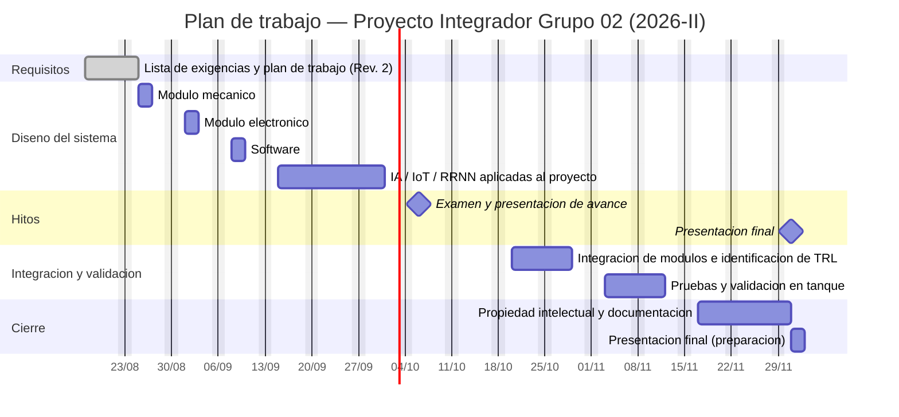

# PLAN DE TRABAJO

**Proyecto:** Sistema inteligente de inspección y determinación del nivel de bioincrustación en linternas de cultivo de concha de abanico (*Argopecten purpuratus*)  
**Cliente:** Productores de cultivo suspendido de concha de abanico (bahías de Sechura, Samanco y afines)  
**Metodología:** VDI 2206  
**Edición:** Rev. 1  
**Fecha de creación:** 25/08/2026 · **Fecha de revisión:** 25/08/2026  
**Elaborado por:** J.L, M.A, M.B, G.S, Y.P  
**Responsables:** [pendiente — por asignar]  
**Revisado por:** [pendiente]  

> Documento complementario de **[Entregable1_Listadeexigencias.md](Entregable1_Listadeexigencias.md)**. Juntos constituyen el Entregable 1 del curso: *"Lista de exigencias y plan de trabajo"*.

---

## 1. Alcance y criterio de planificación

El plan sigue el **modelo en V del VDI 2206**: la rama izquierda (requisitos → diseño del sistema → diseño específico de dominio) se recorre de agosto a octubre, y la rama derecha (integración → verificación → validación) de octubre a diciembre. Cada fase cierra con un entregable verificable, y las pruebas de la rama derecha se corresponden con las verificaciones mínimas exigidas en la fila **E-15 (Control de calidad / Verificación)** de la lista de exigencias.

El semestre académico va del **17/08/2026 al 11/12/2026**. La carga total estimada es de **120 horas** de trabajo de equipo, coherente con la fila **E-21 (Plazos)**.

---

## 2. Fases del proyecto

| # | Fase | Ventana | Rama del modelo en V | Entregable de cierre | Responsable(s) |
|:---:|---|:---:|:---:|---|:---:|
| 1 | **Requisitos** — lista de exigencias y plan de trabajo | S1–S2 (17–25/08) | Izquierda | Lista de exigencias **Rev. 2** + este plan (Checkpoint 2 VDI 2206 superado) | Por asignar |
| 2 | **Diseño del sistema — Módulo mecánico** | 25–27/08 | Izquierda | Envolvente, ventana de captura, sistema de fijación al cabo, balance de flotabilidad (E-02, E-04, E-13) | Por asignar |
| 3 | **Diseño del sistema — Módulo electrónico** | 01–03/09 | Izquierda | Arquitectura electrónica, presupuesto energético, esquema de PCB (E-05, E-09) | Por asignar |
| 4 | **Diseño del sistema — Software** | 08–10/09 | Izquierda | Cadena de procesamiento de imagen, base de datos, interfaz de usuario (E-10) | Por asignar |
| 5 | **IA / IoT / RRNN aplicadas al proyecto** | 15/09–01/10 | Izquierda | Modelo de estimación de cobertura y enlace de datos; base de la Etapa 2 (D-01, D-02, E-11) | Por asignar |
| — | **Hito: examen y presentación de avance** | 06–08/10 | — | Presentación de avance y sustentación | Por asignar |
| 6 | **Integración de módulos e identificación de TRL** | 20–29/10 | Derecha | Prototipo integrado y nivel de madurez tecnológica declarado | Por asignar |
| 7 | **Pruebas y validación en tanque** | 03–12/11 | Derecha | Ensayo de estanqueidad, verificación dimensional y de peso, ensayo de autonomía y validación del MAE (E-15) | Por asignar |
| 8 | **Propiedad intelectual y documentación** | 17/11–01/12 | Derecha | Expediente técnico, búsqueda de antecedentes y documentación final | Por asignar |
| — | **Hito: presentación final** | 01–03/12 | — | Presentación final, póster y entrega del repositorio | Por asignar |

---

## 3. Diagrama de Gantt

---

## 4. Método de seguimiento

| Día | Actividad | Resultado |
|:---:|---|---|
| **Lunes / martes** | Reunión de coordinación del equipo | Reparto de tareas de la semana y confirmación de responsables |
| **Miércoles** | Punto de control | Avance real contra el Gantt; se marcan tareas en riesgo |
| **Jueves** | Replanificación | Ajuste de fechas y reasignación de carga si hay desviación |
| **Domingo** | Acta semanal por correo a todo el equipo (según sílabo del curso) | Registro de acuerdos, pendientes y decisiones tomadas |

**Asignación de responsables.** La columna **Responsable(s)** de la tabla de la lista de exigencias es la fuente única de asignación: cada exigencia (E-01…E-21) y cada deseo (D-01…D-04) tendrá un responsable nominal, y este plan de trabajo hereda esa asignación por fase. Las filas nuevas de la Rev. 2 (E-06, E-15, D-02, D-04) están hoy con `[ ]` y deben cerrarse en la primera reunión de coordinación posterior a la aprobación de la Rev. 2.

**Trazabilidad con el modelo en V.** Toda tarea de la rama derecha (fases 6–8) debe referenciar la exigencia que verifica. Las verificaciones mínimas están fijadas en **E-15** y se ejecutan en la fase 7 (Pruebas y validación en tanque).

**Decisiones pendientes.** Los puntos marcados con `<!-- DECISIÓN DE EQUIPO -->` en la lista de exigencias y todos los valores `*(tentativo — validar en equipo)*` deben resolverse antes del cierre de la fase 2 (diseño mecánico), porque condicionan geometría, energía y costos.

---

## 5. Riesgos identificados

| Riesgo | Impacto | Mitigación |
|---|:---:|---|
| Acceso limitado a un tanque o a una linterna real para validación | Alto | Anticipar la gestión del espacio de ensayo antes de la fase 7; prever un banco de pruebas alternativo con muestras fotografiadas |
| Plazos de importación de componentes (PCB, cámara, sensores) | Alto | Comprar en la fase 3; contemplar equivalentes de mercado nacional en la solución de referencia de E-09 y E-14 |
| Visibilidad del agua por debajo del umbral operativo (E-18) durante la validación | Medio | Definir el criterio de descarte de lecturas y registrar la turbidez de cada ensayo |
| Conjunto de imágenes insuficiente para validar el MAE < 15 % (D-01) | Medio | Iniciar la recolección y anotación de imágenes desde la fase 4, en paralelo al desarrollo |
| Contradicciones de diseño no resueltas por el equipo (valores tentativos) | Medio | Cerrarlas en la primera reunión posterior a la aprobación de la Rev. 2, según la sección 4 |
