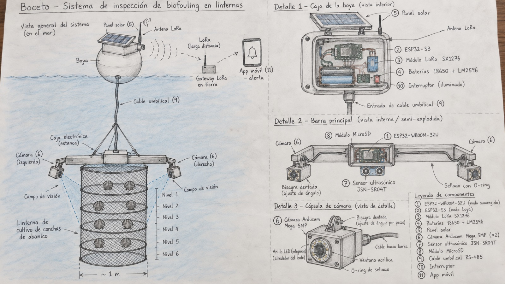
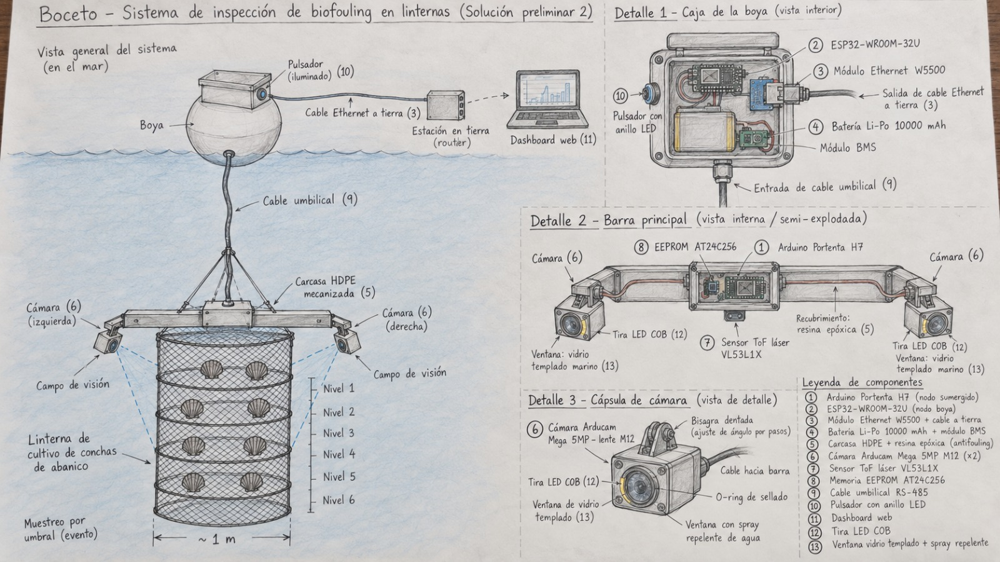
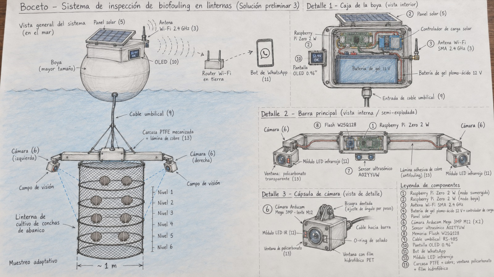
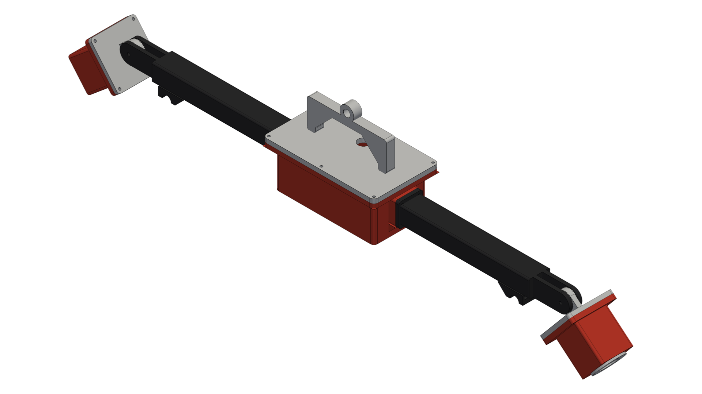
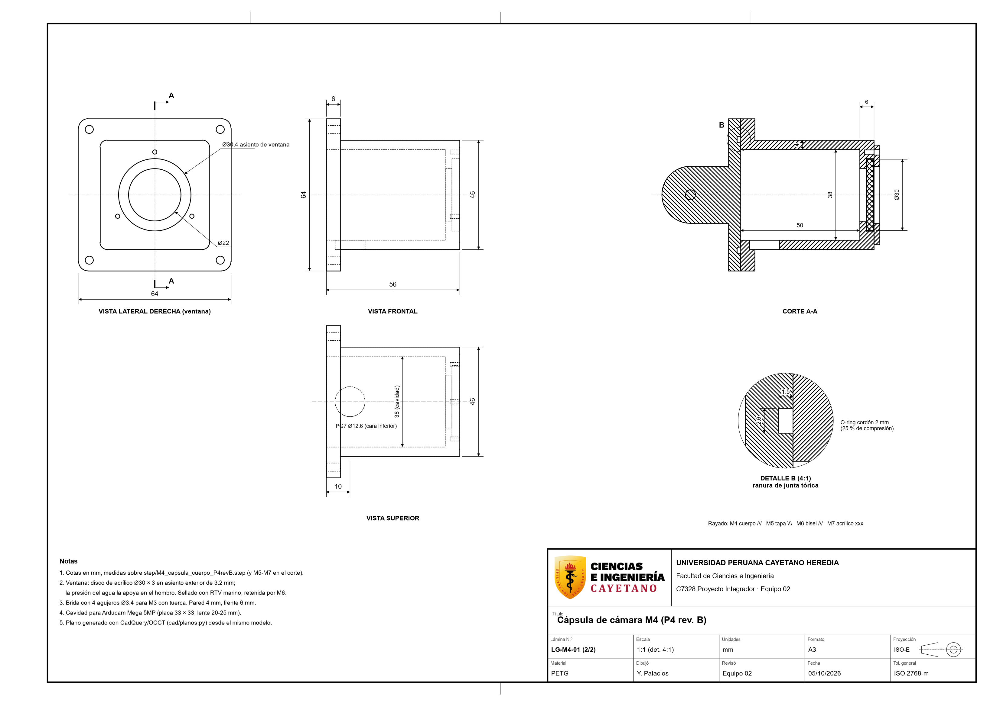

# Bocetos y Diseño 3D
> **LanternGuard: sistema de monitoreo de biofouling en linternas de cultivo de conchas de abanico**

---

## 1. Bocetos

Se hicieron tres bocetos de solución a partir de la matriz morfológica y la evaluación ponderada del Entregable 2. La **Solución 1** es la seleccionada. En los tres bocetos el sistema tiene dos partes: un nodo sumergido (barra con dos cámaras sobre la linterna) y una boya en superficie, unidas por un cable umbilical RS-485.

### 1.1 Solución 1 (seleccionada)

**Elementos (según la leyenda del boceto):**

1. ESP32-WROOM-32U (nodo sumergido)
2. ESP32-S3 (nodo boya)
3. Módulo LoRa SX1276
4. Baterías 18650 + LM2596
5. Panel solar
6. Cámara Arducam Mega 5MP (x2)
7. Sensor ultrasónico JSN-SR04T
8. Módulo MicroSD
9. Cable umbilical RS-485
10. Interruptor
11. App móvil

**Cómo interactúa con el mundo real:** las dos cámaras fotografían la linterna por los lados, con anillo LED integrado para iluminar, y el sensor ultrasónico JSN-SR04T mide la proximidad a la malla. El ESP32 del nodo sumergido guarda los datos en la MicroSD y los envía por el cable RS-485 a la boya. La boya se alimenta con un panel solar y baterías 18650, y su ESP32-S3 transmite por LoRa de larga distancia a un gateway en tierra, que llega a la app móvil como alerta cuando hay que limpiar la linterna.

### 1.2 Solución 2

**Elementos (según la leyenda del boceto):**

1. Arduino Portenta H7 (nodo sumergido)
2. ESP32-WROOM-32U (nodo boya)
3. Módulo Ethernet W5500 y cable a tierra
4. Batería Li-Po 10000 mAh y módulo BMS
5. Carcasa HDPE y resina epóxica (antifouling)
6. Cámara Arducam Mega 5MP con lente M12 (x2)
7. Sensor ToF láser VL53L1X
8. Memoria EEPROM AT24C256
9. Cable umbilical RS-485
10. Pulsador con anillo LED
11. Dashboard web
12. Tira LED COB
13. Ventana de vidrio templado y spray repelente

**Cómo interactúa con el mundo real:** las cámaras con lente M12 y tiras LED COB capturan la linterna a través de ventanas de vidrio templado con spray repelente, y el sensor ToF mide la distancia por láser. El muestreo se activa por umbral (evento). Los datos suben por el cable RS-485 a la boya y de ahí por cable Ethernet a una estación en tierra con router, donde un dashboard web muestra el estado. Depende de un tendido de cable hasta la costa, y la boya funciona con una batería Li-Po sin panel solar.

### 1.3 Solución 3

**Elementos (según la leyenda del boceto):**

1. Raspberry Pi Zero 2 W (nodo sumergido)
2. Raspberry Pi Zero 2 W (nodo boya)
3. Antena Wi-Fi SMA 2.4 GHz
4. Batería de gel plomo-ácido 12 V y controlador de carga
5. Panel solar
6. Cámara Arducam Mega 3MP con lente M12 (x2)
7. Sensor ultrasónico A02YYUW
8. Memoria Flash W25Q128
9. Cable umbilical RS-485
10. Pantalla OLED 0.96"
11. Bot de WhatsApp
12. Módulo LED infrarrojo
13. Carcasa PTFE con lámina de cobre, ventana de policarbonato y film hidrofóbico

**Cómo interactúa con el mundo real:** las cámaras con iluminación infrarroja fotografían la linterna, y la carcasa de PTFE con lámina de cobre busca frenar el crecimiento de organismos sobre el propio equipo. El muestreo es adaptativo. La boya, alimentada por panel solar y una batería de gel de 12 V, se conecta por Wi-Fi 2.4 GHz a un router en tierra, y un bot de WhatsApp avisa al operario. Una pantalla OLED en la boya muestra el estado de la batería, lo que permite revisar el equipo sin abrir la caja. El alcance del Wi-Fi limita la distancia a la costa.

---

## 2. Diseño 3D

El diseño 3D del módulo mecánico se trabajó en CAD sobre la solución seleccionada (Solución 1). Los archivos de esta sección se incorporan al repositorio con el PR de la rama `yoichi/diseno-mecanico`. Hasta que ese PR se integre, los enlaces e imágenes de abajo no se van a mostrar.

### 2.1 Vistas del modelo

**Figura 1.** Vista isométrica del módulo mecánico.

**Figura 2.** Vista explosionada del ensamble.

Otras vistas:

- [Vista frontal](../../Recursos/Imágenes/LG_mec_vista_frontal.png)
- [Vista superior](../../Recursos/Imágenes/LG_mec_vista_superior.png)
- [Vista lateral](../../Recursos/Imágenes/LG_mec_vista_lateral.png)

### 2.2 Planos

**Figura 3.** Plano de ensamble LG-ENS-01 ([PDF](../../Proyecto/MóduloMecánico/planos/LG-ENS-01.pdf)).

**Figura 4.** Plano de la pieza LG-M4-01 ([PDF](../../Proyecto/MóduloMecánico/planos/LG-M4-01.pdf)).

### 2.3 Animación

- [Video de la animación del ensamble (MP4)](../../Recursos/Imágenes/LG_mec_animacion_v2.mp4). Si el MP4 no está disponible, la animación también existe como GIF: `LG_mec_animacion.gif`.

### 2.4 Modelo CAD

- Descripción del modelo, piezas y cómo regenerarlo: [README del Módulo Mecánico](../../Proyecto/MóduloMecánico/README.md).
- Modelo en Onshape: [documento LanternGuard en Onshape](https://cad.onshape.com/documents/334bb52b53534654aa263486/w/5f6a780b6452e0681fd370de/e/d75494b0dece2167eaac1b34?renderMode=0&uiState=6ac3edb87f46c1d8290c1f38)

> **Nota:** los archivos `LG_mec_*`, los planos y el README del Módulo Mecánico llegan al repositorio con el PR de la rama `yoichi/diseno-mecanico`.
