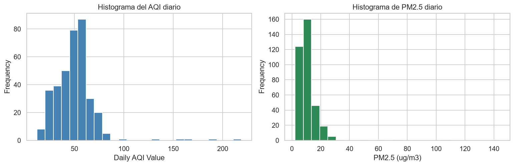
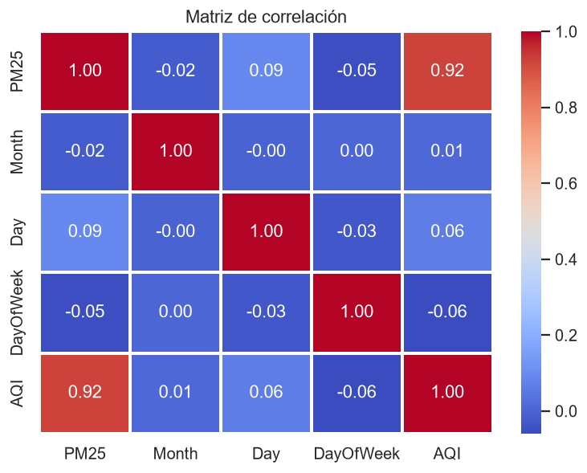
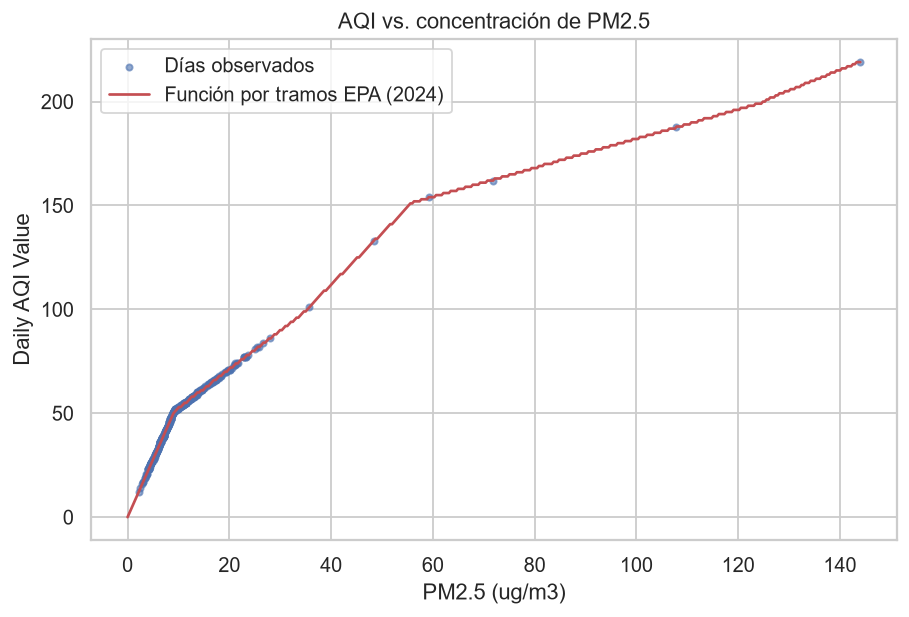
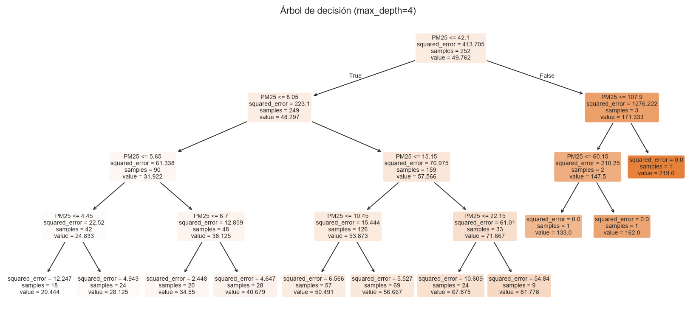
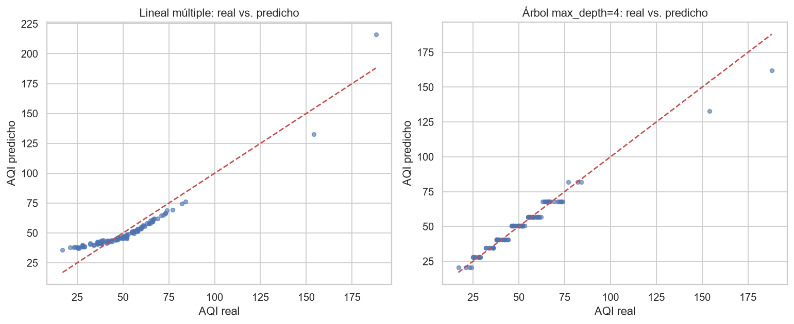
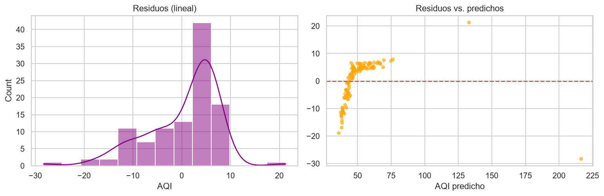

# Taller 3.1: Regresión lineal múltiple y árbol de decisión con datos de calidad del aire (PM2.5, Davenport, Iowa, 2023)

---

**Componente analizado:** material particulado fino PM2.5 (parámetro AQS 88101)

**Período:** 1 de enero de 2023 a 31 de diciembre de 2023

**Fuente de datos:** Air Quality System (AQS), U.S. Environmental Protection Agency [1]

**Unidad:** µg/m³ (condiciones locales)

**Registros analizados:** 360 días con medición

**Archivos:** `Regresion_PM25_Palacios.ipynb` (notebook ejecutado) y `ad_viz_plotval_data_PM25_2023.csv` (datos de la estación)

### Estación elegida

| Dato | Valor |
|---|---|
| Estado | Iowa |
| Condado | Scott |
| Ciudad | Davenport |
| Estación | DAVENPORT, JEFFERSON SCH. |
| Site ID | 191630015 |
| POC | 3 |
| Método | 236 (Teledyne T640, espectroscopía de banda ancha) |
| Latitud / Longitud | 41.530011 / −90.587611 |

Escogí esta estación porque tiene 360 días de 365 (el taller pedía al menos 330) y porque su AQI tiene un rango amplio (12 a 219) con pocos días muy altos, en vez de una serie plana alrededor de "Bueno".

---

## 1. Introducción

### 1.1 Consigna

Con el archivo diario de una estación de la EPA, predecir el índice de calidad del aire (`Daily AQI Value`) con una regresión lineal múltiple y con un árbol de decisión, y compararlos con MSE, MAE y R². Mis compañeros trabajaron con CO, NO₂, SO₂ y O₃. Yo usé **PM2.5**, que es el contaminante que más pesa en el AQI de muchas ciudades y el más relacionado con el humo.

### 1.2 Objetivos

- Explorar el archivo (tipos, nulos, estadística descriptiva, histogramas, correlaciones).
- Entrenar una regresión lineal múltiple y un árbol de decisión con `random_state=123`, igual que en clase.
- Comparar los modelos con MSE, MAE y R² sobre datos de prueba.
- Explicar con honestidad por qué el R² sale alto en este problema.

---

## 2. Metodología

### 2.1 Obtención de los datos

La EPA publica un archivo diario de PM2.5 para todo el país [1]. Descargué `daily_88101_2023.zip` (847 162 filas, todas las estaciones) y filtré una sola estación y un solo POC. Después reordené las columnas al formato de "Download Daily Data" que usaron mis compañeros (`Date`, `Source`, `Site ID`, `POC`, `Daily Mean PM2.5 Concentration`, `Units`, `Daily AQI Value`, etc.) y lo guardé como `ad_viz_plotval_data_PM25_2023.csv`.

Dos detalles del armado que conviene dejar claros:

- El archivo masivo de la EPA no trae el código CBSA numérico, solo el nombre. La columna `CBSA Code` queda vacía en mi CSV (no inventé el número). No se usa en el análisis.
- Este monitor entrega un promedio de 24 horas por día, así que `Daily Obs Count` vale 1 y `Percent Complete` vale 100 todos los días. Son columnas constantes y se descartan.

### 2.2 Herramientas

| Biblioteca | Para qué se usó | Ref. |
|---|---|---|
| `pandas` | Carga, fechas y estadística descriptiva | [2] |
| `numpy` | Cálculos numéricos y la función por tramos del AQI | [3] |
| `matplotlib` y `seaborn` | Histogramas, mapa de calor y dispersión | [4], [5] |
| `scikit-learn` | Partición, `LinearRegression`, `DecisionTreeRegressor` y métricas | [6] |

El notebook se ejecutó en local con `jupyter nbconvert --execute`, sin editar a mano ninguna salida.

### 2.3 Preparación

1. `pd.to_datetime` convierte `Date` a fecha, y de ahí salen `Month`, `Day` y `DayOfWeek`. El año no se usa porque es constante.
2. Se renombran `Daily Mean PM2.5 Concentration` a `PM25` y `Daily AQI Value` a `AQI`.
3. Predictores: `PM25`, `Month`, `Day`, `DayOfWeek`. Objetivo: `AQI`.
4. `train_test_split(test_size=0.3, random_state=123)`: 252 días de entrenamiento y 108 de prueba.

---

## 3. Resultados

### 3.1 Estructura y estadística descriptiva

El archivo tiene 360 filas y 21 columnas. Los únicos nulos son los de `CBSA Code` (vacía por lo explicado arriba). Del resto, 17 columnas son constantes para esta estación.

| Variable | Media | Desv. est. | Mín. | Mediana | Máx. |
|---|---:|---:|---:|---:|---:|
| PM25 (µg/m³) | 11.40 | 11.02 | 2.20 | 9.50 | 144.00 |
| AQI | 50.25 | 20.88 | 12 | 52 | 219 |

La media (11.40) está por encima de la mediana (9.50): la distribución tiene cola larga a la derecha, producto de pocos días con concentraciones muy altas.

**Figura 1.** Histogramas del AQI y de PM2.5. Casi todos los días están en la zona baja y hay pocos valores extremos.

### 3.2 Correlaciones

**Figura 2.** Matriz de correlación de Pearson.

| Variable | Correlación con AQI |
|---|---:|
| PM25 | 0.923 |
| Month | 0.008 |
| Day | 0.062 |
| DayOfWeek | −0.059 |

Solo `PM25` se relaciona con el AQI. Las variables de calendario están cerca de cero.

### 3.3 De dónde sale el AQI

El AQI de PM2.5 no se mide, se **calcula** a partir de la concentración con una función lineal por tramos [7]. En el notebook programé esa función con dos tablas de cortes y comparé con el AQI del archivo:

| Tabla de cortes | Días en que coincide con el archivo |
|---|---:|
| Anterior (límite de "Bueno" en 12.0 µg/m³) | 0.6 % |
| Revisada en 2024 (límite de "Bueno" en 9.0 µg/m³) | 100.0 % |

Con la tabla revisada la coincidencia es total (error absoluto máximo 0), así que el archivo que bajé ya usa los cortes nuevos. El AQI de esta estación es, día por día, una función exacta de `PM25`.

**Figura 3.** AQI observado frente a PM2.5. Los puntos caen sobre la función por tramos (línea roja). Se ve cómo la pendiente cambia entre tramos.

### 3.4 Regresión lineal múltiple

Intercepto: 30.518.

| Variable | Coeficiente |
|---|---:|
| PM25 | 1.7291 |
| Month | 0.1530 |
| Day | −0.0450 |
| DayOfWeek | −0.1207 |

### 3.5 Árbol de decisión

El árbol sin límite llegó a profundidad 8 con 65 hojas. En la importancia de variables, `PM25` concentra 0.9958 y `Day` 0.0042 (`Month` y `DayOfWeek` salen en 0). También probé `max_depth=4` para ver el efecto de limitar el árbol.

**Figura 4.** Árbol de decisión con `max_depth=4`.

### 3.6 Comparación de métricas (conjunto de prueba, 108 días)

| Modelo | MSE | MAE | R² prueba | R² entrenamiento |
|---|---:|---:|---:|---:|
| Lineal múltiple (PM25 + fecha) | 54.570 | 6.016 | 0.887 | 0.835 |
| Árbol sin límite de profundidad | 10.657 | 0.620 | 0.978 | 1.000 |
| Árbol `max_depth=4` | 16.396 | 2.458 | 0.966 | 0.981 |
| Lineal solo calendario | 481.669 | 14.125 | −0.000 | 0.008 |
| Árbol `max_depth=4` solo calendario | 454.214 | 13.232 | 0.057 | 0.592 |
| Modelo nulo (siempre la media) | 484.25 | 13.86 | −0.006 | n/a |

**Figura 5.** Valores reales frente a predichos, regresión lineal y árbol de profundidad 4.

**Figura 6.** Residuos de la regresión lineal: histograma y residuos contra predichos. El residuo absoluto máximo fue 28.33 y la desviación 7.41.

---

## 4. Discusión

### 4.1 El R² alto no es un descubrimiento

Un R² de 0.887 (lineal) o 0.978 (árbol) se ve muy bien, pero aquí **casi es una identidad**. El AQI se calcula directamente de la concentración de PM2.5 con una función por tramos, y yo estoy poniendo esa misma concentración como predictor. El modelo no "descubre" nada del aire: reconstruye una fórmula que ya existe. En la sección 3.3 lo comprobé: la fórmula reproduce el AQI del archivo en el 100 % de los días.

### 4.2 Por qué gana el árbol

La función es lineal dentro de cada tramo, pero la pendiente cambia entre tramos (1.863 puntos de AQI por µg/m³ entre 9.1 y 35.4, y 0.701 entre 55.5 y 125.4, según los cortes). Una sola recta no puede seguir esos quiebres, y se nota en el MSE de 54.57. Un árbol parte el eje de PM25 en intervalos y devuelve un valor casi constante por intervalo, que es justo la forma de una función por tramos. Por eso un árbol de profundidad 4 ya baja el MSE a 16.40, y uno sin límite lo baja a 10.66.

El coeficiente de `PM25` en la lineal (1.7291) es una pendiente única que promedia esos tramos.

### 4.3 Sobreajuste

El árbol sin límite tiene R² de entrenamiento 1.000 y de prueba 0.978. La brecha es chica en este caso porque la relación subyacente es muy limpia, pero el 1.000 en entrenamiento indica que memoriza (65 hojas para 252 días). En un problema con ruido real ese árbol generalizaría peor. La lineal es lo contrario: ajusta menos (0.835 en entrenamiento) y en prueba da 0.887, un poco más alto. Con solo 108 días de prueba y unos pocos días extremos, esa diferencia depende de qué días cayeron en cada partición, así que no la leo como una ventaja real de la lineal.

### 4.4 Qué pasa sin la concentración

Cuando quito `PM25` y dejo solo mes, día y día de la semana, el R² cae a −0.000 (lineal) y 0.057 (árbol de profundidad 4), y el MSE queda cerca del modelo nulo (481.67 y 454.21 contra 484.25). El árbol llega a 0.592 en entrenamiento y 0.057 en prueba, es decir, memoriza el calendario sin generalizar. Esto confirma que toda la capacidad predictiva venía de `PM25`.

### 4.5 Coeficientes del calendario

`Month`, `Day` y `DayOfWeek` tienen coeficientes pequeños (0.15, −0.05 y −0.12 en el modelo completo) y correlaciones cercanas a cero con el AQI. No hay evidencia de un efecto de calendario en una sola estación y un solo año. Con 360 datos no me atrevo a interpretar esos signos.

### 4.6 Limitaciones

- Una sola estación y un solo año: los resultados no se generalizan a otras ciudades.
- Los pocos días extremos (PM25 hasta 144 µg/m³) pesan mucho en el MSE y en el R².
- El AQI es una variable derivada. Un ejercicio más honesto sería predecir la concentración de PM2.5 de mañana a partir de los días anteriores y variables meteorológicas, que no están en este archivo.
- No hice validación cruzada. Con 108 días de prueba, las métricas dependen de la partición.

---

## 5. Aplicación en LanternGuard

LanternGuard monitorea el biofouling en linternas de concha de abanico con un nodo sumergido (ESP32 y dos cámaras Arducam), un enlace RS-485 a una boya (ESP32-S3 con LoRa) y procesamiento de imágenes fuera del nodo. Este taller deja tres ideas útiles para ese sistema:

1. **Un índice por tramos también aparece en LanternGuard.** Igual que el AQI convierte una concentración en categorías (Bueno, Moderado, etc.), el nivel de ensuciamiento de una malla se puede definir como categorías a partir de una variable continua, por ejemplo el porcentaje de área cubierta que estima el procesamiento de imágenes. Si el índice se define así, un árbol de decisión pequeño es una herramienta natural y barata para asignar la categoría, y se puede revisar a simple vista.
2. **Cuidado con la fuga de la variable objetivo.** Si el índice de biofouling se calcula desde el área cubierta y luego uso el área cubierta para "predecir" ese índice, obtendré un R² altísimo sin aprender nada, como me pasó aquí. Lo interesante sería predecir el ensuciamiento futuro (por ejemplo, el valor de la semana siguiente) con variables que sí se conocen antes: temperatura, clorofila o turbidez del nodo, días desde la última limpieza.
3. **Calendario, poca señal.** En este taller el mes y el día no explicaron nada, pero con un fenómeno biológico estacional como la fijación de organismos podría ser distinto. La forma de comprobarlo es la misma: comparar contra el modelo nulo y contra la variante sin esa variable, como hice en la sección 4.4.

Además, un árbol pequeño se puede escribir como reglas `if/else` y ejecutarse directamente en el ESP32 de la boya, sin enviar todo a un servidor. Eso va bien con un enlace LoRa de poco ancho de banda.

---

## 6. Archivos

| Archivo | Descripción |
|---|---|
| `Regresion_PM25_Palacios.ipynb` | Notebook ejecutado de principio a fin |
| `ad_viz_plotval_data_PM25_2023.csv` | 360 días de PM2.5 de la estación 191630015 |
| `Recursos/Imágenes/Taller31_Palacios_*.png` | Seis figuras exportadas desde el notebook |

---

## 7. Referencias

[1] U.S. Environmental Protection Agency, "AirData: Pre-generated data files," *Air Quality System (AQS)*. [En línea]. Disponible: https://aqs.epa.gov/aqsweb/airdata/download_files.html

[2] W. McKinney, "Data structures for statistical computing in Python," en *Proc. 9th Python in Science Conf.*, 2010, pp. 56-61.

[3] C. R. Harris *et al.*, "Array programming with NumPy," *Nature*, vol. 585, pp. 357-362, 2020.

[4] J. D. Hunter, "Matplotlib: A 2D graphics environment," *Computing in Science & Engineering*, vol. 9, no. 3, pp. 90-95, 2007.

[5] M. L. Waskom, "seaborn: statistical data visualization," *Journal of Open Source Software*, vol. 6, no. 60, art. 3021, 2021.

[6] F. Pedregosa *et al.*, "Scikit-learn: Machine learning in Python," *Journal of Machine Learning Research*, vol. 12, pp. 2825-2830, 2011.

[7] U.S. Environmental Protection Agency, "Technical Assistance Document for the Reporting of Daily Air Quality: the Air Quality Index (AQI)," Research Triangle Park, NC, EPA.
