# Taller 04: Redes neuronales (CNN, Keras y Perceptrón)

---

**Curso:** Proyectos de Ingeniería

**Integrante:** Palacios, Yoichi (Equipo 02)

**Notebook:** `Redes_neuronales_Palacios.ipynb` (ejecutado completo, en local y con CPU)

**Herramientas:** Python 3.12, PyTorch 2.14 (CPU) [8], torchvision, TensorFlow 2.21 con Keras, scikit-learn, matplotlib y seaborn

**Datos:** TrashNet (vidrio y plástico), IMDB y MNIST

Todas las cifras de este documento salen de la ejecución del notebook, con semilla 123 en la parte de modelos y 42 en la partición de TrashNet (la de `trash_dataset.py`). Con otra semilla o con GPU los números pueden moverse un poco.

---

## Introducción

Una red neuronal artificial es una composición de capas que aprenden pesos ajustados por descenso de gradiente [1]. En este taller trabajé tres niveles de la misma idea:

1. **Perceptrón:** una sola neurona con una función de activación, la pieza mínima.
2. **Keras:** redes densas apiladas, entrenadas con muy poco código, para ver sobreajuste y cómo controlarlo.
3. **CNN:** redes con convoluciones, hechas para imágenes, que es lo que va a necesitar LanternGuard para leer las fotos de las cámaras.

Reutilicé los notebooks de clase (`Redes_neuronales_ss`, `CNN_TransferLearning`, `Keras_Clasificacion_binaria`, `Red_neuronal_con_Keras` y `Perceptrón`) y los ejecuté de principio a fin. En la parte del perceptrón encontré un error en un ejemplo de la clase, explicado en la sección 3.2.

---

## 1. CNN con PyTorch (TrashNet: vidrio contra plástico)

### 1.1 Datos

TrashNet [2] reúne fotos de residuos sobre fondo claro. Usé solo dos clases, vidrio (0) y plástico (1), en escala de grises, con la partición estratificada 70/15/15 de `trash_dataset.py`:

| Conjunto | Vidrio | Plástico | Total |
|---|---:|---:|---:|
| Entrenamiento | 350 | 337 | 687 |
| Validación | 75 | 72 | 147 |
| Prueba | 76 | 73 | 149 |

Las clases están casi balanceadas, así que la exactitud (*accuracy*) es una métrica razonable y el azar da alrededor de 50 %.

**Decisión por tiempo de cómputo:** las fotos originales son de 384x512 px. En una prueba de una época con la CNN de clase, a tamaño completo tomó 51 s y a 128x128 tomó 5.5 s, así que redimensioné a **144x192** (misma proporción 3:4) para la CNN. Las épocas son las de la clase (8 y 6). La ResNet18 usa 224x224, como en clase.

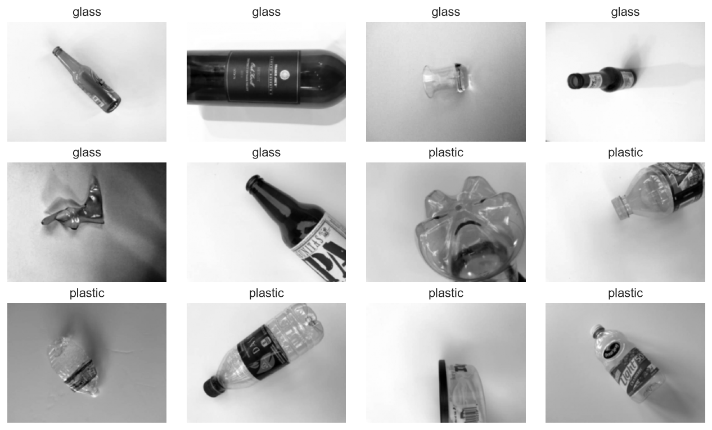

**Figura 1.** Ejemplos de vidrio y plástico del conjunto de entrenamiento.

### 1.2 CNN desde cero

Tres bloques `Conv2d` + ReLU (los dos primeros con `MaxPool2d`), `AdaptiveAvgPool2d` y una capa lineal, 23 426 parámetros, optimizador Adam con lr = 1e-3 y 8 épocas. Tomó 66 s en total en CPU.

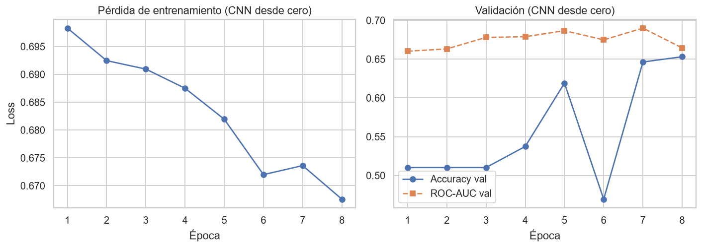

**Figura 2.** Pérdida de entrenamiento y métricas de validación de la CNN desde cero.

La pérdida baja muy poco (de 0.698 a 0.668) y la exactitud de validación oscila (por ejemplo 0.619, 0.469, 0.646 y 0.653 en las épocas 5 a 8). Es un modelo que **no aprendió lo suficiente**, no uno que sobreajusta. Resultado en prueba:

| Métrica | Valor |
|---|---:|
| Accuracy | 0.5436 |
| ROC-AUC | 0.6096 |
| F1 vidrio / plástico | 0.5526 / 0.5342 |

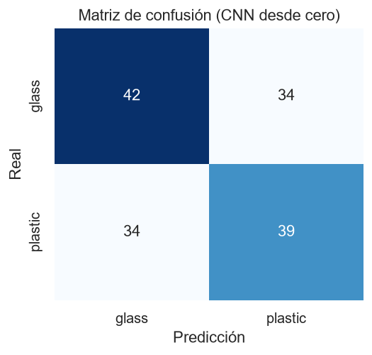

**Figura 3.** Matriz de confusión de la CNN desde cero: 42 y 39 aciertos, 34 y 34 errores.

Una exactitud de 54.4 % con dos clases balanceadas está apenas por encima del azar. Con solo 687 imágenes en escala de grises, 8 épocas y una red pequeña, esta CNN no alcanza a distinguir un envase de vidrio transparente de uno de plástico transparente, que se parecen mucho en una foto en grises.

### 1.3 Data augmentation

Misma arquitectura, entrenada 6 épocas con rotaciones de hasta 10° y traslaciones de hasta 5 %.

| Modelo | Accuracy en prueba | ROC-AUC en prueba |
|---|---:|---:|
| Sin augmentation (8 épocas) | 0.5436 | 0.6096 |
| Con augmentation (6 épocas) | 0.6040 | 0.6547 |

Con augmentation sube de 0.544 a 0.604. Hay que leerlo con cuidado: son 149 imágenes de prueba (cada imagen vale 0.67 puntos), las épocas no son las mismas (8 contra 6) y la validación de ambas oscila bastante. Es una mejora posible, pero no una prueba de que el augmentation sea la causa.

### 1.4 Transfer learning con ResNet18

Se parte de una ResNet18 preentrenada en ImageNet [3], se repite el canal gris en tres canales y se reemplaza la última capa por una de dos salidas.

- **Etapa 1:** se congela todo el backbone y se entrena solo la capa final (1 026 parámetros), 4 épocas con lr = 1e-3. Tomó 106 s.
- **Etapa 2 (fine-tuning):** se descongela `layer4` (8 394 754 parámetros entrenables), 4 épocas con lr = 1e-4. Tomó 143 s.

| Época | Etapa 1 val. acc. | Etapa 1 val. AUC | Etapa 2 val. acc. | Etapa 2 val. AUC |
|---:|---:|---:|---:|---:|
| 1 | 0.6463 | 0.7050 | 0.8912 | 0.9472 |
| 2 | 0.7347 | 0.8406 | 0.9048 | 0.9641 |
| 3 | 0.7687 | 0.8752 | 0.8844 | 0.9637 |
| 4 | 0.7687 | 0.8946 | 0.8912 | 0.9696 |

Resultado en prueba: **accuracy 0.9060 y ROC-AUC 0.9548**. Matriz de confusión: 72 vidrios bien clasificados y 4 mal, 63 plásticos bien y 10 mal. La precisión del plástico es 0.9403 y su recall es 0.8630: el modelo es más propenso a llamar "vidrio" a un plástico.

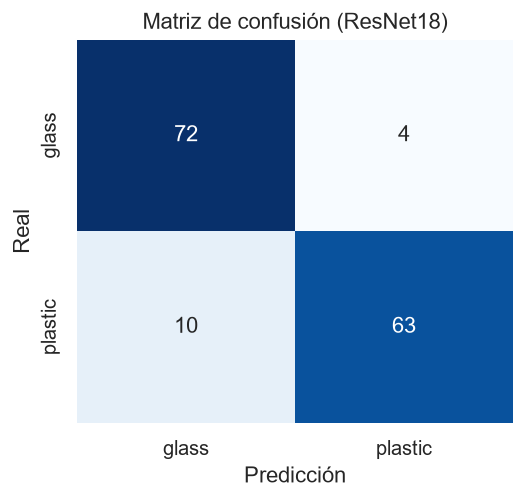

**Figura 4.** Matriz de confusión de la ResNet18 con transfer learning.

### 1.5 Comparación global

| Modelo | Accuracy | ROC-AUC |
|---|---:|---:|
| CNN desde cero | 0.5436 | 0.6096 |
| CNN + augmentation | 0.6040 | 0.6547 |
| Transfer learning (ResNet18) | 0.9060 | 0.9548 |

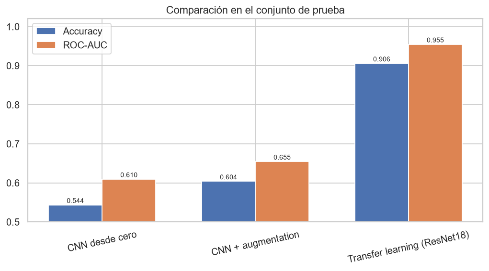

**Figura 5.** Comparación de los tres modelos en el conjunto de prueba.

La diferencia entre el modelo desde cero y el de transfer learning (36 puntos de exactitud) es demasiado grande para atribuirla al tamaño pequeño de la prueba. La causa es que la ResNet18 ya trae filtros útiles aprendidos en un conjunto enorme de imágenes, y con 687 fotos la CNN desde cero no puede aprender esos filtros por sí sola.

### 1.6 Interpretabilidad con Grad-CAM

Grad-CAM [4] pondera los mapas de la última capa convolucional (`layer4`) con el gradiente de la clase predicha, y da un mapa de calor de dónde se apoyó el modelo.

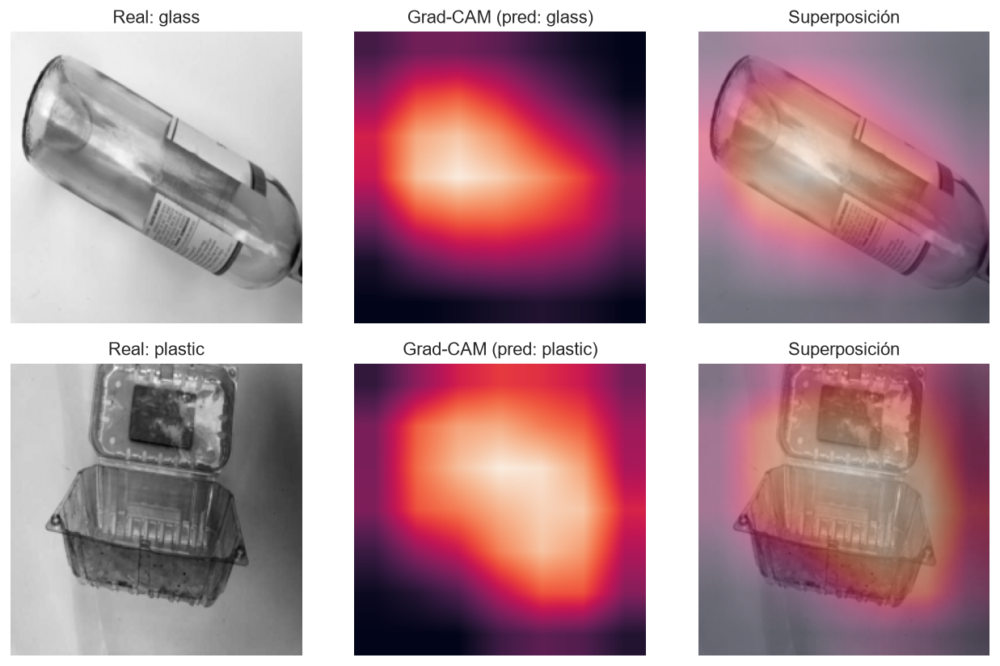

**Figura 6.** Grad-CAM de la ResNet18 para una imagen de vidrio y una de plástico del conjunto de prueba (ambas bien clasificadas). El mapa es de 7x7 celdas, por eso es borroso.

En estos dos ejemplos el calor se concentra sobre el objeto y no sobre el fondo. Con solo dos imágenes no se puede concluir que el modelo siempre mire el objeto: sirve como revisión puntual, no como prueba.

---

## 2. Keras: clasificación binaria con IMDB y red densa con MNIST

### 2.1 IMDB (reseñas positivas o negativas)

Se usan las 10 000 palabras más frecuentes de las reseñas de IMDB [5]: 25 000 de entrenamiento (12 500 positivas y 12 500 negativas) y 25 000 de prueba. Cada reseña pasa a un vector *one-hot* de 10 000 posiciones. Se reservan 10 000 reseñas del entrenamiento como validación, quedan 15 000 para entrenar. Cada modelo se entrena 20 épocas con RMSprop, lote de 512 y pérdida `binary_crossentropy`.

Modelo base: Dense(16, ReLU), Dense(16, ReLU) y Dense(1, sigmoide). Variantes: más pequeño (4 y 4 neuronas), regularización L2 de 0.001 y Dropout de 0.5.

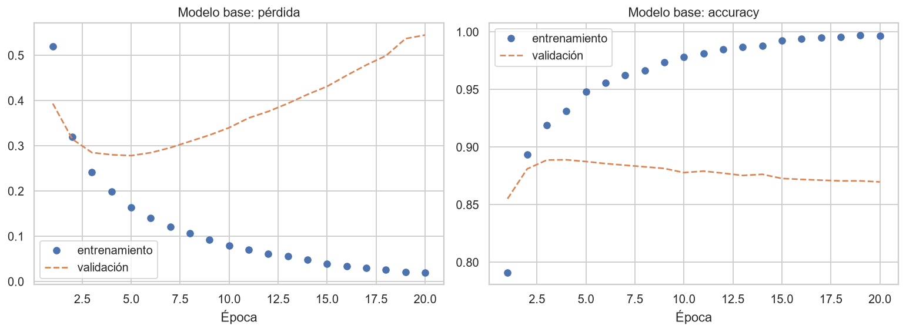

**Figura 7.** Modelo base: pérdida y exactitud de entrenamiento y validación.

**Sobreajuste en el modelo base.** La exactitud de entrenamiento llega a 0.9965 pero la de validación se queda en 0.8698, y la pérdida de validación toca su mínimo (0.2784) en la época 5 y después sube hasta 0.5450 en la época 20. A partir de la época 5 la red memoriza las reseñas de entrenamiento.

| Variante | Mejor val. loss (época) | Val. loss final (época 20) | Test loss | Test accuracy |
|---|---:|---:|---:|---:|
| Base (16-16) | 0.2784 (5) | 0.5450 | 0.5881 | 0.8577 |
| Pequeño (4-4) | 0.2745 (10) | 0.3329 | 0.3581 | 0.8704 |
| L2 (0.001) | 0.3322 (5) | 0.4337 | 0.4572 | 0.8634 |
| Dropout (0.5) | 0.2925 (7) | 0.5131 | 0.5415 | 0.8742 |

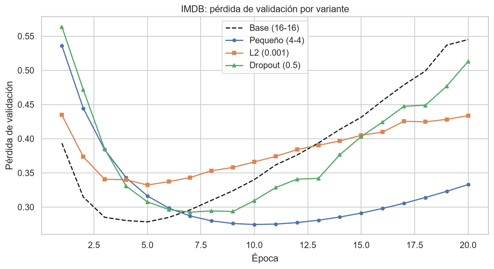

**Figura 8.** Pérdida de validación de las cuatro variantes.

Lectura de la tabla:

- **El modelo pequeño** retrasa el sobreajuste: su mínimo llega en la época 10 y a la época 20 su pérdida (0.3329) es la más baja de las cuatro. Una red más grande no es mejor para un problema simple.
- **L2** sube menos que el base (0.4337 contra 0.5450 al final), pero su mínimo es el más alto de todos (0.3322).
- **Dropout** retrasa un poco el mínimo (época 7) y tiene la mayor exactitud en prueba (0.8742), pero su pérdida final (0.5131) sigue siendo alta.
- Las diferencias de exactitud en prueba entre variantes son de 1 a 1.7 puntos, con una sola semilla. No las leo como una clasificación firme. Las diferencias de pérdida son más grandes y más claras.
- Lo más útil para cualquier variante sería **detener el entrenamiento** cerca del mínimo de validación (*early stopping*), que aquí está entre las épocas 5 y 10.

Predicción de ejemplo con el modelo base: para la reseña 10 del conjunto de prueba dio P(positiva) = 0.9928 y su etiqueta real es positiva.

### 2.2 MNIST con una red densa

Se usa MNIST [7]. Dense(512, ReLU) y Dense(10, softmax), 407 050 parámetros, 5 épocas, lote de 128 y pérdida `categorical_crossentropy`. La exactitud de entrenamiento por época fue 0.9258, 0.9693, 0.9802, 0.9863 y 0.9905. En el conjunto de prueba (10 000 imágenes) dio **accuracy 0.9788** y pérdida 0.0664.

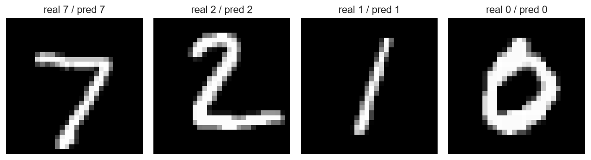

**Figura 9.** Cuatro dígitos de prueba con su clase real y la predicha.

---

## 3. Perceptrón

### 3.1 Funciones de activación

Un perceptrón calcula `z = w·x + b` y le aplica una función de activación. Con el ejemplo de clase (presión arterial 100 y colesterol HDL 50, pesos 0.5 y −0.5, sesgo −30) sale z = −5. El escalón da 0 y tanh da −0.9999: ambos indican "no", pero tanh entrega una salida continua y derivable, que es lo que permite entrenar con gradiente, mientras que el escalón solo da 0 o 1.

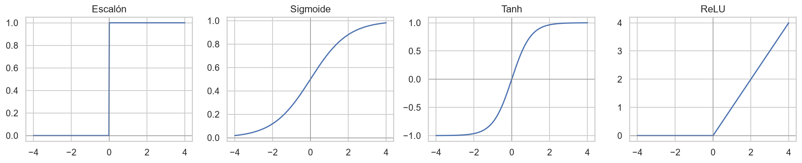

**Figura 10.** Funciones de activación: escalón, sigmoide, tanh y ReLU.

### 3.2 Compuertas AND y OR

| Compuerta | Pesos | Sesgo | Salidas para (0,0), (0,1), (1,0), (1,1) |
|---|---|---:|---|
| AND | 0.4 y 0.4 | −0.5 | 0, 0, 0, 1 (correcto) |
| AND (ejemplo de clase) | 0.8 y 0.5 | −0.7 | 0, 0, **1**, 1 (**no es AND**) |
| AND (corregido) | 0.8 y 0.5 | −1.0 | 0, 0, 0, 1 (correcto) |
| OR | 2 y 1 | −0.5 | 0, 1, 1, 1 (correcto) |

**Error encontrado en el material de clase.** El segundo ejemplo de AND (pesos 0.8 y 0.5, sesgo −0.7) no es un AND: con la entrada (1, 0) la suma es 0.8 − 0.7 = 0.1, que es mayor o igual a cero, así que el escalón dispara 1. Lo que calcula es "la primera entrada". Con sesgo −1.0 sí funciona, porque 0.8 − 1.0 = −0.2 queda negativo y 0.8 + 0.5 − 1.0 = 0.3 queda positivo.

### 3.3 El problema XOR

Una sola neurona separa el plano con una recta. AND y OR se pueden separar con una recta, XOR no. Lo comprobé buscando: probé 226 981 combinaciones de dos pesos y un sesgo en una malla de −3 a 3 y **ninguna** reproduce XOR con una sola neurona.

Con dos capas sí se resuelve: una neurona calcula OR, otra calcula NAND, y una tercera hace el AND de ambas. El notebook lo verifica y da las salidas 0, 1, 1, 0.

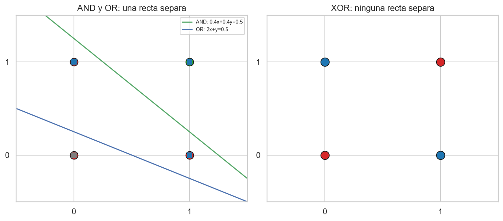

**Figura 11.** A la izquierda, AND y OR: las rectas separan los puntos (círculo grande: AND, verde si da 1 y rojo si da 0; cuadrado pequeño: OR, azul si da 1 y gris si da 0). A la derecha, XOR: los puntos del mismo color están en esquinas opuestas y ninguna recta los separa.

Esto es la razón de ser de las capas ocultas: una sola capa solo resuelve problemas linealmente separables [6].

---

## 4. Aplicación en LanternGuard

LanternGuard mide el biofouling en linternas de concha de abanico con un nodo sumergido (ESP32 con dos cámaras Arducam), un enlace RS-485 a una boya con un ESP32-S3 y LoRa, y el procesamiento de imágenes se hace fuera del nodo. Del taller salen estas conclusiones concretas.

**Cómo clasificaría una CNN la malla.** La malla de la linterna se puede dividir en celdas (por ejemplo, cuadrículas de la foto de cada nivel). Una CNN recibiría cada celda y la clasificaría como *limpia* o *con biofouling*. El porcentaje de celdas con biofouling sería el indicador del sistema, y la alerta se dispararía al pasar un umbral. Si se necesita más detalle, el siguiente paso es una segmentación (clasificar cada píxel) para medir el área cubierta, pero la clasificación por celdas es más barata de etiquetar y más fácil de empezar.

**Por qué transfer learning.** En este taller, con 687 imágenes de entrenamiento, la CNN desde cero quedó en 0.544 de exactitud y la ResNet18 preentrenada llegó a 0.906. En LanternGuard las imágenes de campo van a ser pocas al inicio, porque hay que sumergir el equipo, esperar a que crezca el biofouling y etiquetar a mano. En ese escenario, partir de un modelo preentrenado y afinar solo la parte final es lo viable. Habría que verificarlo con imágenes reales.

**Diferencias con este experimento que hay que tener presentes:**

- Aquí usé escala de grises porque lo pedía la clase. En biofouling el **color** probablemente informa (algas verdes y marrones sobre malla), así que LanternGuard debería usar 3 canales.
- La iluminación bajo el agua cambia con la turbidez y la profundidad. Para eso sirve el *augmentation* con cambios de brillo y contraste, y las cámaras llevan iluminación propia (anillo LED).
- Con pocas imágenes y dos clases hay que revisar con Grad-CAM que el modelo mire la malla y no un reflejo o el fondo (en la Figura 6 el mapa cae sobre el objeto, pero eso fue con dos imágenes).
- Como el procesamiento es fuera del nodo, el costo de la CNN (CPU de un servidor) no pesa en la batería del nodo. Lo que sí hay que cuidar es cuántas fotos se envían por el enlace LoRa, por eso conviene que el nodo envíe pocas fotos y solo cuando hace falta.
- La métrica a vigilar es el **recall de la clase biofouling**: dejar pasar una linterna sucia cuesta más que una falsa alarma. En este taller la clase con más errores fue plástico, con recall de 0.8630, y es el tipo de desbalance de errores que hay que mirar.

**Keras y perceptrón.** El caso de IMDB mostró que sin *early stopping* una red entrenada de más memoriza (pérdida de validación de 0.2784 a 0.5450). Para LanternGuard eso implica guardar el mejor modelo según validación. El perceptrón con umbral (escalón) sirve como lógica final de alerta (por ejemplo, "si el porcentaje de biofouling supera X, avisar"), que no necesita entrenarse.

---

## 5. Conclusiones

- **Perceptrón:** una neurona separa con una recta. AND y OR sí, XOR no (0 de 226 981 combinaciones), y se resuelve con dos capas. Además, el ejemplo de AND con sesgo −0.7 de la clase no es un AND.
- **Keras:** una red demasiado grande para un problema simple sobreajusta. En IMDB, la pérdida de validación del modelo base toca su mínimo en la época 5 (0.2784) y termina en 0.5450. Reducir el tamaño, L2 y Dropout lo atenúan, y el modelo pequeño es el que menos pérdida tiene al final.
- **CNN:** con pocos datos y una red pequeña, la CNN desde cero no sale del azar (0.544). El augmentation ayuda algo (0.604) y el transfer learning cambia el panorama (0.906 de exactitud y 0.9548 de AUC).
- **Limitación general:** los conjuntos de prueba son chicos (149 imágenes), cada configuración se entrenó con una sola semilla y las diferencias pequeñas no son concluyentes.

---

## 6. Archivos

| Archivo | Descripción |
|---|---|
| `Redes_neuronales_Palacios.ipynb` | Notebook ejecutado de principio a fin |
| `trash_dataset.py` | Clase de dataset de la clase (sin cambios) |
| `.gitignore` | Excluye la carpeta `_datos/` (TrashNet, unos 43 MB, el notebook lo descarga solo) |
| `Recursos/Imágenes/Taller4_Palacios_*.png` | Once figuras exportadas desde el notebook |

Para reproducirlo: `pip install torch torchvision tensorflow scikit-learn matplotlib seaborn` y ejecutar el notebook. La primera ejecución descarga TrashNet, los pesos de la ResNet18, IMDB y MNIST.

---

## 7. Referencias

[1] I. Goodfellow, Y. Bengio y A. Courville, *Deep Learning*. Cambridge, MA, EE. UU.: MIT Press, 2016.

[2] G. Thung y M. Yang, "Classification of trash for recyclability status," proyecto del curso CS229, Stanford University, 2016. Datos: https://github.com/garythung/trashnet

[3] K. He, X. Zhang, S. Ren y J. Sun, "Deep residual learning for image recognition," en *Proc. IEEE Conf. Computer Vision and Pattern Recognition (CVPR)*, 2016, pp. 770-778.

[4] R. R. Selvaraju *et al.*, "Grad-CAM: Visual explanations from deep networks via gradient-based localization," en *Proc. IEEE Int. Conf. Computer Vision (ICCV)*, 2017, pp. 618-626.

[5] A. L. Maas *et al.*, "Learning word vectors for sentiment analysis," en *Proc. 49th Annual Meeting of the ACL*, 2011, pp. 142-150.

[6] M. Minsky y S. Papert, *Perceptrons: An Introduction to Computational Geometry*. Cambridge, MA, EE. UU.: MIT Press, 1969.

[7] Y. LeCun, L. Bottou, Y. Bengio y P. Haffner, "Gradient-based learning applied to document recognition," *Proc. IEEE*, vol. 86, no. 11, pp. 2278-2324, 1998. (MNIST)

[8] A. Paszke *et al.*, "PyTorch: An imperative style, high-performance deep learning library," en *Advances in Neural Information Processing Systems*, vol. 32, 2019.
