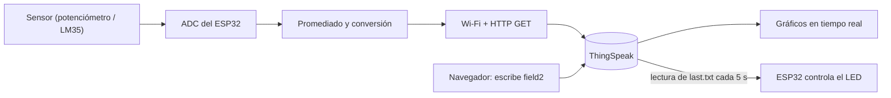

# Taller 5 (IoT): Actividades del 1 a 5 — Adquisición de datos, conectividad Wi-Fi y control desde la nube

---

**Curso:** Proyectos de Ingeniería — Taller de Internet de las Cosas (IoT)

**Equipo:** Equipo 02

**Integrante:** Antezana, María

**Hardware:** ESP32 Dev Kit V1, kit de sensores, cables Jumpers, multímetro y protoboard

**Software:** Arduino IDE 2.3.10, núcleo `esp32` v3.3.12, lenguaje C++ (Arduino)

**Plataforma IoT utilizada:** ThingSpeak

---

## 1. Introducción

El Internet de las Cosas (IoT) conecta dispositivos físicos equipados con sensores y actuadores a redes de datos, de modo que puedan medir variables del entorno, enviarlas a la nube y recibir órdenes de forma remota. En este taller se trabajó con un microcontrolador **ESP32**, que integra procesador de doble núcleo, conversor analógico-digital (ADC) y conectividad Wi-Fi en un solo chip [1], para recorrer el ciclo completo de una solución IoT básica:

1. **Adquirir** una señal analógica y convertirla a una magnitud física (en nuestro caso, se usó voltaje y temperatura).
2. **Conectar** el dispositivo a una red Wi-Fi.
3. **Enviar** los datos a una plataforma en la nube y visualizarlos en tiempo real.
4. **Controlar** un actuador (el LED del ESP32) desde la nube.

Este recorrido funciona como las primeras bases de nuestro proyecto **LanternGuard**, ya que este es un dispositivo que mide el biofouling en las linternas de cultivo de conchas de abanico y envía esa información a la nube para que un aplicativo avise cuándo hace falta limpiar. Las actividades de este taller replican, en pequeño, esa misma cadena: sensor → microcontrolador → nube → decisión.

---

## 2. Objetivos

**Objetivo general**

Implementar y documentar una cadena IoT completa con un ESP32, desde la lectura de sensores hasta el monitoreo y control remoto mediante una plataforma en la nube.

**Objetivos específicos**

- **Actividad 01:** mejorar la lectura de un potenciómetro aplicando promediado de muestras y conversión de valores del ADC a voltaje.
- **Actividad 02:** conectar el ESP32 a una red Wi-Fi creada con un celular (hotspot) y obtener la dirección IP asignada.
- **Actividad 03:** enviar la lectura del potenciómetro a una plataforma IoT y visualizar su variación en tiempo real.
- **Actividad 04:** enviar a la nube la lectura de un sensor del kit (LM35) con salida expresada en temperatura (°C).
- **Actividad 05:** controlar el encendido de un LED conectado al ESP32 desde una plataforma web.

---

## 3. Materiales y herramientas

| Elemento | Cantidad | Uso en el taller |
|---|---|---|
| ESP32 Dev Kit (NodeMCU ESP-32S) | 1 | Microcontrolador con Wi-Fi |
| Kit de sensores | 1 | Potenciómetro, sensor de temperatura LM35 |
| Multímetro | 1 | Validación del voltaje medido |
| Protoboard y cables Jumpers | 1 | Conexiones |
| LED (integrado en el microcontrolador) | 1 | Actuador controlado desde la nube |
| Celular con función de hotspot | 1 | Red Wi-Fi 2.4 GHz |
| Cable USB de datos | 1 | Alimentación y programación |

<p align="center">
  
  <br>
  <em><b>Figura 1.</b> Materiales utilizados en el taller: ESP32, kit Keystudio, protoboard y multímetro.</em>
</p>

---

## 4. Marco previo: arquitectura de la solución

### 4.1 Flujo de datos de las cinco actividades



El flujo superior (sensor → nube → gráfico) cubre las Actividades 01, 03 y 04. El flujo inferior (navegador → nube → ESP32 → LED) cubre la Actividad 05. La Actividad 02 es el paso previo que habilita ambos: la conexión a la red.

### 4.2 El ESP32 y su conversor analógico-digital

El ADC del ESP32 tiene una resolución de **12 bits**, es decir, entrega valores enteros entre 0 y 4095. Con la atenuación `ADC_11db` el rango de entrada llega aproximadamente hasta 3.3 V, aunque la respuesta no es perfectamente lineal cerca de los extremos [1]. La conversión de un valor del ADC a voltaje es:

$$V = \frac{ADC \cdot V_{ref}}{4095}, \qquad V_{ref} \approx 3.3\ \text{V}$$

Con estos valores, cada paso del ADC equivale a $3.3/4095 \approx 0.806$ mV.

Dos restricciones del hardware condicionaron las conexiones:

- Los pines **ADC2** no pueden usarse para lectura analógica mientras el Wi-Fi está activo, por lo que las señales analógicas se conectaron al **GPIO34**, que pertenece a **ADC1** y es solo de entrada [1], [2].
- Los pines **GPIO0, 2, 12 y 15** definen el modo de arranque (*strapping pins*), así que conviene no tener cables conectados a ellos mientras se graba el programa.

### 4.3 La plataforma ThingSpeak

ThingSpeak es una plataforma IoT de MathWorks organizada en **canales**, cada uno con hasta 8 campos (*fields*) donde se almacenan series de datos con marca de tiempo [3]. Se eligió por tres razones: permite enviar datos con una simple petición HTTP (sin librerías adicionales), genera gráficos en tiempo real automáticamente y es compatible con MATLAB para análisis posteriores.

Los dos servicios de la API REST que se utilizaron fueron:

| Operación | Petición | Respuesta |
|---|---|---|
| Escribir un dato | `GET /update?api_key=<WRITE_KEY>&field1=<valor>` | Número de entrada (>0) si se guardó; `0` si fue rechazado |
| Leer el último dato de un campo | `GET /channels/<ID>/fields/2/last.txt?api_key=<READ_KEY>` | Último valor del campo |

En la cuenta gratuita existe un intervalo mínimo de **15 segundos** entre escrituras al mismo canal [3], por lo que los programas envían un dato cada 20 s.

El canal del equipo se configuró con los siguientes campos:

| Campo | Nombre | Contenido | Actividad |
|---|---|---|---|
| Field 1 | Voltaje | Voltaje del potenciómetro (V) | 03 |
| Field 2 | Led | Estado del LED (1 = encendido, 0 = apagado) | 05 |
| Field 3 | Temperatura (°C) | Temperatura medida con el LM35 | 04 |

<p align="center">
  
  <br>
  <em><b>Figura 2.</b> Configuración del canal en ThingSpeak con los campos habilitados (Channel Settings).</em>
</p>

---

## 5. Actividad 01: Lectura de un potenciómetro con ESP32

### 5.1 Enunciado

> Mejorar el código anterior haciendo uso de un promediado de los datos y convirtiendo los valores del ADC a valores de voltaje.

### 5.2 Conexiones

| Pin del potenciómetro | Pin del ESP32 |
|---|---|
| GND | GND |
| VCC | 3V3 |
| SIG (señal) | GPIO34 |

El potenciómetro se alimenta con **3.3 V** y no con 5 V, porque los pines del ESP32 toleran como máximo 3.3 V y una señal mayor podría dañarlos.

<p align="center">
  
  <br>
  <em><b>Figura 3.</b> Conexión del potenciómetro al ESP32 (GND, 3V3 y señal al GPIO34).</em>
</p>

### 5.3 Código

El código base de la clase leía el pin una sola vez cada 500 ms y mostraba el valor crudo del ADC. La versión mejorada promedia 32 lecturas y convierte el resultado a voltaje:

```cpp
const int potPin = 34;           // GPIO34 (ADC1, solo entrada)
const int NUM_MUESTRAS = 32;     // Cantidad de lecturas a promediar
const float VREF = 3.3;          // Voltaje de referencia del ESP32
const int ADC_MAX = 4095;        // Resolución de 12 bits (0 - 4095)

void setup() {
  Serial.begin(115200);
  analogReadResolution(12);                  // 12 bits
  analogSetPinAttenuation(potPin, ADC_11db); // Rango completo ~0 - 3.3 V
}

void loop() {
  // 1. Promediado de muestras
  long suma = 0;
  for (int i = 0; i < NUM_MUESTRAS; i++) {
    suma += analogRead(potPin);
    delay(2); // pequeña pausa entre muestras
  }
  float promedio = suma / (float)NUM_MUESTRAS;

  // 2. Conversión ADC -> voltaje
  float voltaje = promedio * VREF / ADC_MAX;

  // 3. Mostrar resultados
  Serial.print("ADC promedio: ");
  Serial.print(promedio, 1);
  Serial.print("  |  Voltaje: ");
  Serial.print(voltaje, 2);
  Serial.println(" V");

  delay(500);
}
```

### 5.4 Explicación del código

| Bloque | Qué hace | Por qué es necesario |
|---|---|---|
| `Serial.begin(115200)` | Abre la comunicación serie a 115200 baudios | El monitor serie debe estar a la misma velocidad; si no, aparecen caracteres ilegibles |
| `analogReadResolution(12)` | Fija el ADC en 12 bits | Define el rango 0–4095 usado en la conversión |
| `analogSetPinAttenuation(..., ADC_11db)` | Amplía el rango de entrada hasta ~3.3 V | Con la atenuación por defecto el rango de entrada sería menor |
| Bucle `for` con `analogRead` | Toma 32 lecturas separadas por 2 ms y las suma | Es el **promediado** solicitado |
| `suma / (float)NUM_MUESTRAS` | Calcula la media | El `(float)` evita la división entera, que truncaría los decimales |
| `promedio * VREF / ADC_MAX` | Convierte el valor del ADC a voltaje | Es la **conversión** solicitada |
| `Serial.print(..., 2)` | Imprime con 2 decimales | Presenta el voltaje de forma legible |

**Sobre el promediado.** Si el ruido de cada lectura es aleatorio e independiente, promediar $N$ muestras reduce su desviación estándar en un factor $\sqrt{N}$. Con $N = 32$ la reducción es de aproximadamente $\sqrt{32} \approx 5.7$ veces. A cambio, cada medida tarda unos $32 \times 2 = 64$ ms, un costo despreciable para una variable que cambia lentamente.

### 5.5 Resultados

<p align="center">
  
  <br>
  <em><b>Figura 4.</b> Salida del monitor serie con el código mejorado: ADC promedio y voltaje mínimo.</em>
</p>

<p align="center">
  
  <br>
  <em><b>Figura 5.</b> Salida del monitor serie con el código mejorado: ADC promedio y voltaje máximo.</em>
</p>

**Interpretación:** con el código base, el valor mostrado fluctuaba aún cuando el potenciómetro no se movía, porque cada lectura individual incluye ruido del ADC. Con el promediado de 32 muestras, la lectura se estabilizó y la variación entre mensajes consecutivos disminuyó de forma visible. La conversión a voltaje convierte además un número sin unidades (0–4095) en una magnitud física que puede compararse con un instrumento. Además, se comprobaron los valores mínimo (0v) y máximo (3.3v) de voltios posibles a obtener manipulando el potenciómetro.

---

## 6. Actividad 02: Conexión Wi-Fi con el ESP32

### 6.1 Enunciado

> Crear una red Wi-Fi usando su smartphone como hotspot, y conectarse a ella con el ESP32. En el monitor serial se deberá visualizar la dirección IP asignada.

### 6.2 Conceptos previos

La biblioteca `WiFi.h` gestiona la conectividad Wi-Fi del ESP32. En modo **estación** (`WIFI_STA`) el ESP32 actúa como cliente de una red existente. El ESP32 solo trabaja en la banda de **2.4 GHz**, por lo que el hotspot del celular debe configurarse en esa banda; si se usa solo 5 GHz, la red no aparece en el escaneo.

El ejemplo de clase realizaba únicamente el escaneo de redes. Se amplió para escanear y, a continuación, conectarse al hotspot.

### 6.3 Código

```cpp
#include <WiFi.h>

const char* ssid     = "Redmi Note 14 Pro 5G";
const char* password = "11111111";

void setup() {
  Serial.begin(115200);
  delay(1000);

  WiFi.mode(WIFI_STA);
  WiFi.disconnect();
  delay(100);

  // Escaneo de redes
  Serial.println("Escaneando redes...");
  int n = WiFi.scanNetworks();
  Serial.print(n);
  Serial.println(" redes encontradas:");
  for (int i = 0; i < n; i++) {
    Serial.print(i + 1);
    Serial.print(": ");
    Serial.print(WiFi.SSID(i));
    Serial.print(" (");
    Serial.print(WiFi.RSSI(i));
    Serial.println(" dBm)");
  }

  // Conexión al hotspot
  Serial.print("\nConectando a: ");
  Serial.println(ssid);
  WiFi.begin(ssid, password);

  unsigned long inicio = millis();
  while (WiFi.status() != WL_CONNECTED && millis() - inicio < 15000) {
    delay(500);
    Serial.print(".");
  }

  if (WiFi.status() == WL_CONNECTED) {
    Serial.println("\n¡Conectado!");
    Serial.print("Dirección IP: ");
    Serial.println(WiFi.localIP());
    Serial.print("Señal (RSSI): ");
    Serial.print(WiFi.RSSI());
    Serial.println(" dBm");
  } else {
    Serial.println("\nNo se pudo conectar. Revisa nombre, clave y que sea 2.4 GHz.");
  }
}

void loop() {
  if (WiFi.status() != WL_CONNECTED) {
    Serial.println("Conexión perdida. Reintentando...");
    WiFi.disconnect();
    WiFi.begin(ssid, password);
    delay(5000);
  }
  delay(1000);
}
```

### 6.4 Explicación del código

| Bloque | Qué hace |
|---|---|
| `WiFi.mode(WIFI_STA)` y `WiFi.disconnect()` | Configura el ESP32 como cliente y borra cualquier conexión previa |
| `WiFi.scanNetworks()` | Escanea las redes cercanas y devuelve cuántas encontró |
| `WiFi.SSID(i)` y `WiFi.RSSI(i)` | Entregan el nombre y la intensidad de señal (dBm) de cada red |
| `WiFi.begin(ssid, password)` | Inicia la conexión con el hotspot |
| Bucle `while` con `millis()` | Espera la conexión con un **tiempo máximo de 15 s**, para no bloquearse indefinidamente |
| `WiFi.localIP()` | Devuelve la dirección IP asignada por el servidor DHCP del celular |
| `loop()` | Verifica el estado y reconecta si se pierde el enlace |

### 6.5 Resultados

<p align="center">
  
  <br>
  <em><b>Figura 6.</b> Escaneo de redes en el monitor serie: el ESP32 detectó 26 redes, entre ellas el hotspot del celular. Además, se muestra la dirección IP asignada al ESP32 y la intensidad de la señal.</em>
</p>

**Interpretación del escaneo:** el ESP32 detectó **26 redes** cercanas. El hotspot del celular apareció con una intensidad de **−47 dBm** y otra red cercana con **−51 dBm**. Valores de RSSI cercanos a −50 dBm corresponden a una señal muy fuerte, lo esperable cuando el celular está a pocos centímetros de la placa. La gran cantidad de redes detectadas indica que la banda de 2.4 GHz está saturada en el entorno de trabajo, lo que explica que a veces la conexión tarde unos segundos en establecerse.
Tras la conexión, el ESP32 recibió la dirección IP **10.199.46.208**, que pertenece al rango de direcciones privadas `10.0.0.0/8`. Esa dirección fue asignada automáticamente por el servidor DHCP del hotspot, lo que confirma que el ESP32 ya forma parte de la red y puede comunicarse con Internet a través del celular.

### 6.6 Observación: la IP no abre en el navegador

Al escribir la IP del ESP32 en el navegador del computador apareció el error `ERR_CONNECTION_TIMED_OUT`.

<p align="center">
  
  <br>
  <em><b>Figura 7.</b> Error del navegador al intentar abrir la IP del ESP32.</em>
</p>

Este resultado es el esperado: el programa de la Actividad 02 **no incluye un servidor web**, por lo que el ESP32 no tiene ningún servicio escuchando en el puerto 80 que responda a la petición del navegador. Para que la IP respondiera sería necesario implementar un servidor HTTP en el ESP32 y que el computador estuviera conectado a la misma red.

### 6.7 Prueba de comunicación

Para comprobar la comunicación entre la computadora y el microcontrolador ESP32 Dev Kit 1 se realizó una prueba utilizando el comando ping. La respuesta obtenida permitió verificar que existe comunicación entre ambos dispositivos dentro de la misma red WiFi.

<p align="center">
  
  <br>
  <em><b>Figura 8.</b> Prueba de comunicación entre la computadora y el ESP32.</em>
</p>

---

## 7. Actividad 03: Enviando datos a la nube (potenciómetro → ThingSpeak)

### 7.1 Enunciado y conexiones

> Escribir un código que muestre en tiempo real la variación del potenciómetro conectado al ESP32 en plataformas de IoT.

Para esta actividad se utilizó **ThingSpeak**, por su sencillez de integración mediante HTTP. También se mantuvieron las conexiones de la Actividad 01 (potenciómetro en GPIO34, alimentado con 3.3 V).

### 7.2 Código

```cpp
#include <WiFi.h>
#include <HTTPClient.h>

// ====== WiFi ======
const char* ssid     = "Redmi Note 14 Pro 5G";
const char* password = "11111111";

// ====== ThingSpeak ======
const char* TS_API_KEY = "L7ZNJ5Z633EXMQE9";

// ====== Potenciómetro ======
const int potPin = 34;
const int NUM_MUESTRAS = 32;

const unsigned long INTERVALO = 20000;  // ThingSpeak gratis: mínimo 15 s
unsigned long ultimoEnvio = 0;

float leerVoltaje() {
  long suma = 0;
  for (int i = 0; i < NUM_MUESTRAS; i++) {
    suma += analogRead(potPin);
    delay(2);
  }
  float promedio = suma / (float)NUM_MUESTRAS;
  return promedio * 3.3 / 4095.0;
}

void conectarWiFi() {
  Serial.print("Conectando a WiFi");
  WiFi.mode(WIFI_STA);
  WiFi.begin(ssid, password);
  while (WiFi.status() != WL_CONNECTED) {
    delay(500);
    Serial.print(".");
  }
  Serial.print("\nConectado. IP: ");
  Serial.println(WiFi.localIP());
}

void enviarThingSpeak(float voltaje) {
  HTTPClient http;
  String url = "http://api.thingspeak.com/update?api_key=" + String(TS_API_KEY) +
               "&field1=" + String(voltaje, 2);
  http.begin(url);
  int codigo = http.GET();

  if (codigo == 200) {
    Serial.print("ThingSpeak -> entrada #");
    Serial.println(http.getString());   // Si es 0, el dato NO se guardó
  } else {
    Serial.print("Error HTTP: ");
    Serial.println(codigo);
  }
  http.end();
}

void setup() {
  Serial.begin(115200);
  analogReadResolution(12);
  analogSetPinAttenuation(potPin, ADC_11db);
  conectarWiFi();
}

void loop() {
  if (WiFi.status() != WL_CONNECTED) conectarWiFi();

  float voltaje = leerVoltaje();
  Serial.print("Voltaje: ");
  Serial.print(voltaje, 2);
  Serial.println(" V");

  if (millis() - ultimoEnvio >= INTERVALO || ultimoEnvio == 0) {
    ultimoEnvio = millis();
    enviarThingSpeak(voltaje);
  }

  delay(500);
}
```

### 7.3 Explicación del código

| Bloque | Qué hace |
|---|---|
| `leerVoltaje()` | Reutiliza el promediado y la conversión de la Actividad 01 |
| `conectarWiFi()` | Conecta al hotspot y muestra la IP (Actividad 02) |
| `enviarThingSpeak()` | Arma la URL con la API key y el valor en `field1`, y envía una petición `GET` |
| `http.getString()` | Lee la respuesta: el número de entrada si el dato se guardó, o `0` si fue rechazado |
| `millis() - ultimoEnvio >= INTERVALO` | Temporiza el envío **sin bloquear** el programa con `delay()` y respeta el mínimo de 15 s de ThingSpeak |

Esta actividad integra las dos anteriores: la lectura confiable del sensor (Actividad 01) y la conectividad (Actividad 02).

### 7.4 Resultados

<p align="center">
  
  <br>
  <em><b>Figura 9.</b> Monitor serie: voltaje leído cada 0.5 s y confirmación de envío a ThingSpeak con el número de entrada.</em>
</p>

<p align="center">
  
  <br>
  <em><b>Figura 10.</b> Gráfico del Field 1 (Voltaje) en ThingSpeak mientras se gira el potenciómetro.</em>
</p>

**Interpretación:** el monitor serie muestra el voltaje local cada 0.5 s, mientras que ThingSpeak recibe un dato cada 20 s. Por eso el gráfico de la nube es una versión **submuestreada** de lo que se ve en el monitor: para que la variación se note, hay que mover el potenciómetro entre un envío y el siguiente. Cada respuesta con número de entrada mayor que cero confirma que ThingSpeak almacenó el dato. La gráfica muestra valores entre 0 V y aproximadamente 3.3 V, coherentes con el rango de alimentación del potenciómetro.

---

## 8. Actividad 04: Enviando datos a la nube, parte 2 (sensor LM35 → ThingSpeak)

### 8.1 Enunciado

> Escribir un código que muestre en tiempo real la variación de uno de los sensores del kit Keystudio (LM35, LDR, etc.) conectado al ESP32 en plataformas de IoT.

Se eligió el sensor de temperatura **LM35**, con la salida expresada en **grados Celsius**.

### 8.2 Principio de funcionamiento del LM35

El LM35 es un sensor de temperatura analógico cuya tensión de salida es proporcional a la temperatura en °C, con una sensibilidad de **10 mV/°C** [4]:

$$T\ (^\circ C) = \frac{V_{out}\ (mV)}{10}$$

Por ejemplo, a 25 °C la salida es de 250 mV. Con la resolución del ADC (≈ 0.806 mV por paso), un paso equivale a ≈ 0.08 °C en teoría; en la práctica el ruido del ADC es el factor que limita la precisión, por lo que se promedian 64 lecturas.

### 8.3 Conexiones

Con la cara plana del sensor (donde dice LM35) hacia el frente y las patas hacia abajo, de izquierda a derecha:

| Pata del LM35 | Pin del ESP32 |
|---|---|
| +Vs (izquierda) | VIN (5 V) |
| Vout (centro) | GPIO34 |
| GND (derecha) | GND |

El LM35 requiere una alimentación mínima de unos 4 V [5], por eso se alimenta con **5 V (VIN)** y no con 3.3 V. La salida a temperatura ambiente es de solo unas decenas de milivoltios por encima de 0 (≈ 0.25 V a 25 °C), por lo que **no supera los 3.3 V** que tolera el pin de entrada.

<p align="center">
  
  <br>
  <em><b>Figura 11.</b> Conexión del sensor LM35 al ESP32 (+Vs a VIN, Vout a GPIO34 y GND a GND).</em>
</p>

### 8.4 Código

```cpp
#include <WiFi.h>
#include <HTTPClient.h>

// ====== WiFi ======
const char* ssid     = "Redmi Note 14 Pro 5G";
const char* password = "11111111";

// ====== ThingSpeak ======
const char* TS_API_KEY = "L7ZNJ5Z633EXMQE9";

// ====== Sensor LM35 ======
const int lm35Pin = 34;
const int NUM_MUESTRAS = 64;

const unsigned long INTERVALO = 20000;  // ThingSpeak gratis: mínimo 15 s
unsigned long ultimoEnvio = 0;

float leerTemperatura() {
  long suma_mV = 0;
  for (int i = 0; i < NUM_MUESTRAS; i++) {
    suma_mV += analogReadMilliVolts(lm35Pin);  // Lectura calibrada en mV
    delay(2);
  }
  float mV = suma_mV / (float)NUM_MUESTRAS;
  return mV / 10.0;   // LM35: 10 mV por °C
}

void conectarWiFi() {
  Serial.print("Conectando a WiFi");
  WiFi.mode(WIFI_STA);
  WiFi.begin(ssid, password);
  while (WiFi.status() != WL_CONNECTED) {
    delay(500);
    Serial.print(".");
  }
  Serial.print("\nConectado. IP: ");
  Serial.println(WiFi.localIP());
}

void enviarThingSpeak(float temperatura) {
  HTTPClient http;
  String url = "http://api.thingspeak.com/update?api_key=" + String(TS_API_KEY) +
               "&field3=" + String(temperatura, 1);
  http.begin(url);
  int codigo = http.GET();

  if (codigo == 200) {
    Serial.print("ThingSpeak -> entrada #");
    Serial.println(http.getString());   // Si es 0, el dato NO se guardó
  } else {
    Serial.print("Error HTTP: ");
    Serial.println(codigo);
  }
  http.end();
}

void setup() {
  Serial.begin(115200);
  analogReadResolution(12);
  analogSetPinAttenuation(lm35Pin, ADC_11db);
  conectarWiFi();
}

void loop() {
  if (WiFi.status() != WL_CONNECTED) conectarWiFi();

  float temperatura = leerTemperatura();
  Serial.print("Temperatura: ");
  Serial.print(temperatura, 1);
  Serial.println(" °C");

  if (millis() - ultimoEnvio >= INTERVALO || ultimoEnvio == 0) {
    ultimoEnvio = millis();
    enviarThingSpeak(temperatura);
  }

  delay(500);
}
```

### 8.5 Explicación del código

| Bloque | Qué hace | Diferencia respecto a la Actividad 03 |
|---|---|---|
| `analogReadMilliVolts()` | Lee el pin y devuelve directamente **milivoltios**, usando la calibración de fábrica del chip | Antes se convertía manualmente de ADC a voltios |
| 64 muestras promediadas | Reduce el ruido de la lectura | Antes eran 32 |
| `mV / 10.0` | Convierte milivoltios a °C con la sensibilidad del LM35 | Sustituye la conversión a voltaje |
| `&field3=` | Envía el dato al **Field 3** (Temperatura) | Antes se enviaba al Field 1 (Voltaje) |

Se usó un campo distinto (Field 3) para que el gráfico de temperatura no se mezcle con los datos del potenciómetro del Field 1, que corresponden a otra magnitud y a otra actividad.

### 8.6 Resultados

<p align="center">
  
  <br>
  <em><b>Figura 12.</b> Monitor serie: temperatura en °C medida con el LM35 y confirmación de envío a ThingSpeak.</em>
</p>

<p align="center">
  
  <br>
  <em><b>Figura 13.</b> Gráfico del Field 3 (Temperatura) en ThingSpeak.</em>
</p>

**Interpretación:** a temperatura ambiente, el sensor entregó valores de aproximadamente **… °C**, coherentes con las condiciones del laboratorio. Para verificar que el sensor responde a cambios reales, se sujetó el LM35 entre los dedos: la temperatura subió de **… °C** a **… °C** en unos segundos y volvió a bajar al soltarlo. Ese comportamiento, visible tanto en el monitor serie como en la gráfica de la nube, confirma que la cadena sensor → ADC → Wi-Fi → ThingSpeak funciona de extremo a extremo.

<p align="center">
  
  <br>
  <em><b>Figura 14.</b> Prueba de respuesta: calentamiento del LM35 con la mano y aumento de la temperatura.</em>
</p>

**Precisión:** se espera una diferencia de 1 a 2 °C respecto a un termómetro de referencia, principalmente por la no linealidad del ADC del ESP32 [2]. Esta incertidumbre es aceptable para monitoreo, pero debe considerarse si la aplicación requiere una medición más exacta.

---

## 9. Actividad 05: Controlando desde la nube (LED)

### 9.1 Enunciado

> Conectar un LED en uno de los pines digitales del ESP32 y controlar su encendido desde alguna de las plataformas web de su preferencia.

### 9.2 Estrategia de control

ThingSpeak no ofrece un botón de encendido en su panel, por lo que el control se resolvió con el **Field 2** del canal, que funciona como "buzón" de comandos:

1. El usuario escribe `1` (encender) o `0` (apagar) en el Field 2 desde cualquier navegador, mediante una URL de la API.
2. El ESP32 consulta cada **5 segundos** el último valor del Field 2.
3. Si el valor cambió, actualiza el estado del LED con `digitalWrite()`.

A diferencia de las actividades anteriores, aquí el flujo de datos va **de la nube hacia el dispositivo**.

El código usa por defecto el **LED azul integrado** en la placa (GPIO2), que no requiere cableado.

### 9.3 Código

```cpp
#include <WiFi.h>
#include <HTTPClient.h>

// ====== WiFi ======
const char* ssid     = "Redmi Note 14 Pro 5G";
const char* password = "11111111";

// ====== ThingSpeak ======
const char* CHANNEL_ID   = "3515252";
const char* TS_READ_KEY  = "RWORDQV5T4AA9YQO";

// ====== LED ======
const int LED_PIN = 2;

const unsigned long INTERVALO = 5000;  // Consulta cada 5 s
unsigned long ultimaConsulta = 0;
int estadoLed = -1;                    // -1 = aún sin estado

void conectarWiFi() {
  Serial.print("Conectando a WiFi");
  WiFi.mode(WIFI_STA);
  WiFi.begin(ssid, password);
  while (WiFi.status() != WL_CONNECTED) {
    delay(500);
    Serial.print(".");
  }
  Serial.print("\nConectado. IP: ");
  Serial.println(WiFi.localIP());
}

void consultarLed() {
  HTTPClient http;
  String url = "http://api.thingspeak.com/channels/" + String(CHANNEL_ID) +
               "/fields/2/last.txt?api_key=" + String(TS_READ_KEY);
  http.begin(url);
  int codigo = http.GET();

  if (codigo == 200) {
    String respuesta = http.getString();
    respuesta.trim();

    int nuevo = (respuesta == "1") ? 1 : 0;
    if (nuevo != estadoLed) {
      estadoLed = nuevo;
      digitalWrite(LED_PIN, estadoLed ? HIGH : LOW);
      Serial.print("Comando recibido: ");
      Serial.println(estadoLed ? "LED ENCENDIDO" : "LED APAGADO");
    }
  } else {
    Serial.print("Error HTTP: ");
    Serial.println(codigo);
  }
  http.end();
}

void setup() {
  Serial.begin(115200);
  pinMode(LED_PIN, OUTPUT);
  digitalWrite(LED_PIN, LOW);
  conectarWiFi();
}

void loop() {
  if (WiFi.status() != WL_CONNECTED) conectarWiFi();

  if (millis() - ultimaConsulta >= INTERVALO || ultimaConsulta == 0) {
    ultimaConsulta = millis();
    consultarLed();
  }
}
```

### 9.4 Explicación del código

| Bloque | Qué hace |
|---|---|
| `TS_READ_KEY` | Clave de **solo lectura**: el ESP32 nunca necesita la clave de escritura para esta función |
| `consultarLed()` | Pide a ThingSpeak el último valor del Field 2 (`last.txt`) |
| `respuesta.trim()` | Elimina espacios y saltos de línea para poder comparar con `"1"` |
| `if (nuevo != estadoLed)` | Actúa solo cuando el comando **cambia**, evitando escrituras innecesarias |
| `digitalWrite(LED_PIN, ...)` | Enciende o apaga el LED |
| `pinMode(LED_PIN, OUTPUT)` | Configura el pin como salida |

### 9.5 Comandos desde el navegador

Para encender o apagar el LED se abre una de estas URLs (con la Write API Key del canal):

| Acción | URL |
|---|---|
| Encender | `https://api.thingspeak.com/update?api_key=L7ZNJ5Z633EXMQE9&field2=1` |
| Apagar | `https://api.thingspeak.com/update?api_key=L7ZNJ5Z633EXMQE9&field2=0` |

### 9.6 Resultados

<p align="center">
  
  <br>
  <em><b>Figura 15.</b> Número de entrada 73 al encender y 74 al apagar.</em>
</p>

<p align="center">
  
  <br>
  <em><b>Figura 16.</b> Monitor serie: respuesta de la nube y mensajes «LED ENCENDIDO» y «LED APAGADO».</em>
</p>

<p align="center">
  
  <br>
  <em><b>Figura 17.</b> Estado físico del LED: encendido tras el comando <code>field2=1</code> y apagado tras <code>field2=0</code>.</em>
</p>

<p align="center">
  
  <br>
  <em><b>Figura 18.</b> Gráfico del Field 2 (Led) en ThingSpeak, con las transiciones entre 1 y 0.</em>
</p>

**Interpretación:** al abrir la URL de encendido, el navegador mostró el número **68**, y al abrir la de apagado, el número **69**. Ambos valores son mayores que cero, lo que confirma que ThingSpeak almacenó los comandos (si hubiera mostrado `0`, el comando habría sido rechazado). Esos números son el contador de entradas del canal, compartido con los datos de las otras actividades, por eso son altos. Pocos segundos después, el monitor serie del ESP32 registró el cambio de estado y el LED respondió. La gráfica del Field 2 muestra las transiciones entre 1 y 0 en el momento de cada comando.

**Latencia del sistema:** el LED no responde de inmediato. El retraso total se compone de la propagación del dato en ThingSpeak más el periodo de consulta del ESP32 (hasta 5 s). Además, entre dos comandos consecutivos deben pasar al menos **15 s**, porque la cuenta gratuita rechaza escrituras más frecuentes.

---

## 10. Aplicación a LanternGuard

Las cinco actividades se corresponden directamente con la arquitectura propuesta para LanternGuard, donde el dispositivo mide, el procesamiento pesado se realiza en la nube y el resultado llega a un aplicativo:

| Actividad del taller | Equivalente en LanternGuard |
|---|---|
| 01. Lectura analógica con promediado y conversión | Lectura confiable del sensor de proximidad que estima el volumen de biofouling; el promediado reduce el ruido de la señal |
| 02. Conexión a una red Wi-Fi | Enlace de comunicación del dispositivo (en campo se usarían las antenas de radio del equipo, pero la lógica de conexión y reconexión es la misma) |
| 03 y 04. Envío de datos a la nube y gráfico en tiempo real | Envío periódico de las lecturas al servidor y visualización del volumen de biofouling en el aplicativo |
| 05. Control remoto desde la nube | Envío de comandos al dispositivo (por ejemplo, cambiar la frecuencia de medición o activar una señal de alerta) |

Además, la restricción de **un envío cada 15–20 s** de ThingSpeak refleja una condición real del proyecto: el dispositivo funciona con pilas y panel solar, por lo que conviene enviar datos de forma espaciada y no de forma continua, lo que reduce el consumo de energía.

---

## 11. Conclusiones

- **Actividad 01:** el promediado de muestras estabiliza la lectura del ADC y la conversión a voltaje permite validar el resultado con un instrumento (el multímetro). Se comprobó que la lectura cruda del ADC contiene ruido y que el ADC del ESP32 no es perfectamente lineal en los extremos.
- **Actividad 02:** el ESP32 solo opera en 2.4 GHz y obtiene su IP por DHCP. Aprendimos que obtener una IP no implica tener un servidor: sin código que escuche peticiones, la IP no responde en el navegador.
- **Actividad 03:** la integración de lectura confiable más conectividad permitió visualizar una variable física en la nube. El gráfico es una versión submuestreada de la lectura local por el límite de 15 s de ThingSpeak.
- **Actividad 04:** el LM35 permite obtener temperatura con una conversión directa de 10 mV/°C. Usar un campo independiente por variable mantiene los gráficos limpios y facilita la interpretación.
- **Actividad 05:** se logró el flujo inverso, de la nube hacia el dispositivo, mediante sondeo periódico. Funciona, pero con latencia; esto motiva el uso de protocolos de publicación/suscripción como MQTT.
- **Aprendizaje general:** en IoT no basta con que el código compile; hay que validar cada etapa (sensor, ADC, red, nube) por separado, y registrar los errores y sus causas. Además, **las claves de API y las contraseñas no deben publicarse**: en este documento se reemplazaron por texto genérico.

---

## 13. Referencias bibliográficas

[1] Espressif Systems, "ESP32 Series Datasheet." [Online]. Available: https://www.espressif.com/sites/default/files/documentation/esp32_datasheet_en.pdf

[2] Last Minute Engineers, "Getting Started with ESP32 Development Board (Pinout)." [Online]. Available: https://lastminuteengineers.com/getting-started-with-esp32/

[3] MathWorks, "ThingSpeak Documentation." [Online]. Available: https://www.mathworks.com/help/thingspeak/

[4] Texas Instruments, "LM35 Precision Centigrade Temperature Sensors," hoja de datos. [Online]. Available: https://www.ti.com/lit/ds/symlink/lm35.pdf

---

## Anexo A. Resumen de pines y conexiones

| Actividad | Componente | Pin del ESP32 | Alimentación |
|---|---|---|---|
| 01, 03 | Potenciómetro (SIG) | GPIO34 | 3V3 |
| 02 | — (solo Wi-Fi) | — | USB |
| 04 | LM35 (Vout) | GPIO34 | VIN (5 V) |
| 05 | LED integrado | GPIO2 | — |

## Anexo B. Resumen de resultados

| Actividad | Entrada | Salida | Plataforma / campo |
|---|---|---|---|
| 01 | Potenciómetro | ADC promedio y voltaje en el monitor serie | — |
| 02 | Red Wi-Fi (hotspot) | Dirección IP en el monitor serie | — |
| 03 | Potenciómetro | Voltaje (V) | ThingSpeak, Field 1 |
| 04 | LM35 | Temperatura (°C) | ThingSpeak, Field 3 |
| 05 | Comando 1/0 desde el navegador | LED encendido/apagado | ThingSpeak, Field 2 |
