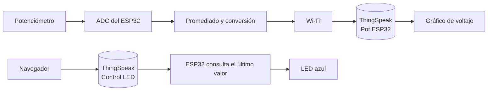

# Taller 5 (IoT): Adquisición de datos, conectividad Wi-Fi y control desde la nube con ESP32

**Curso:** Proyectos de Ingeniería — Taller de Internet de las Cosas (IoT)  

**Equipo:** Equipo 02  

**Integrante:** Bustos Montañez Melisa  

**Hardware principal:** ESP32 Dev Kit 1, potenciómetro, protoboard y cables jumper  

**Software:** Arduino IDE 1.8.19 — placa configurada como *ESP32 Dev Module*  

**Plataforma IoT utilizada:** ThingSpeak  


---

## 1. Introducción

El Internet de las Cosas (IoT) permite conectar dispositivos físicos a una red para que puedan captar información de su entorno, procesarla, transmitirla y, en determinados casos, recibir instrucciones de manera remota. Para lograrlo se integran elementos como sensores, microcontroladores, conectividad y plataformas en la nube.

En este taller se utilizó un **ESP32** como elemento central del sistema. A través de cinco actividades se trabajó de manera progresiva con las etapas básicas de una solución IoT: primero se realizó la adquisición de una señal analógica mediante un potenciómetro; después se estableció la conexión del microcontrolador a una red Wi-Fi; posteriormente se enviaron las mediciones a ThingSpeak para almacenarlas y visualizarlas; y, finalmente, se utilizó la información de la nube para controlar el estado de un LED.

Las actividades se relacionan entre sí y forman una secuencia. La primera permite comprender cómo se obtiene y procesa una señal; la segunda incorpora la conectividad; la tercera y la cuarta trasladan los datos desde el dispositivo hacia la nube; y la quinta desarrolla el recorrido inverso, desde la nube hacia el ESP32. De esta manera, el taller permitió observar el flujo completo de un sistema IoT básico: **medición → procesamiento → comunicación → almacenamiento → visualización o acción**.

---

## 2. Objetivos

### 2.1 Objetivo general

Implementar y documentar una solución IoT básica utilizando un ESP32, integrando la adquisición y procesamiento de una señal analógica, la conectividad Wi-Fi, el envío de datos a una plataforma en la nube y el control remoto de un actuador.

### 2.2 Objetivos específicos

- Mejorar la lectura de un potenciómetro mediante el promediado de muestras y la conversión de valores del ADC a voltaje.
- Conectar el ESP32 a una red Wi-Fi generada desde un teléfono celular y comprobar la dirección IP asignada.
- Enviar a ThingSpeak las lecturas obtenidas con el ESP32 y verificar que los datos sean recibidos correctamente.
- Visualizar en la nube la variación del voltaje generado por el potenciómetro.
- Comparar dos formas de obtener el voltaje a partir de la entrada analógica del ESP32.
- Utilizar ThingSpeak como medio para enviar una orden al ESP32 y controlar el estado de un LED.

---

## 3. Materiales y herramientas

La guía del taller contemplaba el uso de un **ESP32 Dev Kit 1**, un Arduino Explore IoT Kit, un kit de sensores Keystudio 48 en 1, un multímetro y una protoboard. Para las actividades documentadas en este README se trabajó principalmente con el ESP32, un potenciómetro, elementos de conexión y un teléfono celular utilizado como punto de acceso Wi-Fi.

| Elemento | Función dentro de la práctica |
|---|---|
| ESP32 Dev Kit 1 | Microcontrolador encargado de leer, procesar y transmitir los datos |
| Potenciómetro B10K | Generar una señal analógica variable |
| Kit de sensores Keystudio | Fuente de los componentes disponibles para las actividades del taller |
| Protoboard | Facilitar el montaje de las conexiones |
| Cables jumper | Realizar las conexiones eléctricas |
| Cable USB | Alimentar y programar el ESP32 desde la computadora |
| Teléfono celular | Crear la red Wi-Fi mediante hotspot |
| Computadora | Programar el ESP32, utilizar el monitor serie y revisar ThingSpeak |
| Arduino IDE 1.8.19 | Escribir, compilar y cargar los programas |
| `WiFi.h` | Gestionar la conexión Wi-Fi del ESP32 |
| `HTTPClient.h` | Realizar las solicitudes HTTP hacia ThingSpeak |
| ThingSpeak | Recibir, almacenar y representar los datos enviados por el ESP32 |

---

## 4. Fundamentos de la solución

Antes de desarrollar las actividades es necesario entender los tres elementos que se repiten a lo largo del taller: el **ESP32**, la **adquisición de datos mediante el ADC** y la **plataforma ThingSpeak**.

### 4.1 ESP32 y adquisición de datos

El ESP32 es una tarjeta de desarrollo que integra capacidad de procesamiento, entradas y salidas digitales, conversión analógico-digital y conectividad Wi-Fi [1]. En este taller estas características permitieron utilizar una sola placa tanto para medir una señal como para transmitir los datos a internet.

El potenciómetro genera una señal analógica, es decir, un voltaje que puede variar de forma continua al girar su perilla. El ESP32 necesita convertir esa señal en un valor digital para poder trabajar con ella dentro del programa. Esa tarea la realiza el **ADC (Analog-to-Digital Converter)**.

En las actividades se configuró el ADC con una resolución de **12 bits**, por lo que puede representar la entrada utilizando 4096 niveles diferentes [2]:

```text
0, 1, 2, ..., 4095
```

El valor `0` representa el extremo inferior de la escala y `4095` el extremo superior. Para relacionar ese número con un voltaje se utilizó la expresión:

```text
Voltaje = ADC × 3.3 / 4095
```

Por ejemplo, una lectura de `2233` corresponde aproximadamente a:

```text
2233 × 3.3 / 4095 ≈ 1.80 V
```

Esta conversión es importante porque transforma un número digital sin una unidad física directa en un dato expresado en voltios, que resulta más sencillo de interpretar.

La señal del potenciómetro se conectó al **GPIO34**. Este pin pertenece al grupo ADC1 y puede emplearse para lectura analógica aun cuando la conectividad Wi-Fi está activa [1], [4]. Esto resulta importante en las actividades posteriores, donde el ESP32 debe medir el potenciómetro y comunicarse con ThingSpeak al mismo tiempo.

### 4.2 Conexión del potenciómetro

| Potenciómetro | ESP32 | Función |
|---|---|---|
| GND | GND | Referencia eléctrica |
| VCC | 3V3 | Alimentación |
| SIG | GPIO34 | Señal analógica hacia el ADC |

El potenciómetro se alimentó con **3.3 V**, de manera que la señal entregada al ESP32 permanezca dentro del rango de trabajo utilizado durante la práctica.

<p align="center">
  
  <br>
  <em><b>Figura 1.</b> Conexión inicial</em>
</p>

### 4.3 Conectividad Wi-Fi y comunicación HTTP

Para enviar información a la nube, el ESP32 primero debe formar parte de una red. En este caso se creó un hotspot desde un teléfono celular y el ESP32 se configuró como **estación (`WIFI_STA`)**, es decir, como un dispositivo cliente de esa red.

Una vez conectado, el teléfono le asigna al ESP32 una dirección IP local. A partir de ese momento, el microcontrolador puede acceder a servicios disponibles en internet a través del propio teléfono.

En las actividades 3, 4 y 5 se utilizó además la biblioteca `HTTPClient.h`. Esta permite realizar solicitudes HTTP hacia ThingSpeak [2]. De esta manera, el ESP32 puede enviar un dato a la plataforma o consultar el último valor almacenado en un campo.

### 4.4 Plataforma ThingSpeak

ThingSpeak se utilizó como plataforma IoT para recibir y representar los datos del ESP32. La información se organiza en **canales**, y dentro de cada canal se pueden utilizar distintos campos o *fields* [3].

En nuestra implementación se trabajó con dos canales:

| Canal | Campo utilizado | Información |
|---|---|---|
| **Pot ESP32** | Field 1: Voltaje | Valor del voltaje medido con el potenciómetro |
| **Control LED** | Field 1: LED | Orden para el LED: `1` para encender y `0` para apagar |

Para enviar un valor al canal de voltaje se utilizó una solicitud con la siguiente estructura:

```text
http://api.thingspeak.com/update?api_key=WRITE_API_KEY&field1=VALOR
```

ThingSpeak responde con un número de entrada cuando almacena correctamente el dato. Si la respuesta del cuerpo es `0`, la escritura no fue aceptada [3]. Por esta razón, en los resultados no solo se revisó el código HTTP, sino también el número de entrada devuelto por la plataforma.

Para consultar el último valor del canal utilizado para controlar el LED se empleó una dirección con esta estructura:

```text
http://api.thingspeak.com/channels/CHANNEL_ID/fields/1/last.txt?api_key=READ_API_KEY
```

En nuestros programas se dejó un intervalo de **20 segundos** entre los envíos de voltaje para respetar el tiempo mínimo requerido entre actualizaciones del canal [3].

### 4.5 Arquitectura general de las actividades



Las primeras actividades siguen principalmente el flujo **entrada → ESP32 → nube**, mientras que la Actividad 5 incorpora el recorrido **nube → ESP32 → actuador**.

---

## 5. Actividad 01: lectura de un potenciómetro con ESP32

### 5.1 Propósito de la actividad

El código inicial del taller realizaba una lectura directa del potenciómetro con `analogRead()` y mostraba el valor obtenido en el monitor serie. La actividad solicitaba mejorar ese procedimiento aplicando un **promedio de datos** y convirtiendo el valor del ADC a **voltaje**.

El objetivo no era únicamente mostrar más información en pantalla. El promedio permite que el resultado no dependa de una sola muestra, mientras que la conversión a voltaje permite interpretar físicamente la señal que está ingresando al ESP32.

### 5.2 Procedimiento realizado

Se mantuvo el potenciómetro conectado al GPIO34 y se configuró el ADC con una resolución de 12 bits. En cada ciclo del programa se tomaron **20 lecturas**, separadas por 5 ms. Después se sumaron y se dividieron entre la cantidad total de muestras:

```text
promedio = suma de las 20 lecturas / 20
```

Con el promedio calculado se obtuvo el voltaje mediante:

```text
voltaje = promedio × 3.3 / 4095
```

La secuencia utilizada fue, por lo tanto:

```text
Potenciómetro → lectura ADC → 20 muestras → promedio → conversión a voltaje → monitor serie
```

### 5.3 Código implementado

```cpp
const int POT_PIN = 34;   // pin del potenciómetro
const int N = 20;         // número de lecturas a promediar

void setup() {
  Serial.begin(115200);
  analogReadResolution(12);         // lecturas de 0 a 4095
  analogSetAttenuation(ADC_11db);   // permite leer hasta ~3.3 V
}

void loop() {
  // 1) Promediado: tomamos N lecturas y sacamos el promedio
  long suma = 0;
  for (int i = 0; i < N; i++) {
    suma += analogRead(POT_PIN);
    delay(5);
  }
  int promedio = suma / N;

  // 2) Conversión ADC -> voltaje
  float voltaje = promedio * 3.3 / 4095.0;

  // 3) Mostrar
  Serial.print("ADC promedio: ");
  Serial.print(promedio);
  Serial.print("   Voltaje: ");
  Serial.print(voltaje, 2);
  Serial.println(" V");

  delay(300);
}
```

### 5.4 Explicación del código

| Elemento | Función | Importancia |
|---|---|---|
| `Serial.begin(115200)` | Inicia la comunicación con el monitor serie | Permite observar las lecturas obtenidas |
| `analogReadResolution(12)` | Configura una resolución de 12 bits | Define una escala de 0 a 4095 |
| `analogSetAttenuation(ADC_11db)` | Ajusta el rango de lectura analógica | Permite trabajar con el rango de voltaje utilizado |
| `analogRead(POT_PIN)` | Lee el valor analógico en GPIO34 | Obtiene cada muestra del potenciómetro |
| Bucle `for` | Repite la lectura 20 veces | Permite realizar el promediado |
| `suma / N` | Calcula la media de las muestras | Produce un valor representativo de las lecturas |
| `promedio * 3.3 / 4095.0` | Convierte el valor digital a voltaje | Expresa el resultado en una magnitud física |

El uso de `4095.0` está relacionado con la resolución del ADC. Al trabajar con 12 bits existen 4096 niveles posibles, numerados desde 0 hasta 4095 [2]. Por ello, ese valor representa el extremo superior de la escala utilizada en la conversión.

### 5.5 Resultados

Con el potenciómetro próximo al mínimo se obtuvieron valores cercanos a cero:

<p align="center">
  
  <br>
  <em><b>Figura 2.</b> Lecturas obtenidas con el potenciómetro en el extremo inferior.</em>
</p>

Al girar progresivamente el potenciómetro, aumentaron tanto el valor promedio del ADC como el voltaje calculado:

<p align="center">
  
  <br>
  <em><b>Figura 3.</b> Variación de la lectura digital y del voltaje al modificar el potenciómetro.</em>
</p>

Algunos de los valores observados fueron:

| ADC promedio | Voltaje mostrado |
|---:|---:|
| 20 | 0.02 V |
| 957 | 0.77 V |
| 2233 | 1.80 V |
| 3379 | 2.72 V |
| 4095 | 3.30 V |

### 5.6 Interpretación

Los resultados muestran que ambas variables aumentan de forma relacionada. Cuando el potenciómetro entrega una señal mayor, el ADC representa esa entrada con un número más alto y, al aplicar la fórmula, el voltaje calculado también aumenta.

Por ejemplo:

```text
2233 × 3.3 / 4095 ≈ 1.80 V
```

Esto coincide con el valor mostrado durante la práctica. De esta forma se comprobó que el programa no genera dos mediciones distintas: el valor del ADC y el voltaje representan la **misma señal**, pero expresada en escalas diferentes.

El máximo de `3.30 V` debe interpretarse como el resultado de la fórmula cuando el ADC alcanza `4095`. Más adelante, en la Actividad 3, se obtuvo un valor máximo ligeramente distinto usando otro método de lectura. Esa diferencia permite comparar cómo influye el procedimiento utilizado para convertir la entrada analógica.

---

## 6. Actividad 02: conexión del ESP32 a una red Wi-Fi

### 6.1 Propósito de la actividad

La segunda actividad solicitaba crear una red Wi-Fi utilizando el hotspot de un smartphone, conectar el ESP32 a esa red y mostrar en el monitor serie la dirección IP asignada.

Esta actividad es necesaria antes de trabajar con una plataforma IoT. El ESP32 puede adquirir datos sin internet, pero para transmitirlos a ThingSpeak necesita primero establecer correctamente la conexión de red.

### 6.2 Procedimiento realizado

Se activó el hotspot del teléfono y se configuró el ESP32 en modo estación mediante `WIFI_STA`. Después se indicó el nombre de la red y su contraseña.

El programa espera hasta que `WiFi.status()` indique que la conexión se completó. Una vez conectado, muestra cuatro datos:

- **IP:** dirección asignada al ESP32 dentro de la red local.
- **Gateway:** dirección del dispositivo que permite la salida de la red; en este caso, el teléfono.
- **MAC:** identificador de la interfaz de red del ESP32.
- **RSSI:** intensidad de la señal Wi-Fi recibida.

### 6.3 Código implementado

```cpp
#include <WiFi.h>

const char* WIFI_SSID = "telefon12";
const char* WIFI_PASS = "22062006";

void setup() {
  Serial.begin(115200);
  WiFi.mode(WIFI_STA);
  WiFi.begin(WIFI_SSID, WIFI_PASS);
  Serial.print("Conectando a "); Serial.println(WIFI_SSID);

  unsigned long t0 = millis();
  while (WiFi.status() != WL_CONNECTED) {
    delay(500); Serial.print(".");
    if (millis() - t0 > 20000) {
      Serial.println("\nNo conecta: revisa SSID/clave y que sea 2.4 GHz");
      ESP.restart();
    }
  }
  Serial.println("\n¡Conectado!");
  Serial.print("IP asignada: "); Serial.println(WiFi.localIP());
  Serial.print("Gateway:   "); Serial.println(WiFi.gatewayIP());
  Serial.print("MAC:       "); Serial.println(WiFi.macAddress());
  Serial.print("RSSI:      "); Serial.println(WiFi.RSSI());
}

void loop() {
}
```

### 6.4 Explicación del código

`WiFi.mode(WIFI_STA)` configura el ESP32 como cliente de una red existente. Luego `WiFi.begin()` inicia el intento de conexión utilizando el SSID y la contraseña indicados [2].

El ciclo `while` mantiene al programa esperando mientras la conexión no se haya completado. En nuestro código se incorporó además un límite de 20 segundos. Si el ESP32 no logra conectarse dentro de ese tiempo, muestra un mensaje y se reinicia. Esto evita que el programa permanezca indefinidamente esperando una red incorrecta o no disponible.

Cuando la conexión se completa, `WiFi.localIP()` permite conocer la dirección entregada al ESP32 por el hotspot.

### 6.5 Resultados

<p align="center">
  
  <br>
  <em><b>Figura 4.</b> Datos mostrados después de conectar el ESP32 al hotspot.</em>
</p>

| Dato | Resultado |
|---|---|
| IP asignada | `192.168.43.196` |
| Gateway | `192.168.43.1` |
| RSSI | `-66 dBm` |

### 6.6 Interpretación

La obtención de la dirección `192.168.43.196` confirma que el ESP32 quedó incorporado a la red local creada por el teléfono. El gateway `192.168.43.1` corresponde al dispositivo que permite al ESP32 comunicarse fuera de esa red.

El RSSI se expresa en dBm y representa la potencia con la que se recibe la señal Wi-Fi. En esta prueba, el valor obtenido fue suficiente para mantener la comunicación necesaria durante las actividades posteriores.

La misma dirección IP volvió a observarse en las siguientes pruebas, lo que facilitó reconocer al ESP32 dentro de la red y realizar posteriormente una comprobación mediante `ping`.

---

## 7. Actividad 03: envío del voltaje a ThingSpeak

### 7.1 Propósito de la actividad

La tercera actividad solicitaba mostrar en tiempo real la variación del potenciómetro conectado al ESP32 utilizando una plataforma IoT. La guía mencionaba Arduino Cloud, ThingSpeak y Ubidots. En nuestra implementación se trabajó con **ThingSpeak**.

Esta actividad une por primera vez las dos etapas anteriores: el ESP32 toma una medición analógica y, utilizando la conexión Wi-Fi, la envía a un servicio en la nube.

### 7.2 Configuración realizada en ThingSpeak

Se creó el canal **Pot ESP32** y se utilizó el **Field 1** para almacenar el voltaje.

Cada dato enviado necesita una **Write API Key**, que identifica y autoriza la escritura en el canal [3]. El programa construye una dirección que contiene esa clave y el valor medido:

```text
http://api.thingspeak.com/update?api_key=WRITE_API_KEY&field1=VALOR
```

El envío se realiza mediante una solicitud HTTP `GET` [3].

### 7.3 Lectura utilizada en esta actividad

A diferencia de la Actividad 1, en esta parte se utilizó:

```cpp
analogReadMilliVolts(POT_PIN)
```

Esta función entrega la lectura directamente en milivoltios [2]. Para disminuir la dependencia de una sola medición se realizaron **32 lecturas** y posteriormente se calculó su promedio. Finalmente, el resultado se dividió entre 1000 para expresarlo en voltios.

El envío se programó cada **20 segundos**.

### 7.4 Código implementado

```cpp
#include <WiFi.h>
#include <HTTPClient.h>

const char* WIFI_SSID = "telefon12";
const char* WIFI_PASS = "22062006";
const char* TS_WRITE_KEY = "YJWX17833REE5YRH";

const int POT_PIN = 34;
const unsigned long PERIODO_MS = 20000;  // ThingSpeak gratis: mínimo 15 s entre envíos
unsigned long ultimo = 0;

float leerVoltaje() {
  uint32_t s = 0;
  for (int i = 0; i < 32; i++) { s += analogReadMilliVolts(POT_PIN); delay(2); }
  return s / 32.0 / 1000.0;
}

void setup() {
  Serial.begin(115200);
  WiFi.begin(WIFI_SSID, WIFI_PASS);
  while (WiFi.status() != WL_CONNECTED) { delay(500); Serial.print("."); }
  Serial.print("\nIP: "); Serial.println(WiFi.localIP());
}

void loop() {
  if (millis() - ultimo >= PERIODO_MS) {
    ultimo = millis();
    float v = leerVoltaje();
    String url = "http://api.thingspeak.com/update?api_key=" + String(TS_WRITE_KEY)
               + "&field1=" + String(v, 3);
    HTTPClient http;
    http.begin(url);
    int code = http.GET();
    String resp = http.getString();   // devuelve el nº de entrada; "0" = rechazado
    http.end();
    Serial.printf("V=%.3f  HTTP=%d  entrada=%s\n", v, code, resp.c_str());
  }
}
```

### 7.5 ¿Qué significa la respuesta mostrada en el monitor serie?

El monitor serie muestra tres elementos importantes:

```text
V=3.139  HTTP=200  entrada=6
```

- `V=3.139` corresponde al voltaje medido.
- `HTTP=200` indica que la solicitud HTTP fue atendida correctamente.
- `entrada=6` corresponde al número de registro creado por ThingSpeak.

Es importante diferenciar estos dos últimos datos. Un código HTTP `200` confirma que hubo una comunicación válida con el servidor, pero el número de entrada permite comprobar que ThingSpeak **aceptó y almacenó** el dato. Si la respuesta del cuerpo fuera `0`, la escritura habría sido rechazada [3].

### 7.6 Evidencia general

<p align="center">
  
  <br>
  <em><b>Figura 5.</b> Resultado general de la Actividad 03: envíos a ThingSpeak y comprobación de conectividad con el ESP32.</em>
</p>

### 7.7 Evidencia resaltada para el análisis

<p align="center">
  
  <br>
  <em><b>Figura 6.</b> Evidencia resaltada para identificar el voltaje, el código HTTP, el número de entrada y la respuesta del ping.</em>
</p>

La segunda imagen permite centrar el análisis en los datos que confirman cada etapa del proceso: la lectura del voltaje, la comunicación con ThingSpeak, el almacenamiento de la información y la presencia del ESP32 dentro de la red local.

### 7.8 Resultados e interpretación

Durante esta prueba se observaron seis registros consecutivos con un voltaje de aproximadamente **3.139 V**. El valor se mantuvo prácticamente constante porque el potenciómetro permaneció en la posición máxima durante esos envíos.

Los números de entrada aumentaron consecutivamente. Esto demuestra que ThingSpeak fue creando un nuevo registro por cada actualización recibida.

También se realizó un `ping` a:

```text
192.168.43.196
```

La recepción de respuestas confirma que la computadora podía alcanzar al ESP32 dentro de la red local. Sin embargo, esta prueba debe interpretarse correctamente: el `ping` verifica **conectividad local con el dispositivo**, mientras que los valores `HTTP=200` y el número de entrada de ThingSpeak verifican la comunicación con la plataforma en la nube. Son comprobaciones diferentes y, juntas, permiten identificar mejor en qué parte del sistema podría existir un problema.

Otro resultado importante fue la diferencia respecto de la Actividad 1. Allí, al llegar al máximo del ADC, la fórmula directa produjo **3.30 V**, mientras que en esta actividad se obtuvo aproximadamente **3.139 V** mediante `analogReadMilliVolts()`.

La diferencia no significa que una actividad haya fallado. Los dos códigos obtienen el voltaje de manera distinta:

```text
Actividad 1 → analogRead() → valor ADC → fórmula con 3.3 / 4095
Actividad 3 → analogReadMilliVolts() → milivoltios → conversión a voltios
```

La comparación evidencia que una conversión teórica basada directamente en la escala del ADC y una lectura expresada en milivoltios no necesariamente producen exactamente el mismo valor en los extremos del rango.

---

## 8. Actividad 04: envío de datos a la nube, parte 2

### 8.1 Adaptación de la actividad

La guía original solicitaba seleccionar uno de los sensores del kit Keystudio —por ejemplo, LM35 o LDR— y mostrar su variación en una plataforma IoT.

En nuestra práctica, **por indicación del docente, se continuó trabajando con el voltaje del potenciómetro en lugar de utilizar un sensor de temperatura**. Por ello, esta actividad se interpreta como una segunda implementación del envío de voltaje a ThingSpeak.

Esta adaptación resulta útil porque permite comparar directamente el método utilizado en la Actividad 3 con el método empleado anteriormente en la Actividad 1.

### 8.2 Cambios realizados respecto de la Actividad 03

En esta actividad se modificaron cuatro elementos principales:

1. Se volvió a utilizar `analogRead()` en lugar de `analogReadMilliVolts()`.
2. Se tomaron **20 muestras** y se calculó su promedio.
3. El voltaje se obtuvo con la fórmula:

```text
promedio × 3.3 / 4095
```

4. Se configuró el programa para realizar el primer envío inmediatamente después de conectarse al Wi-Fi.

Además, se agregó un límite de 20 segundos al proceso de conexión. Si el ESP32 no logra conectarse durante ese tiempo, muestra un aviso y se reinicia.

### 8.3 Código implementado

```cpp
#include <WiFi.h>
#include <HTTPClient.h>

const char* WIFI_SSID    = "telefon12";   // <-- escribe aquí el nombre exacto de tu red
const char* WIFI_PASS    = "22062006";
const char* TS_WRITE_KEY = "YJWX17833REE5YRH";

const int POT_PIN = 34;
const unsigned long PERIODO_MS = 20000;   // ThingSpeak gratis: mínimo 15 s entre envíos
unsigned long ultimo = 0;

float leerVoltaje() {
  long suma = 0;
  for (int i = 0; i < 20; i++) { suma += analogRead(POT_PIN); delay(5); }
  int promedio = suma / 20;
  return promedio * 3.3 / 4095.0;         // 0.00 a 3.30 V
}

void setup() {
  Serial.begin(115200);
  analogReadResolution(12);
  analogSetAttenuation(ADC_11db);

  WiFi.mode(WIFI_STA);
  WiFi.begin(WIFI_SSID, WIFI_PASS);
  Serial.print("Conectando a WiFi");
  unsigned long t0 = millis();
  while (WiFi.status() != WL_CONNECTED) {
    delay(500);
    Serial.print(".");
    if (millis() - t0 > 20000) {
      Serial.println("\nNo conecta: revisa nombre/clave y que el hotspot sea 2.4 GHz");
      ESP.restart();
    }
  }
  Serial.print("\nConectado. IP: ");
  Serial.println(WiFi.localIP());

  ultimo = millis() - PERIODO_MS;         // para que envíe el primer dato de inmediato
}

void loop() {
  if (millis() - ultimo >= PERIODO_MS) {
    ultimo = millis();
    float v = leerVoltaje();

    String url = "http://api.thingspeak.com/update?api_key=" + String(TS_WRITE_KEY)
               + "&field1=" + String(v, 2);
    HTTPClient http;
    http.begin(url);
    int code = http.GET();
    String resp = http.getString();       // nº de entrada; "0" = rechazado
    http.end();

    Serial.printf("Voltaje: %.2f V | HTTP %d | entrada %s\n", v, code, resp.c_str());
  }
}
```

### 8.4 Explicación del funcionamiento

La función `leerVoltaje()` reproduce el procedimiento de la Actividad 1: toma 20 lecturas, calcula su promedio y convierte el valor obtenido a voltaje.

La instrucción:

```cpp
ultimo = millis() - PERIODO_MS;
```

Hace que la condición del `loop()` se cumpla inmediatamente después de terminar el `setup()`. De esta forma no es necesario esperar 20 segundos para registrar el primer dato.

Después del primer envío, los siguientes registros se realizan con una separación de aproximadamente 20 segundos.

### 8.5 Resultados en el monitor serie

<p align="center">
  
  <br>
  <em><b>Figura 7.</b> Voltaje enviado, código HTTP y número de entrada registrados durante la Actividad 04.</em>
</p>

Las marcas de tiempo observadas en los últimos registros fueron aproximadamente:

```text
16:30:37
16:30:57
16:31:17
16:31:37
```

La diferencia de 20 segundos entre los registros coincide con `PERIODO_MS = 20000`, por lo que el comportamiento observado corresponde a la programación realizada.

### 8.6 Representación en ThingSpeak

Durante la ejecución se modificó manualmente la posición del potenciómetro. Primero se mantuvo en un valor alto, después se llevó hasta aproximadamente `0 V` y finalmente se volvió a incrementar.

<p align="center">
  
  <br>
  <em><b>Figura 8.</b> Variación del voltaje registrada en el Field 1 del canal Pot ESP32.</em>
</p>

El gráfico reproduce la manipulación física realizada sobre el potenciómetro: una región inicial con valores altos, una disminución hasta el mínimo y una subida posterior.

Uno de los puntos mostrados en el gráfico corresponde a aproximadamente **2.45 V a las 16:31:17**, valor que también aparece en el monitor serie. Esta coincidencia permite relacionar la medición obtenida localmente por el ESP32 con el registro almacenado en ThingSpeak.

### 8.7 Interpretación

Esta actividad demuestra que el flujo completo se mantiene:

```text
Potenciómetro
    ↓
ESP32
    ↓
lectura y conversión
    ↓
Wi-Fi
    ↓
solicitud HTTP
    ↓
ThingSpeak
    ↓
gráfico
```

Además, vuelve a aparecer un máximo cercano a **3.30 V**, porque se retomó la fórmula directa utilizada en la Actividad 1.

La comparación entre las Actividades 3 y 4 resulta especialmente importante:

| Actividad | Método de lectura | Máximo observado |
|---|---|---:|
| 3 | `analogReadMilliVolts()` | ~3.139 V |
| 4 | `analogRead()` + fórmula | ~3.30 V |

La diferencia se explica por el procedimiento de conversión utilizado. En la Actividad 4, alcanzar `4095` obliga matemáticamente a que la expresión `4095 × 3.3 / 4095` produzca `3.30 V`. En la Actividad 3, el valor proviene directamente de la lectura expresada en milivoltios y no de esa equivalencia matemática.

---

## 9. Actividad 05: control de un LED desde la nube

### 9.1 Propósito de la actividad

La quinta actividad solicitaba controlar desde una plataforma web el encendido de un LED conectado al ESP32.

Hasta este punto, la información había viajado principalmente en una dirección:

```text
ESP32 → ThingSpeak
```

En esta actividad se trabajó también en sentido contrario:

```text
ThingSpeak → ESP32 → LED
```

Por ello, esta parte completa el ciclo básico de comunicación IoT desarrollado durante el taller.

### 9.2 Implementación utilizada

Se empleó el **LED azul integrado del ESP32**, asociado al GPIO2, como actuador.

Para evitar mezclar la medición del potenciómetro con las órdenes del LED se utilizaron dos canales:

| Canal | Función |
|---|---|
| Pot ESP32 | Recibir el voltaje enviado por el ESP32 |
| Control LED | Almacenar la orden `1` o `0` para el LED |

El canal **Control LED** funciona como un pequeño buzón de instrucciones:

```text
1 → encender
0 → apagar
```

Desde el navegador se puede escribir un `1` utilizando una dirección como:

```text
https://api.thingspeak.com/update?api_key=WRITE_API_KEY_DEL_LED&field1=1
```

Para apagarlo se envía:

```text
https://api.thingspeak.com/update?api_key=WRITE_API_KEY_DEL_LED&field1=0
```

### 9.3 Comandos para encender y apagar el LED

Para modificar el estado del LED se utilizó la API de escritura del canal **Control LED** [3]. A diferencia del canal empleado para almacenar el voltaje, este segundo canal se creó específicamente para guardar la orden que posteriormente consulta el ESP32.

El **Field 1** del canal se utilizó como una variable de control:

- `1` representa la orden de **encender** el LED.
- `0` representa la orden de **apagar** el LED.

Los comandos se ejecutan directamente desde el navegador utilizando la **Write API Key del canal Control LED**.

| Acción | Comando |
|---|---|
| Encender LED | `https://api.thingspeak.com/update?api_key=TU_WRITE_API_KEY_DEL_CANAL_LED&field1=1` |
| Apagar LED | `https://api.thingspeak.com/update?api_key=TU_WRITE_API_KEY_DEL_CANAL_LED&field1=0` |

Por ejemplo, al abrir el comando de encendido, ThingSpeak almacena el valor `1` en el Field 1. El ESP32 consulta periódicamente el último valor registrado y, al detectar ese `1`, coloca el GPIO2 en estado `HIGH`, encendiendo el LED azul integrado.

De manera equivalente, cuando se ejecuta el comando con `field1=0`, ThingSpeak registra un `0`. En la siguiente consulta realizada por el ESP32, el programa interpreta ese valor como una orden de apagado y coloca el GPIO2 en estado `LOW`.

El flujo utilizado para el control puede resumirse de la siguiente manera:

```text
Navegador
   ↓
Comando field1=1 o field1=0
   ↓
ThingSpeak - canal Control LED
   ↓
ESP32 consulta el último valor
   ↓
GPIO2
   ↓
LED encendido o apagado
```

### 9.4 Lectura de la orden desde el ESP32

El ESP32 consulta cada **3 segundos** el último valor almacenado en el canal Control LED mediante la API de lectura de ThingSpeak [3]:

```text
/channels/CHANNEL_ID/fields/1/last.txt
```

La respuesta se recibe como texto. El programa elimina espacios con `trim()`, convierte el resultado a número y decide el estado del LED:

```cpp
int nuevo = (resp.toFloat() >= 0.5) ? 1 : 0;
```

Si el resultado es `1`, el GPIO2 se coloca en `HIGH`; si es `0`, se coloca en `LOW`.

Al mismo tiempo, el programa conserva el envío del voltaje del potenciómetro cada 20 segundos. Por lo tanto, el ESP32 realiza dos tareas con periodos distintos:

```text
Cada 3 s  → consultar la orden del LED
Cada 20 s → enviar el voltaje a ThingSpeak
```

### 9.5 Código implementado

```cpp
#include <WiFi.h>
#include <HTTPClient.h>

const char* WIFI_SSID    = "telefon12";
const char* WIFI_PASS    = "22062006";

// Canal 1: VOLTAJE del potenciómetro -> Write Key del PRIMER canal
const char* TS_WRITE_KEY = "YJWX17833REE5YRH";

// Canal 2: CONTROL LED -> solo se LEE desde el ESP32
const char* LED_CHANNEL_ID = "3515262";
const char* LED_READ_KEY   = "G04FHIFSYFX442O3";

const int POT_PIN = 34;
const int LED_PIN = 2;                        // LED azul integrado del ESP32

const unsigned long PERIODO_MS     = 20000;   // envío del voltaje (mín. 15 s)
const unsigned long PERIODO_LED_MS = 3000;    // revisar el LED cada 3 s
unsigned long ultimo = 0;
unsigned long ultimoLed = 0;
int estadoLed = -1;                           // -1 = aún no leído

float leerVoltaje() {
  long suma = 0;
  for (int i = 0; i < 20; i++) {
    suma += analogRead(POT_PIN);
    delay(5);
  }
  int promedio = suma / 20;
  return promedio * 3.3 / 4095.0;             // 0.00 a 3.30 V
}

void enviarVoltaje() {
  float v = leerVoltaje();
  String url = "http://api.thingspeak.com/update?api_key=" + String(TS_WRITE_KEY)
             + "&field1=" + String(v, 2);

  HTTPClient http;
  http.begin(url);
  int code = http.GET();
  String resp = http.getString();             // nº de entrada; "0" = rechazado
  http.end();

  Serial.printf("Voltaje: %.2f V | HTTP %d | entrada %s\n", v, code, resp.c_str());
}

void revisarLed() {
  String url = "http://api.thingspeak.com/channels/" + String(LED_CHANNEL_ID)
             + "/fields/1/last.txt?api_key=" + String(LED_READ_KEY);

  HTTPClient http;
  http.begin(url);
  int code = http.GET();
  String resp = http.getString();
  http.end();
  resp.trim();

  Serial.printf("Canal LED responde: HTTP %d | '%s'\n", code, resp.c_str());

  if (code != 200 || resp == "" || resp == "-1") return;   // canal vacío o error

  int nuevo = (resp.toFloat() >= 0.5) ? 1 : 0;             // 1 / 1.0 -> encendido

  if (nuevo != estadoLed) {
    estadoLed = nuevo;
    digitalWrite(LED_PIN, estadoLed ? HIGH : LOW);
    Serial.printf("LED -> %s\n", estadoLed ? "ENCENDIDO" : "APAGADO");
  }
}

void setup() {
  Serial.begin(115200);
  pinMode(LED_PIN, OUTPUT);
  digitalWrite(LED_PIN, LOW);

  analogReadResolution(12);
  analogSetAttenuation(ADC_11db);

  WiFi.mode(WIFI_STA);
  WiFi.begin(WIFI_SSID, WIFI_PASS);
  Serial.print("Conectando a WiFi");

  unsigned long t0 = millis();

  while (WiFi.status() != WL_CONNECTED) {
    delay(500);
    Serial.print(".");

    if (millis() - t0 > 20000) {
      Serial.println("\nNo conecta: revisa nombre/clave y que el hotspot sea 2.4 GHz");
      ESP.restart();
    }
  }

  Serial.print("\nConectado. IP: ");
  Serial.println(WiFi.localIP());

  ultimo = millis() - PERIODO_MS;             // primer envío inmediato
}

void loop() {
  if (millis() - ultimoLed >= PERIODO_LED_MS) {
    ultimoLed = millis();
    revisarLed();
  }

  if (millis() - ultimo >= PERIODO_MS) {
    ultimo = millis();
    enviarVoltaje();
  }
}
```

### 9.6 Resultados

Antes de enviar la orden de encendido, el LED se encontraba apagado:

<p align="center">
  
  <br>
  <em><b>Figura 9.</b> Estado inicial del montaje antes de enviar la orden desde ThingSpeak.</em>
</p>

El código empleado junto con el resultado:

<p align="center">
  
  <br>
  <em><b>Figura 10.</b> Resultado al correr el código</em>
</p>

Después de registrar un valor `1` en el canal Control LED, el ESP32 consultó ese valor y encendió el LED azul integrado:

<p align="center">
  
  <br>
  <em><b>Figura 11.</b> LED encendido después de recibir la orden desde ThingSpeak.</em>
</p>

El mismo comando quedó registrado en la plataforma:

<p align="center">
  
  <br>
  <em><b>Figura 12.</b> Valor registrado en el canal Control LED utilizado como orden de encendido.</em>
</p>

### 9.7 Interpretación

El resultado confirma que ThingSpeak no se utilizó únicamente como destino de los datos del ESP32. También funcionó como punto intermedio para enviar una orden desde la web hacia el dispositivo.

El método empleado se basa en **polling** o consulta periódica. El ESP32 no recibe la orden automáticamente en el mismo instante en que se escribe; cada tres segundos pregunta cuál es el último valor almacenado. Por esa razón existe un pequeño retraso entre la actualización del canal y el cambio del LED.

Este comportamiento permite diferenciar dos formas de comunicación:

```text
Actividades 3 y 4:
ESP32 → ThingSpeak

Actividad 5:
Navegador → ThingSpeak → ESP32 → LED
```

La Actividad 5 demuestra así que un dispositivo IoT puede no solo reportar información, sino también actuar en respuesta a un dato recibido de forma remota.

---

## 10. Problemas encontrados y soluciones

La mayor parte de las actividades se ejecutó sin inconvenientes importantes. Sin embargo, se presentaron dos situaciones que afectaron el avance y que resultaron útiles para comprender mejor el proceso de configuración y diagnóstico.

### 10.1 Preparación del entorno de programación

Antes de comenzar con las actividades se perdió tiempo preparando el entorno. Uno de los integrantes no tenía instalado Arduino IDE y, en el otro equipo, se había eliminado el paquete necesario para trabajar con el ESP32.

Esto impedía seleccionar y programar correctamente la placa, aunque el código estuviera escrito.

La solución consistió en instalar o reinstalar el entorno necesario, agregar nuevamente el soporte para ESP32 y comprobar el puerto correspondiente antes de continuar.

Este problema permitió comprobar que, antes de buscar errores dentro del código, también es necesario revisar que el entorno de desarrollo reconozca correctamente el hardware.

### 10.2 El LED no respondía en la Actividad 05

El principal error durante las actividades ocurrió al intentar controlar el LED. El programa se ejecutaba, pero el LED no respondía a la orden almacenada en ThingSpeak.

Al revisar la configuración se encontró que el **Channel ID del canal Control LED había sido copiado incorrectamente: faltaba el dígito inicial `3`**.

El Channel ID es el identificador que le indica al ESP32 qué canal debe consultar [3]. Si el número es incorrecto, la solicitud se dirige a un recurso distinto del esperado y el programa no obtiene la orden correcta.

Después de corregir el identificador, el ESP32 pudo leer el valor del canal y el LED respondió al comando.

Este error también muestra por qué conviene verificar un sistema IoT por etapas:

```text
1. ¿El ESP32 está funcionando?
2. ¿La conexión Wi-Fi está establecida?
3. ¿La solicitud HTTP llega al servidor?
4. ¿El Channel ID y las API Keys son correctos?
5. ¿El valor recibido es el esperado?
6. ¿La salida física responde?
```

Separar el sistema en etapas facilita encontrar la causa real del problema y evita modificar partes que ya funcionan correctamente.

---

## 11. Conclusiones

El Taller 5 permitió integrar progresivamente los elementos principales de una solución IoT utilizando un ESP32.

En la primera actividad se comprobó que una señal analógica puede representarse digitalmente mediante el ADC y posteriormente convertirse a una magnitud física como el voltaje. El uso de varias muestras permitió trabajar con un valor promedio en lugar de depender de una única lectura.

La segunda actividad estableció la conectividad necesaria para las siguientes etapas. La dirección IP obtenida confirmó que el ESP32 había ingresado correctamente a la red generada por el teléfono.

En la tercera actividad se integraron la adquisición de datos y la conectividad. Los códigos `HTTP=200` y los números de entrada consecutivos permitieron comprobar la comunicación con ThingSpeak y el almacenamiento de las mediciones. Además, la comparación entre `3.139 V` y `3.30 V` mostró que el resultado puede variar según el método utilizado para obtener el voltaje.

La cuarta actividad permitió observar el comportamiento de una variable en el tiempo mediante el gráfico de ThingSpeak. La disminución y el aumento registrados en la plataforma correspondieron a los cambios realizados físicamente sobre el potenciómetro, lo que permitió relacionar directamente la señal real con su representación en la nube.

Finalmente, la quinta actividad completó el flujo al incorporar comunicación desde la nube hacia el dispositivo. El encendido del LED confirmó que el ESP32 puede utilizar un dato remoto como una orden para modificar una salida física.

En conjunto, el taller permitió comprender que una solución IoT no depende de una única parte del sistema. La medición, el procesamiento, la red, las credenciales, la plataforma y el actuador deben funcionar de manera coordinada. El error encontrado en el Channel ID reforzó precisamente esta idea: una conexión física y un código correctos no son suficientes si el dispositivo consulta un recurso incorrecto en la nube.

---

## 12. Resumen técnico de las actividades

| Actividad | Entrada o acción | Procesamiento principal | Resultado |
|---|---|---|---|
| 01 | Potenciómetro | Promedio de 20 lecturas y conversión ADC → voltaje | Voltaje mostrado en monitor serie |
| 02 | Hotspot del celular | Conexión mediante `WiFi.h` | IP, gateway, MAC y RSSI |
| 03 | Potenciómetro | 32 lecturas con `analogReadMilliVolts()` | Datos enviados a ThingSpeak |
| 04 | Potenciómetro | 20 lecturas con `analogRead()` + fórmula | Variación del voltaje visualizada en ThingSpeak |
| 05 | Orden `1/0` desde ThingSpeak | Consulta periódica del último valor | LED del ESP32 encendido o apagado |

---

## 13. Referencias

[1] Espressif Systems, “ESP32 Series Datasheet,” [Online]. Available: https://www.espressif.com/sites/default/files/documentation/esp32_datasheet_en.pdf. [Accessed: Oct. 2, 2026].

[2] Espressif Systems, “Arduino-ESP32 Documentation,” [Online]. Available: https://docs.espressif.com/projects/arduino-esp32/en/latest/. [Accessed: Oct. 2, 2026].

[3] MathWorks, “ThingSpeak Documentation,” [Online]. Available: https://www.mathworks.com/help/thingspeak/. [Accessed: Oct. 2, 2026].

[4] Last Minute Engineers, “Getting Started with ESP32 Development Board (Pinout),” [Online]. Available: https://lastminuteengineers.com/getting-started-with-esp32/. [Accessed: Oct. 2, 2026].
