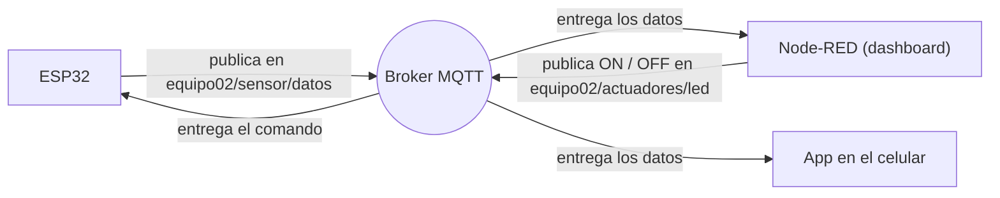

# Mini Proyecto IoT: ESP32 Dev Kit 1, MQTT y Node-RED

---

**Curso:** Proyectos de Ingeniería — Taller de Internet de las Cosas (IoT)

**Equipo:** Equipo 02

**Docentes:** De la Cruz, Lewis; Chan, Renzo; Rejas, María; Rivera, Harry.

**Tarjeta:** ESP32 Dev Kit 1 (en Arduino IDE: *ESP32 Dev Module*)

**Protocolo:** MQTT, con el broker `mqtt.rcr-labs.com`

**Interfaz:** Dashboard en Node-RED

**Sensor:** DHT11, temperatura y humedad

> **Nota de seguridad:** por ser un repositorio público, las contraseñas de Wi-Fi y de MQTT aparecen como `TU_RED_WIFI`, `TU_PASSWORD_WIFI` y `TU_PASSWORD_MQTT`. Los valores reales no se publican.

---

## 1. Descripción

En este taller armamos un sistema IoT completo con una tarjeta **ESP32 Dev Kit 1**. El sistema hace tres cosas:

1. **Se conecta a Internet** por Wi-Fi y al **broker MQTT** del taller.
2. **Envía datos** de temperatura y humedad cada 5 segundos.
3. **Recibe órdenes** para encender y apagar el LED azul de la tarjeta.

Todo se ve y se controla desde un **dashboard en Node-RED**.

El trabajo tuvo dos etapas:

- **Etapa 1:** usamos el código del taller, que **inventa** los valores de temperatura y humedad con números al azar (datos simulados). Con eso probamos la comunicación.
- **Etapa 2 (mejora):** cambiamos el código para que los valores sean **reales**, medidos con un sensor **DHT11**.

---

## 2. Objetivo

**Objetivo general**

Comunicar un ESP32 con un broker MQTT para enviar datos de sensores y controlar un LED de forma remota desde un dashboard en Node-RED.

**Objetivos específicos**

- Conectar el ESP32 a una red Wi-Fi y al broker MQTT.
- Configurar los tópicos del Equipo 02 para no mezclar nuestros mensajes con los de otros equipos.
- Publicar datos de temperatura y humedad en formato JSON.
- Recibir los comandos `ON` y `OFF` para controlar el LED azul de la tarjeta.
- Visualizar los datos y controlar el LED desde Node-RED.
- Mejorar el código para publicar **datos reales** con un sensor DHT11.

---

## 3. Materiales y herramientas utilizadas

| Elemento | Para qué se usó |
|---|---|
| ESP32 Dev Kit 1 | Cerebro del sistema: se conecta al Wi-Fi y habla con el broker |
| Sensor DHT11 | Medir temperatura y humedad reales (etapa 2) |
| Protoboard y cables | Conectar el sensor a la tarjeta |
| Cable USB | Alimentar y programar la tarjeta |
| Computadora con Arduino IDE | Escribir y subir el código |
| Celular | Compartir Wi-Fi (hotspot) y comprobar los mensajes MQTT con una app cliente |
| Broker MQTT (`mqtt.rcr-labs.com`, EMQX) | Reparte los mensajes |
| Node-RED | Dashboard para ver datos y controlar el LED |
| Biblioteca `WiFi.h` | Conexión Wi-Fi |
| Biblioteca `PubSubClient.h` | Comunicación MQTT |
| Biblioteca `ArduinoJson.h` | Armar los mensajes en formato JSON |
| Biblioteca `DHT sensor library` (Adafruit) | Leer el sensor DHT11 |

---

## 4. Conceptos usados

Para el desarrollo de este taller fue fundamenta entender que MQTT es una forma muy ligera de enviar mensajes entre dispositivos. Funciona como un grupo de WhatsApp con temas:

| Concepto | Explicación simple |
|---|---|
| **Broker** | La "oficina de correos": recibe todos los mensajes y los reparte a quien corresponde |
| **Tópico** | El "tema" o dirección del mensaje, por ejemplo `equipo02/sensor/datos` |
| **Publicar** | Enviar un mensaje a un tópico |
| **Suscribirse** | Pedirle al broker que nos avise cuando llegue un mensaje a un tópico |
| **Cliente** | Cualquier dispositivo o programa conectado al broker (el ESP32, Node-RED, la app del celular) |



El ESP32 **publica** datos y se **suscribe** a los comandos. Node-RED hace lo contrario: se suscribe a los datos y publica los comandos.

---

## 5. Configuración inicial del código

Para empezar usamos el código que nos dio el profesor. Este código **no usa ningún sensor**: genera la temperatura y la humedad con números al azar.

<details>
<summary><b>Ver el código inicial completo</b></summary>

```cpp
#include <WiFi.h>
#include <PubSubClient.h>
#include <ArduinoJson.h>

// ================= CONFIGURACIÓN WIFI =================
const char* WIFI_SSID = "TU_RED_WIFI";
const char* WIFI_PASS = "TU_PASSWORD_WIFI";

// ================= CONFIGURACIÓN MQTT =================
const char* MQTT_SERVER   = "mqtt.rcr-labs.com";
const int   MQTT_PORT     = 1883;

const char* MQTT_USER     = "alumno";
const char* MQTT_PASSWORD = "TU_PASSWORD_MQTT";
const char* CLIENT_ID     = "ESP32_Equipo02";

// Topics MQTT (versión del taller)
const char* TOPIC_PUB     = "taller/sensor/datos";
const char* TOPIC_SUB     = "taller/actuadores/led";

// ================= OBJETOS Y VARIABLES ===============
WiFiClient espClient;
PubSubClient client(espClient);

unsigned long ultimoEnvio = 0;
const long intervaloEnvio = 5000; // Envío cada 5 segundos (no bloqueante)

// Conexión a la red Wi-Fi
void setupWiFi() {
  delay(10);
  Serial.println();
  Serial.print("Conectando a Wi-Fi: ");
  Serial.println(WIFI_SSID);

  WiFi.mode(WIFI_STA);
  WiFi.begin(WIFI_SSID, WIFI_PASS);

  while (WiFi.status() != WL_CONNECTED) {
    delay(500);
    Serial.print(".");
  }

  Serial.println("\nWiFi conectado con éxito");
  Serial.print("Dirección IP local: ");
  Serial.println(WiFi.localIP());
}

// Recepción de mensajes suscritos (control del LED desde Node-RED)
void callback(char* topic, byte* payload, unsigned int length) {
  Serial.print("Mensaje recibido en topic [");
  Serial.print(topic);
  Serial.print("]: ");

  String mensaje = "";
  for (unsigned int i = 0; i < length; i++) {
    mensaje += (char)payload[i];
  }
  Serial.println(mensaje);

  if (String(topic) == TOPIC_SUB) {
    if (mensaje == "ON") {
      digitalWrite(2, HIGH);
      Serial.println("Comando: Encender LED");
    } else if (mensaje == "OFF") {
      digitalWrite(2, LOW);
      Serial.println("Comando: Apagar LED");
    }
  }
}

// Reconexión automática al broker EMQX
void reconnect() {
  while (!client.connected()) {
    Serial.print("Intentando conectar con broker MQTT...");

    if (client.connect(CLIENT_ID, MQTT_USER, MQTT_PASSWORD)) {
      Serial.println(" ¡Conectado!");
      client.subscribe(TOPIC_SUB);
      Serial.print("Suscrito a: ");
      Serial.println(TOPIC_SUB);
    } else {
      Serial.print(" Falló. Código de error rc=");
      Serial.print(client.state());
      Serial.println(" Reintentando en 5 segundos...");
      delay(5000);
    }
  }
}

void setup() {
  Serial.begin(115200);
  setupWiFi();

  client.setServer(MQTT_SERVER, MQTT_PORT);
  client.setCallback(callback);
  pinMode(2, OUTPUT);
}

void loop() {
  if (!client.connected()) {
    reconnect();
  }
  client.loop();

  unsigned long ahora = millis();
  if (ahora - ultimoEnvio >= intervaloEnvio) {
    ultimoEnvio = ahora;

    // Simulación de lectura de sensores (números al azar)
    float tempSimulada = 24.0 + (random(0, 100) / 10.0);
    float humSimulada  = 55.0 + (random(0, 200) / 10.0);

    // Creación del documento JSON
    StaticJsonDocument<200> doc;
    doc["dispositivo"] = CLIENT_ID;
    doc["temperatura"] = serialized(String(tempSimulada, 2));
    doc["humedad"]     = serialized(String(humSimulada, 2));

    char jsonBuffer[256];
    serializeJson(doc, jsonBuffer);

    // Publicación hacia EMQX
    Serial.print("Publicando en ");
    Serial.print(TOPIC_PUB);
    Serial.print(": ");
    Serial.println(jsonBuffer);

    client.publish(TOPIC_PUB, jsonBuffer);
  }
}
```

</details>

<p align="center">
  
  <br>
  <em><b>Figura 1.</b> Código inicial del taller para la conexión Wi-Fi y MQTT del ESP32.</em>
</p>

### 5.1 Explicación del código en palabras simples

| Parte del código | Qué hace |
|---|---|
| `#include <WiFi.h>` | Trae las funciones para conectarse al Wi-Fi |
| `#include <PubSubClient.h>` | Trae las funciones para usar MQTT |
| `#include <ArduinoJson.h>` | Ayuda a armar el mensaje en formato JSON (ordenado en pares "nombre: valor") |
| `WIFI_SSID` y `WIFI_PASS` | Nombre y contraseña del Wi-Fi que se va a usar |
| `MQTT_SERVER` y `MQTT_PORT` | Dirección del broker y el "puerto" (la puerta) por donde se conecta; 1883 es la puerta estándar sin cifrado |
| `MQTT_USER` y `MQTT_PASSWORD` | Usuario y contraseña para entrar al broker |
| `TOPIC_PUB` | Tópico donde el ESP32 **publica** sus datos |
| `TOPIC_SUB` | Tópico donde el ESP32 **escucha** las órdenes |
| `setupWiFi()` | Se conecta al Wi-Fi y muestra la IP que le asignaron |
| `callback()` | Se ejecuta sola cada vez que llega un mensaje. Si el mensaje es `ON` enciende el LED y si es `OFF` lo apaga |
| `reconnect()` | Si se cae la conexión con el broker, intenta volver a conectarse y se suscribe de nuevo |
| `setup()` | Se ejecuta una vez al inicio: prepara el Serial, el Wi-Fi, el broker y el LED |
| `loop()` | Se repite siempre: mantiene la conexión y, cada 5 segundos, arma y envía el mensaje con los datos |
| `millis()` en lugar de `delay()` | Permite esperar los 5 segundos **sin congelar** el ESP32, para que pueda seguir recibiendo órdenes |
| `random(...)` | Inventa números al azar: así se simulan la temperatura y la humedad |

---

### 5.2 Configuraciones adicionales

Se modificó el identificador del equipo, la red Wi-Fi y los tópicos de publicación y suscripción.

Después de revisar el código inicial, se realizaron las modificaciones correspondientes para identificar al **Equipo 02**.

### Identificador

El identificador utilizado para el dispositivo fue:

```cpp
const char* CLIENT_ID = "ESP32_Equipo02";
```

Además, es importante resaltar que se modificaron las credenciales de conexión, las cuales no serán mostradas por temas de seguridad, y también se modificó 
la ruta del tópico (TOPIC_PUB) de "taller/sensor/datos" a "equipo02/sensor/datos"; de manera similar con TOPIC_SUB que pasó de "taller/actuadores/led" a "equipo 02/actuadores/led"

### Tópico de publicación

```cpp
const char* TOPIC_PUB = "equipo02/sensor/datos";
```

Este tópico permite publicar la información generada por el ESP32 Dev Kit 1.

### Tópico de suscripción

```cpp
const char* TOPIC_SUB = "equipo02/actuadores/led";
```

Este tópico permite recibir los comandos utilizados para controlar el LED azul integrado del ESP32.


En resumen, para que nuestros mensajes no se mezclen con los de los demás equipos, se hicieron los cambios mencionados anteriormente.

| Elemento | Antes (taller) | Ahora (Equipo 02) |
|---|---|---|
| Tópico de publicación | `taller/sensor/datos` | `equipo02/sensor/datos` |
| Tópico de suscripción | `taller/actuadores/led` | `equipo02/actuadores/led` |
| Identificador | `ESP32_Equipo02` | `ESP32_Equipo02` |

<p align="center">
  
  <br>
  <em><b>Figura 2.</b> Código modificado con los tópicos MQTT del Equipo 02.</em>

---

## 6. Publicación de datos mediante MQTT

Una vez realizada la configuración, el ESP32 Dev Kit 1 fue conectado al broker MQTT.

El programa utilizado genera valores simulados de temperatura y humedad:

```cpp
float tempSimulada = 24.0 + (random(0, 100) / 10.0);
float humSimulada  = 55.0 + (random(0, 200) / 10.0);
```

Estos datos se organizan en formato JSON:

```cpp
StaticJsonDocument<200> doc;

doc["dispositivo"] = CLIENT_ID;
doc["temperatura"] = serialized(String(tempSimulada, 2));
doc["humedad"] = serialized(String(humSimulada, 2));
```

Por ejemplo:

```json
{
  "dispositivo": "ESP32_Equipo02",
  "temperatura": 31.90,
  "humedad": 55.10
}
```

Los valores son enviados periódicamente mediante el tópico:

```text
equipo02/sensor/datos
```

En esta parte del proyecto, los valores de temperatura y humedad fueron **simulados mediante el código**. No corresponden a lecturas realizadas mediante sensores físicos.

---

## 7. Verificación de la publicación MQTT

Para comprobar que los mensajes enviados desde el ESP32 Dev Kit 1 llegaban correctamente al broker MQTT, se realizó una prueba utilizando un cliente MQTT desde un smartphone.

En la aplicación se visualizaron los mensajes correspondientes al tópico del Equipo 02.


**Figura 3. Recepción en un smartphone de los mensajes publicados por el ESP32 Dev Kit 1 mediante el tópico `equipo02/sensor/datos`.**

Esta prueba permitió verificar que el dispositivo estaba publicando correctamente la información mediante MQTT.

---

## 8. Control remoto del LED

Además de publicar información, el ESP32 Dev Kit 1 fue configurado para recibir comandos mediante MQTT.

El dispositivo se suscribió al tópico:

```text
equipo02/actuadores/led
```

Dentro del código se configuraron dos comandos:

```text
ON
OFF
```

Cuando el ESP32 recibe el comando `ON`, se activa el LED integrado.

Cuando recibe el comando `OFF`, el LED se apaga.

La parte del código responsable de esta función es:

```cpp
if (String(topic) == TOPIC_SUB) {

  if (mensaje == "ON") {

    digitalWrite(2, HIGH);
    Serial.println("Comando: Encender LED");

  } else if (mensaje == "OFF") {

    digitalWrite(2, LOW);
    Serial.println("Comando: Apagar LED");
  }
}
```

---

## 9. Prueba con el LED apagado

Primero se realizó una prueba enviando el comando:

```text
OFF
```

En el Monitor Serial se pudo visualizar la recepción del mensaje correspondiente al tópico del Equipo 02.

```text
Mensaje recibido en topic [equipo02/actuadores/led]: OFF
Comando: Apagar LED
```


**Figura 4. Recepción del comando `OFF` mediante MQTT para apagar el LED azul integrado del ESP32 Dev Kit 1.**

Posteriormente, se verificó físicamente el estado del ESP32 Dev Kit 1.


**Figura 5. Montaje físico del ESP32 Dev Kit 1 en la protoboard con el LED azul apagado.**

---

## 10. Prueba con el LED encendido

Luego se realizó una segunda prueba enviando el comando:

```text
ON
```

En el Monitor Serial se visualizó:

```text
Mensaje recibido en topic [equipo02/actuadores/led]: ON
Comando: Encender LED
```


**Figura 6. Recepción del comando `ON` mediante MQTT para encender el LED azul integrado del ESP32 Dev Kit 1.**

También se comprobó físicamente que el LED azul de la tarjeta se encendiera.


**Figura 7. Montaje físico del ESP32 Dev Kit 1 en la protoboard con el LED azul encendido después de recibir el comando `ON` mediante MQTT.**

---

## 11. Dashboard en Node-RED

Posteriormente, se utilizó **Node-RED** para desarrollar una interfaz de visualización y control a partir de los datos recibidos mediante MQTT.

El desarrollo del dashboard se realizó en dos etapas. Primero se implementó una versión inicial que permitía comprobar las funciones principales del sistema. Después de verificar su funcionamiento, esta interfaz fue ampliada con nuevas herramientas de monitoreo, procesamiento y control.

### 11.1 Versión inicial del dashboard

En la primera versión se buscó comprobar que Node-RED pudiera recibir correctamente los mensajes publicados por el ESP32 y representar la información dentro de una interfaz gráfica.

El dashboard permitía visualizar:

- La identificación del dispositivo.
- Los valores de temperatura.
- Los valores de humedad.
- El control del LED integrado del ESP32.

El dispositivo utilizado durante las pruebas se identificó como:

```text
ESP32_Equipo02
```

Para controlar el LED se incorporaron los comandos `ON` y `OFF`, enviados desde Node-RED mediante el tópico:

```text
equipo02/actuadores/led
```

Esta primera implementación permitió comprobar que Node-RED podía utilizarse tanto para recibir la información publicada por el ESP32 como para enviar instrucciones hacia el dispositivo.

<p align="center">
  
  <br>
  <em><b>Figura 8.</b> Versión inicial del dashboard desarrollado en Node-RED para visualizar los datos enviados por el ESP32 Dev Kit 1 y controlar el LED.</em>
</p>

### 11.2 Mejoras implementadas en el dashboard

Una vez comprobado el funcionamiento de la versión inicial, se realizaron mejoras en el flujo de Node-RED y en la interfaz del dashboard. El objetivo fue organizar mejor la información disponible y añadir herramientas que permitieran interpretar el comportamiento del sistema con mayor facilidad.

La versión mejorada incorporó las siguientes funciones:

- Estado de conexión del dispositivo mediante los indicadores **EN LÍNEA**, **SIN SEÑAL** y **ESPERANDO DATOS**.
- Identificación del dispositivo conectado.
- Registro de la hora correspondiente a la última lectura recibida.
- Contador de lecturas procesadas.
- Visualización del valor actual de temperatura.
- Visualización del valor actual de humedad relativa.
- Cálculo de los valores mínimo, promedio y máximo de temperatura.
- Cálculo de los valores mínimo, promedio y máximo de humedad.
- Gráfico histórico de temperatura y humedad.
- Indicador visual del estado del LED.
- Botones independientes para **ENCENDER** y **APAGAR** el LED.
- Función adicional para hacer **parpadear el LED tres veces**.
- Umbral configurable para la temperatura.
- Generación de una alerta cuando la temperatura supera el límite establecido.
- Opción para reiniciar las estadísticas y el gráfico.
- Validación de las lecturas recibidas antes de mostrarlas en la interfaz.

El encabezado del dashboard permite identificar rápidamente si el dispositivo continúa enviando información. Cuando se reciben datos, se muestra el estado **EN LÍNEA**, junto con el identificador del ESP32, la hora de la última lectura y la cantidad de registros recibidos.

Si transcurren más de **15 segundos** sin recibir un nuevo mensaje MQTT, el sistema cambia el estado mostrado en la interfaz para indicar que no se están recibiendo datos.

### 11.3 Visualización de temperatura y humedad

La temperatura y la humedad se presentan mediante tarjetas independientes.

Cada tarjeta muestra el valor recibido más recientemente y, además, conserva estadísticas calculadas durante la ejecución:

```text
mínimo
promedio
máximo
```

De esta manera, el usuario no observa únicamente el valor instantáneo, sino también cómo se ha comportado cada variable desde que comenzaron a procesarse los datos.

También se incorporó un gráfico denominado:

```text
Historial · últimos 10 minutos
```

En este gráfico se representan simultáneamente las variaciones de temperatura y humedad, lo que facilita observar la evolución de ambas variables a lo largo del tiempo.

### 11.4 Control mejorado del LED

El control del LED mantiene los comandos MQTT empleados en la primera versión:

```text
ON  → encender
OFF → apagar
```

Estos comandos se publican en:

```text
equipo02/actuadores/led
```

La interfaz incorpora un indicador gráfico que representa el último estado enviado. Cuando se utiliza el comando `ON`, el indicador cambia a **Encendido**; al utilizar `OFF`, cambia a **Apagado**.

<p align="center">
  
  <br>
  <em><b>Figura 9.</b> Versión mejorada del dashboard con el indicador del LED en estado apagado.</em>
</p>

<p align="center">
  
  <br>
  <em><b>Figura 10.</b> Versión mejorada del dashboard después de enviar el comando de encendido al LED del ESP32.</em>
</p>

Además de los comandos individuales, se incorporó el botón:

```text
Parpadear 3 veces
```

Al utilizarlo, Node-RED genera automáticamente la secuencia:

```text
ON → OFF → ON → OFF → ON → OFF
```

Los cambios se envían con intervalos de aproximadamente 500 ms, produciendo tres ciclos de encendido y apagado. La secuencia termina con el LED apagado.

### 11.5 Umbral y alerta de temperatura

También se añadió una herramienta para establecer un **umbral de temperatura**.

El valor inicial utilizado es:

```text
30 °C
```

El dashboard permite modificar este límite mediante un control deslizante dentro del rango:

```text
20 °C a 40 °C
```

El valor seleccionado se guarda dentro del flujo de Node-RED y se compara con cada nueva temperatura recibida.

Cuando:

```text
Temperatura > Umbral
```

se genera una alerta indicando que la temperatura ha superado el límite establecido.

La tarjeta de temperatura también incluye una marca visual que representa la posición del umbral, permitiendo comparar rápidamente el valor actual con el límite configurado.

### 11.6 Validación y reinicio de los datos

Antes de actualizar el dashboard, el flujo comprueba que los valores recibidos puedan interpretarse correctamente como temperatura y humedad.

También se establecieron límites para evitar que datos evidentemente fuera de rango sean utilizados para actualizar las estadísticas:

```text
Temperatura: -20 °C a 60 °C
Humedad:      0 % a 100 %
```

Si una lectura se encuentra fuera de estos límites, se descarta y el flujo genera un aviso para facilitar la identificación de posibles errores.

Finalmente, se añadió el botón:

```text
Reiniciar estadísticas y gráfico
```

Esta función permite borrar los valores acumulados de mínimo, promedio y máximo, además de limpiar los datos mostrados en el gráfico, para comenzar una nueva observación sin necesidad de reiniciar todo el sistema.

---

## 12. Flujo implementado en Node-RED

### 12.1 Flujo inicial

En la primera versión de Node-RED se configuró un flujo para recibir los mensajes publicados mediante el tópico:

```text
equipo02/sensor/datos
```

Los mensajes recibidos contienen principalmente la identificación del dispositivo, la temperatura y la humedad.

La recepción de datos puede representarse de la siguiente manera:

```text
ESP32 Dev Kit 1
       │
       ▼
   Broker MQTT
       │
       ▼
equipo02/sensor/datos
       │
       ▼
    Node-RED
       │
       ├── Temperatura
       │
       ├── Humedad
       │
       └── Dispositivo
```

Para el control del LED se utiliza el proceso inverso:

```text
Dashboard Node-RED
        │
        ▼
   Control LED
        │
        ▼
equipo02/actuadores/led
        │
        ▼
   Broker MQTT
        │
        ▼
ESP32 Dev Kit 1
        │
        ▼
     LED azul
```

<p align="center">
  
  <br>
  <em><b>Figura 11.</b> Flujo inicial implementado en Node-RED para recibir datos mediante MQTT y enviar comandos al LED del ESP32.</em>
</p>

### 12.2 Flujo mejorado

A partir del flujo inicial se incorporaron nuevos nodos para ampliar el procesamiento de la información y las funciones disponibles en el dashboard.

El nodo principal denominado **Procesar datos** recibe los mensajes provenientes del tópico:

```text
equipo02/sensor/datos
```

y se encarga de validar y distribuir la información hacia los distintos componentes de la interfaz.

De manera general, el flujo mejorado funciona de la siguiente forma:

```text
equipo02/sensor/datos
        │
        ▼
    Datos ESP32
        │
        ├── Ver mensajes
        │
        ├── Sin datos 15 s
        │       │
        │       └── Estado del dispositivo
        │
        └── Procesar datos
                │
                ├── Tarjeta temperatura
                ├── Tarjeta humedad
                ├── Gráfico histórico
                ├── Encabezado
                └── Aviso de temperatura
```

El nodo **Procesar datos** realiza varias operaciones antes de actualizar la interfaz:

```text
Lectura del mensaje MQTT
        ↓
Conversión de temperatura y humedad
        ↓
Validación de los valores
        ↓
Actualización del contador
        ↓
Cálculo de mínimo, promedio y máximo
        ↓
Comparación con el umbral
        ↓
Distribución hacia el dashboard
```

De forma paralela, el nodo **Sin datos 15 s** supervisa la llegada de mensajes. Si transcurre ese periodo sin recibir una nueva lectura, la interfaz cambia el estado del dispositivo para informar que se ha perdido temporalmente el flujo de datos.

### 12.3 Flujo de control del LED

El control del LED se mantiene separado del procesamiento de temperatura y humedad.

Los botones **ENCENDER** y **APAGAR** generan directamente los mensajes:

```text
ON
OFF
```

que se publican mediante el nodo **Comandos LED** en:

```text
equipo02/actuadores/led
```

El flujo de control es:

```text
Dashboard
    │
    ├── ENCENDER ──→ ON
    │
    ├── APAGAR   ──→ OFF
    │
    └── Parpadear 3 veces
                │
                ▼
       Secuencia ON/OFF
                │
                ▼
        Comandos LED
                │
                ▼
equipo02/actuadores/led
                │
                ▼
           Broker MQTT
                │
                ▼
             ESP32
```

Para la función de parpadeo se utiliza una secuencia programada:

```text
ON → OFF → ON → OFF → ON → OFF
```

Después de completar los tres ciclos, el estado final enviado es `OFF`.

### 12.4 Flujo del umbral de temperatura

Para el sistema de alerta se estableció inicialmente un umbral de:

```text
30 °C
```

Este valor es enviado al control deslizante del dashboard y posteriormente almacenado dentro del flujo.

El proceso puede resumirse como:

```text
Umbral inicial 30 °C
        │
        ▼
     Slider
        │
        ▼
  Guardar umbral
        │
        ├── Actualizar texto de la regla
        │
        └── Comparar con temperatura
```

Cuando la temperatura supera el umbral seleccionado, el sistema genera una notificación.

<p align="center">
  
  <br>
  <em><b>Figura 12.</b> Flujo mejorado en Node-RED con procesamiento de datos, monitoreo del estado de conexión, control del LED, alertas y configuración del umbral de temperatura.</em>
</p>

---

## 14. Resultados

Durante esta parte del mini proyecto se logró:

- Conectar correctamente el ESP32 Dev Kit 1 a la red Wi-Fi.
- Establecer comunicación con el broker MQTT.
- Configurar los tópicos correspondientes al Equipo 02.
- Publicar datos simulados de temperatura y humedad.
- Verificar la recepción de los mensajes mediante un cliente MQTT.
- Recibir comandos mediante el tópico `equipo02/actuadores/led`.
- Apagar el LED azul mediante el comando `OFF`.
- Encender el LED azul mediante el comando `ON`.
- Visualizar la información mediante un dashboard en Node-RED.
- Controlar el LED del ESP32 Dev Kit 1 desde Node-RED.

Después de comprobar estas funciones en la versión inicial, el dashboard fue ampliado con nuevas herramientas de monitoreo y control.

La versión mejorada permitió visualizar el valor actual de temperatura y humedad junto con sus respectivos valores mínimo, promedio y máximo. También se incorporó un gráfico histórico que permite observar la evolución de ambas variables.

Asimismo, se implementó un indicador para conocer el estado de recepción de datos del dispositivo. Si los mensajes llegan correctamente, el dashboard muestra **EN LÍNEA**; si dejan de recibirse durante más de 15 segundos, el sistema informa la ausencia de señal.

El control del LED fue ampliado con un indicador visual de estado y una función para hacerlo parpadear tres veces mediante una secuencia automática de comandos `ON` y `OFF`.

Finalmente, se añadió un umbral configurable de temperatura que permite generar una alerta al superar el límite seleccionado, además de una opción para reiniciar las estadísticas y el gráfico.

Estas mejoras permitieron pasar de una interfaz básica de visualización y control a un dashboard con mayores capacidades de monitoreo, procesamiento e interacción.

---

## 15. Conclusiones

La actividad permitió comprobar de manera práctica el funcionamiento de la comunicación MQTT utilizando un ESP32 Dev Kit 1.

La modificación de los tópicos permitió identificar la comunicación correspondiente al **Equipo 02**, separándola de los demás equipos participantes.

También se comprobó que el ESP32 Dev Kit 1 puede trabajar de manera bidireccional mediante MQTT, publicando información hacia el broker y recibiendo comandos para controlar su LED integrado.

El desarrollo inicial en Node-RED permitió comprobar la recepción de los datos y el envío de comandos `ON` y `OFF` desde una interfaz gráfica.

Posteriormente, la mejora del dashboard permitió ampliar las posibilidades del sistema mediante el cálculo de estadísticas, la representación histórica de los datos, el monitoreo del estado de conexión, la configuración de un umbral de temperatura, la generación de alertas y nuevas opciones para controlar el LED.

De esta manera, el mini proyecto muestra cómo **ESP32, MQTT y Node-RED** pueden integrarse no solo para transmitir datos, sino también para procesarlos, representarlos visualmente y generar acciones de control desde una misma interfaz.

---
