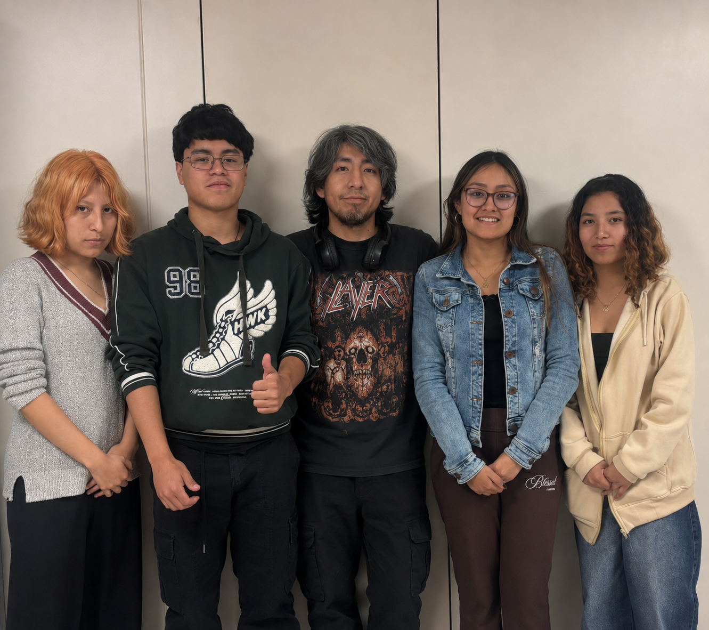
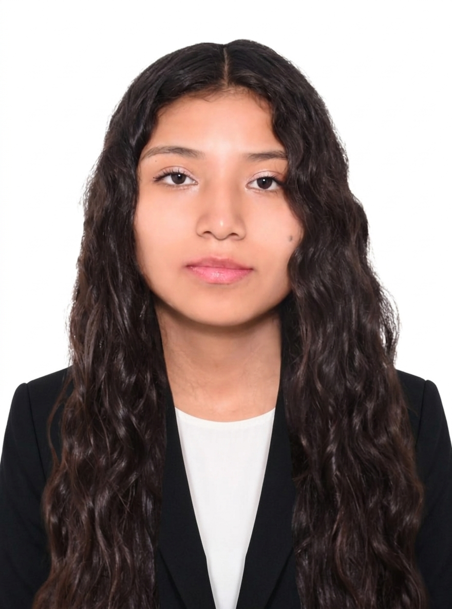
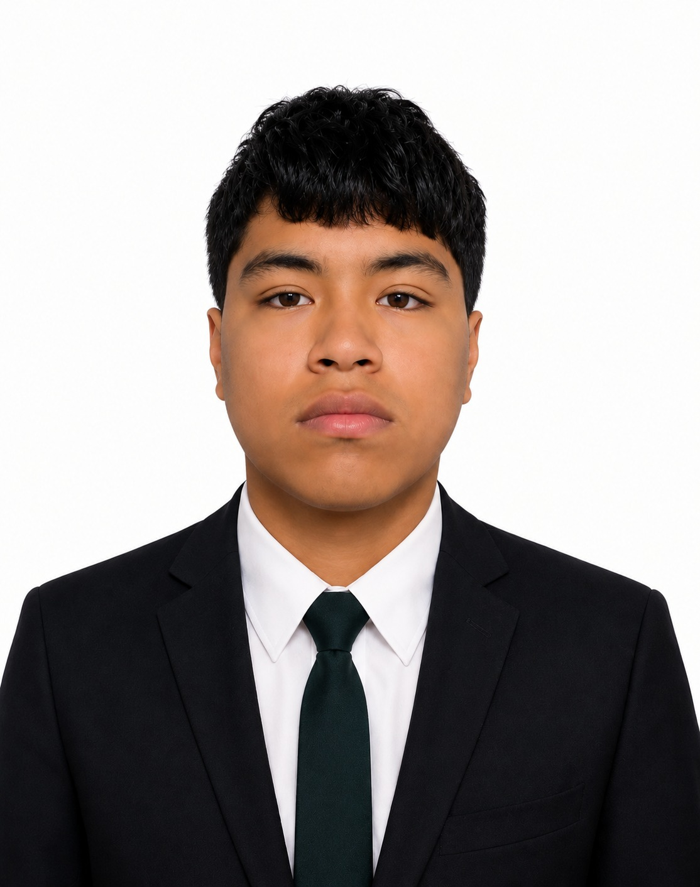

<h1 align="center" style="color: #0000FF; font-weight: bold;">

Equipo 02 - Proyecto Integrador

---

## Descripción del Equipo 

Bienvenidos al repositorio del  **Grupo 02** del curso **Proyecto Integrador 2026-2**, conformado por estudiantes de la carrera de Ingeniería Informática e Ingeniería Industrial de la Universidad Peruana Cayetano Heredia.

Este espacio integra la documentación, avances y entregables de nuestro proyecto académico, desarrollado bajo la metodología VDI 2206, que establece un enfoque sistemático para el diseño, desarrollo y validación de sistemas de ingeniería.  

Nuestro propósito es desarrollar soluciones tecnológicas aplicadas a problemáticas reales del sector acuícola en el Perú, específicamente relacionadas con la gestión eficiente y el monitoreo preventivo del biofouling en el cultivo de concha de abanico (Argopecten purpuratus) en sistemas suspendidos. A través de este proyecto, buscamos proponer una alternativa tecnológica basada en visión por computadora e inspección subacuática automatizada, la cual implementa un algoritmo de segmentación de imágenes a escala para cuantificar el porcentaje de área libre y detectar la obstrucción de las mallas. Con esto, buscamos optimizar las labores de limpieza y recambio de linternas, contribuyendo a una producción acuícola más eficiente, rentable y sostenible.

  
   
  <em>Figura 1. Fotografía del equipo 02</em>

---

## 👥 Integrantes del Equipo

| Foto | Nombre | Rol | Intereses | Correo |
|------|--------|-----|-----------|--------|
|  | **Antezana De la Cruz, María** | Líder del equipo y diseñadora | Diseño de prototipos, UX/UI, creatividad aplicada, innovación social | maria.antezana@upch.pe |
|  | **Santamaria Huaytan, Gabriela** | Responsable de investigación ambiental | Gestión ambiental, desarrollo comunitario, acuicultura sostenible | gabriela.santamaria@upch.pe |
|  | **Bustos Montañez, Melissa** | Especialista en documentación técnica | Comunicación científica, redacción técnica, análisis de requerimientos | melissa.bustos@upch.pe |
|  | **Lombardi Quispe, Joseph** | Programador y modelador de sistemas | Programación, análisis de datos, desarrollo embebido | joseph.lombardi@upch.pe |
|  | **Palacios Tanaka, Yoichi** | Programador y modelador de sistemas | Programación,  análisis de datos, desarrollo embebido | yoichi.palacios@upch.pe |

---

## ¿Por qué este proyecto?

Elegimos trabajar con la acuicultura de la concha de abanico porque es una actividad importante para la costa peruana y tiene un gran potencial comercial, pero durante su cultivo existe un problema que puede dificultar el manejo de las linternas: la acumulación de biofouling en sus mallas. Actualmente, para conocer el estado de estas estructuras, los trabajadores deben realizar inspecciones y labores de limpieza o recambio de manera periódica, lo que implica tiempo, esfuerzo y recursos, y no siempre permite saber con precisión cuándo es realmente necesario intervenir.

Con este proyecto buscamos facilitar el trabajo de los productores mediante un módulo de inspección con visión por computadora, capaz de comparar en serie la captura actual frente a la captura previa para analizar la tasa de reducción del área libre en la malla. Al calcular este cambio progresivo a lo largo del tiempo, el algoritmo detecta la velocidad con la que se acumula el biofouling y emite alertas oportunas antes de que la estructura quede obstruida, optimizando las jornadas de mantenimiento y favoreciendo la supervivencia de la concha de abanico.

---

## Problemática

En las principales zonas acuícolas de la costa peruana, la actividad maricultura se desarrolla en condiciones variables donde el bioincrustamiento es agresivo y constante. La falta de un monitoreo preciso de la condición física de la infraestructura dificulta tomar decisiones correctas en el manejo del cultivo.

Esta problemática se hace evidente en los sistemas suspendidos en linternas, donde la malla retiene progresivamente diversos organismos marinos (ascidias, briozoos, balanos y algas). Esta cobertura reduce drásticamente el flujo de agua y la disponibilidad de oxígeno y fitoplancton para las conchas de abanico, limitando su crecimiento e incrementando la mortalidad del recurso.

Actualmente, el mantenimiento suele basarse en métodos tradicionales con calendarios fijos o revisiones físicas invasivas que no consideran el estado real de cada linterna. Esto provoca que se retiren estructuras antes de tiempo o que se reaccione cuando la malla ya está totalmente obstruida. Cabe resaltar que la acumulación de bioincrustaciones en una linterna puede sobrepasar los 130 kg de biomasa no deseada, incrementando de manera drástica el peso y complicando la maniobra para los trabajadores.

Diversos estudios acuícolas señalan que un manejo oportuno del recambio de linternas reduce la biomasa de *biofouling* en más del 60%, incrementa la supervivencia de las conchas en un 10.8% y mejora sustancialmente el peso del músculo y la gónada. 

En consecuencia, la falta de herramientas tecnológicas automatizadas capaces de evaluar y comparar periódicamente la reducción del área libre en las mallas genera desperdicio de recursos operativos, intervenciones tardías o innecesarias, deterioro de la biomasa y menores ingresos para los acuicultores.

---

## Objetivo:

Como grupo, nuestro objetivo es optimizar la gestión del mantenimiento y recambio de linternas en sistemas de cultivo de concha de abanico mediante el monitoreo subacuático y la cuantificación del porcentaje de obstrucción en sus mallas, con el fin de proteger la biomasa del cultivo, mejorar la toma de decisiones en las operaciones marítimas y reducir los costos por intervenciones tardías o innecesarias.

### Objetivos específicos:

1. Desarrollar un algoritmo de visión por computadora capaz de segmentar el área útil de la malla y cuantificar progresivamente el nivel de obstrucción (biofouling) mediante la comparación secuencial entre la captura actual y la captura previa.

2. Diseñar e implementar un prototipo a escala de laboratorio para simular entornos de mallas en distintas condiciones (limpia vs. obstruida) y validar la precisión del algoritmo en la detección del porcentaje de área libre.

3. Transmitir los datos procesados y el nivel de obstrucción calculado hacia un módulo de alertas para notificar oportunamente al acuicultor cuando se alcancen umbrales críticos de mantenimiento.

---

## ODS en los que nos enfocamos:

Los Objetivos de Desarrollo Sostenible (ODS) son una iniciativa de la Organización de las Naciones Unidas orientada a abordar los principales desafíos globales. Este proyecto se alinea con estos objetivos al integrar tecnología avanzada en la gestión de la acuicultura sostenible:

### ODS 14: Vida Submarina

* **Definición:** Conservar y utilizar sosteniblemente los océanos, los mares y los recursos marinos para el desarrollo sostenible.
* **Relación:** El proyecto contribuye directamente a la **Meta 14.b: Facilitar el acceso de los pescadores artesanales y acuicultores de pequeña escala a los recursos marinos y los mercados**. Al implementar un sistema de inspección subacuática por visión por computadora, se protegen los cultivos de concha de abanico, garantizando la supervivencia del recurso, mejorando el rendimiento biológico y protegiendo la economía de las comunidades maricultoras locales.

### ODS 12: Producción y Consumo Responsables

* **Definición:** Garantizar modalidades de consumo y producción sostenibles.
* **Relación:** Se alinea con la **Meta 12.2: Gestión sostenible y uso eficiente de los recursos naturales**. Al calcular el porcentaje de obstrucción en las mallas comparando capturas secuenciales, las labores de limpieza y recambio se programan con datos objetivos. Esto evita salidas marítimas innecesarias, reduce el consumo de combustible y prolonga la vida útil de las linternas.

### ODS 9: Industria, Innovación e Infraestructura

* **Definición:** Construir infraestructuras resilientes, promover la industrialización sostenible y fomentar la innovación.
* **Relación:** Introduce tecnologías de **visión por computadora, procesamiento digital de imágenes a escala y sistemas de monitoreo de bajo costo** en la acuicultura tradicional peruana, modernizando las herramientas de trabajo en el mar.

---

## Enfoque y sustento

La acuicultura es uno de los pilares del desarrollo económico en el litoral peruano. Pese a esto, surge un problema constante en el manejo de la bioincrustación en los sistemas de cultivo suspendido. Actualmente, no se monitorea adecuadamente la condición visual de las mallas bajo el agua, lo que provoca que se intervenga demasiado tarde o se malgasten recursos en revisiones innecesarias.

Frente a esto, el proyecto **LanternGuard** propone analizar las linternas de manera precisa utilizando un sistema subacuático equipado con un algoritmo de visión por computadora que procesa y compara de manera secuencial la imagen actual frente a la captura previa, aplicando técnicas de segmentación para medir la tasa de reducción del área libre en las linternas. La efectividad de este modelo de evaluación se valida mediante un prototipo experimental a escala de laboratorio, demostrando su viabilidad técnica para la generación de alertas oportunas.

Con este proyecto se logrará:

* Tomar decisiones de recambio basadas en datos objetivos y no en estimaciones.
* Determinar con precisión la velocidad de obstrucción de la malla mediante la comparación de capturas consecutivas.
* Programar jornadas de mantenimiento y lavado de linternas fundamentadas en datos reales de área libre.
* Disminuir gastos logísticos, tiempo de trabajo y consumo de combustible al evitar inspecciones o recambios innecesarios.
* Mantener el flujo constante de agua y nutrientes, favoreciendo la supervivencia, la salud y el peso comercial de la concha de abanico.
* Promover una acuicultura más sostenible, moderna y responsable.

---

## Referencias

[1] Ministerio de la Producción (PRODUCE) y Organismo Nacional de Sanidad Pesquera (SANIPES), *Manual de cosecha y poscosecha de concha de abanico (Argopecten purpuratus)*. Lima, Perú: PRODUCE, 2021.

[2] Organización de las Naciones Unidas para la Alimentación y la Agricultura (FAO), *El estado mundial de la pesca y la acuicultura 2022: Hacia la transformación azul*. Roma, Italia: FAO, 2022.

[3] C. Lodeiros y N. García, «Efecto de la bioincrustación sobre el crecimiento y supervivencia de la concha de abanico Argopecten purpuratus en cultivo suspendido», *Ciencias Marinas*, vol. 30, n.º 3, pp. 45-56, 2004.

[4] J. Mendo y M. Wolff, «El manejo de la pesca y acuicultura de la concha de abanico (Argopecten purpuratus) en el Perú», *Revista Peruana de Biología*, vol. 10, n.º 2, pp. 120-134, 2003.

[5] Samanco Marine Research Group, *Evaluación del impacto de la bioincrustación y estrategias de recambio de linternas en el rendimiento biológico de Argopecten purpuratus*, Informe Técnico N.º 4, Chimbote, Perú, 2025.

---

📌 **Resumen Final**

Como Equipo 02, asumimos el reto de integrar nuestras distintas habilidades y perspectivas para desarrollar un trabajo basado en la ingeniería, la investigación y la innovación. Nuestro compromiso es aplicar estos conocimientos de manera responsable, buscando que cada decisión y cada etapa del proyecto respondan a criterios técnicos y aporten valor frente a las necesidades identificadas.

Este repositorio reúne el trabajo realizado por el equipo y refleja nuestro proceso de aprendizaje, colaboración y desarrollo a lo largo del curso Proyecto Integrador 2026-2. 

