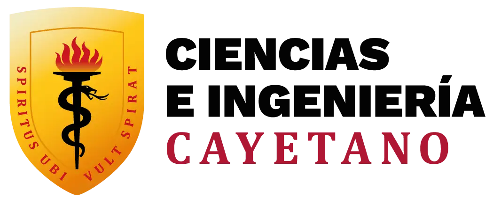
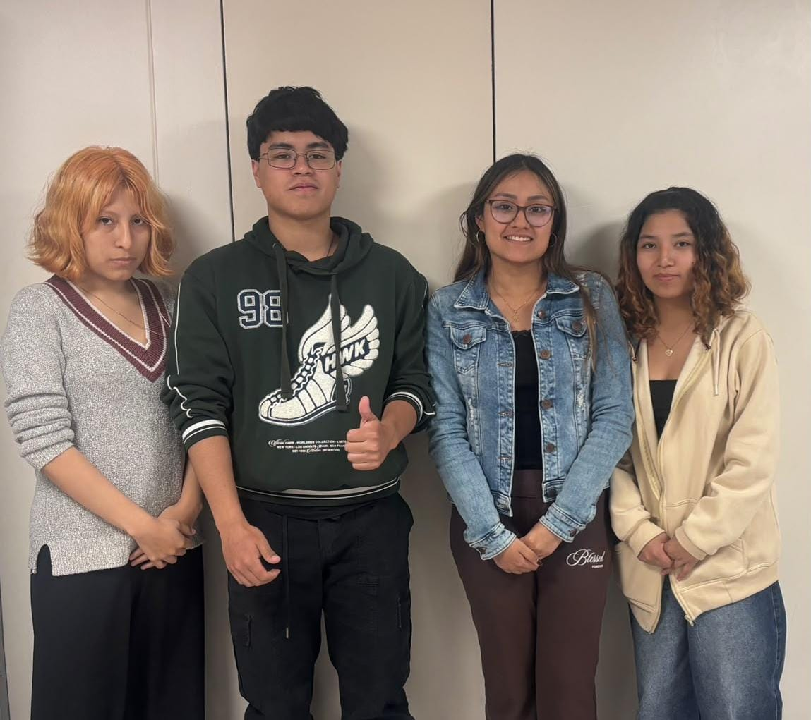
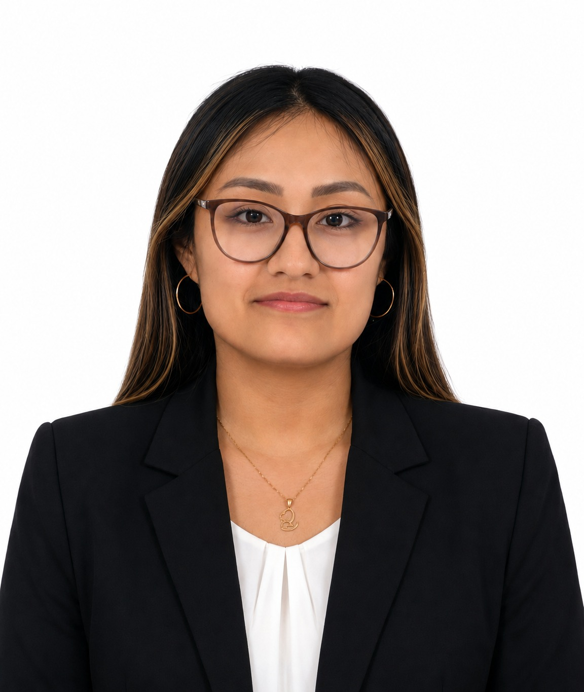
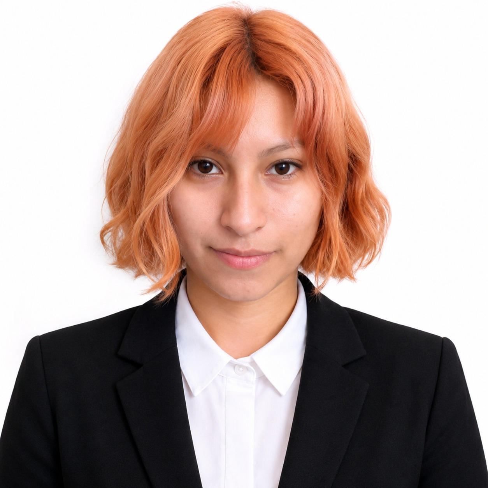

<h1 align="center" style="color: #0000FF; font-weight: bold;">

Equipo 02 - Proyecto Integrador

## 🌍 Descripción del Equipo 

Bienvenidos al repositorio del  **Grupo 02** del curso **Proyecto Integrador 2026-2**, conformado por estudiantes de la carrera de Ingeniería Informática e Ingeniería Industrial de la Universidad Peruana Cayetano Heredia.

Este espacio integra la documentación, avances y entregables de nuestro proyecto académico, desarrollado bajo la metodología VDI 2206, que establece un enfoque sistemático para el diseño, desarrollo y validación de sistemas de ingeniería.  

Como equipo, buscamos combinar los conocimientos adquiridos en nuestras carreras con la investigación, la creatividad, la tecnología y la ingeniería, trabajando de manera conjunta para identificar problemas reales y plantear soluciones que sean innovadoras, viables y responsables con nuestro entorno. 

Es por ello que estamos interesados en trabajar en los siguientes **Objetivos de Desarrollo Sostenible (ODS):**  

- ODS 6: Agua Limpia y Saneamiento  
- ODS 14: Vida submarina

---

## 📸 Fotografía del Equipo  

  <em>Figura 1. Fotografía del equipo 02</em>

---

## 👥 Integrantes del Equipo  

| Foto | Nombre | Rol | Intereses |
|------|--------|-----|-----------|
|  | **Gabriela Santamaría Huaytan** | Responsable de investigación | Gestión ambiental, desarrollo comunitario |
|  | **María Antezana De la Cruz** | Diseñadora | Diseño de prototipos, creatividad aplicada |
|  | **Melissa Bustos Montañez** | Encargado/a de documentación | Comunicación científica, redacción técnica |
|  | **Joseph Lombardi Quispe** | Programador/a - Modelador/a | Programación, análisis de datos, simulación |

---

## 📌 Resumen Final  

Como Equipo 02, asumimos el reto de integrar nuestras distintas habilidades y perspectivas para desarrollar un trabajo basado en la ingeniería, la investigación y la innovación. Nuestro compromiso es aplicar estos conocimientos de manera responsable, buscando que cada decisión y cada etapa del proyecto respondan a criterios técnicos y aporten valor frente a las necesidades identificadas.

Este repositorio reúne el trabajo realizado por el equipo y refleja nuestro proceso de aprendizaje, colaboración y desarrollo a lo largo del curso Proyecto Integrador 2026-2. 
